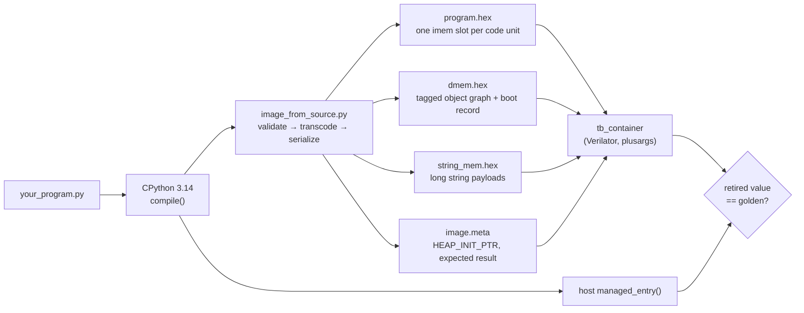
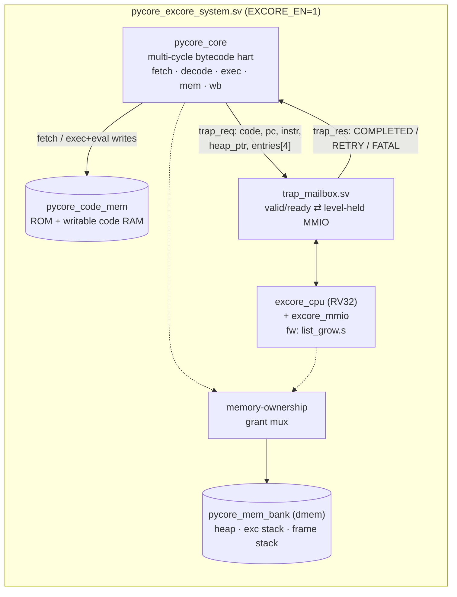
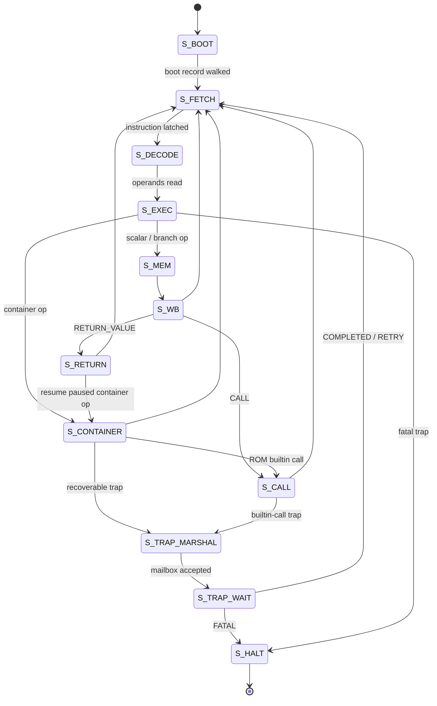
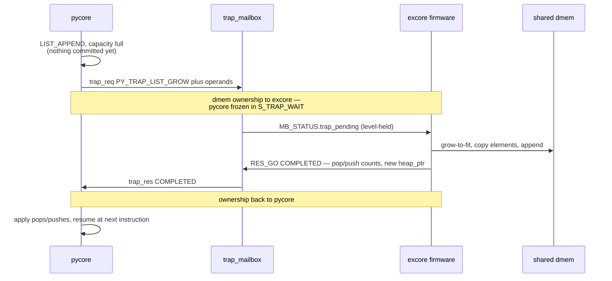

# PyCore

**A research CPU whose native ISA is a CPython 3.14 bytecode subset.**

[](https://github.com/ColtonHarris999/Python-CPU/actions/workflows/all-tests.yml)


PyCore executes Python bytecode directly in hardware. There is no interpreter
loop and no JIT: a `.py` file is compiled by CPython 3.14, lowered 1:1 into a
boot image, and the resulting code units *are* the instruction stream the hart
fetches. Values are 132-bit tagged entries, so `int`, `str`, `list`, `dict` and
friends are architectural types rather than library constructs.

The prototype is portable SystemVerilog simulated with Verilator. FPGA use is a
functional vehicle only — there are no vendor pragmas or resource hints.

```python
# pycore/programs/example_sum_loop.py
def managed_entry():
    total = 0
    for x in [1, 2, 3, 4, 5]:
        total += x
    return total
```

```console
$ make run-file RUN_SOURCE=pycore/programs/example_sum_loop.py
```

---

## Contents

- [Two harts, one image](#two-harts-one-image)
- [Quick start](#quick-start)
- [How a program reaches the hart](#how-a-program-reaches-the-hart)
- [Architecture](#architecture)
  - [System block diagram](#system-block-diagram)
  - [Core FSM](#core-fsm)
  - [Recoverable traps: the pycore ↔ excore handoff](#recoverable-traps-the-pycore--excore-handoff)
  - [Registers, tags and memory](#registers-tags-and-memory)
- [The supported Python subset](#the-supported-python-subset)
- [Status](#status)
- [Testing](#testing)
- [Repository layout](#repository-layout)
- [Documentation index](#documentation-index)

---

## Two harts, one image

| Hart | Directory | Role |
| --- | --- | --- |
| **pycore** | [`pycore/`](pycore/) | The bytecode hart. Boots from a CPython `compile()` object graph; instruction memory is 1:1 with CPython code units, constants live in the serialized `co_consts` tuple in dmem. |
| **excore** | [`excore/`](excore/) | An RV32 multicycle companion that finishes *recoverable* container work (list/dict/set grow, extend, mid-list delete) in firmware instead of halting. |

Fatal traps — type errors, memory faults, illegal opcodes — still halt the
machine. Recoverable traps become a mailbox round trip to excore and the
program continues.

## Quick start

**Requirements:** Python **3.14** (hard requirement — the image builder version-gates), Verilator, `make`, a C++ toolchain.

<details>
<summary><strong>Linux (Ubuntu/Debian)</strong></summary>

```bash
git clone https://github.com/ColtonHarris999/Python-CPU.git
cd Python-CPU
git submodule update --init --recursive
sudo apt-get update
sudo apt-get install -y make g++ verilator python3.14 python3.14-venv
```

If the distro has no `python3.14`, install it via pyenv (or equivalent) and pass
`PYTHON=python3.14` to `make`. On Windows, use WSL2 Ubuntu with the same commands.
</details>

<details>
<summary><strong>Docker (no local Verilator / Python 3.14)</strong></summary>

```bash
sudo apt-get install -y docker.io
make docker-build
make docker-lint-file RUN_SOURCE=pycore/programs/example_sum_loop.py
make docker-run-file  RUN_SOURCE=pycore/programs/example_sum_loop.py
```

Behind a restrictive network, pass through host networking:

```bash
make docker-all-tests DOCKER_BUILD_FLAGS=--network=host DOCKER_RUN_FLAGS=--network=host
```
</details>

Lint first, then simulate:

```bash
make help                                                        # full supported-program summary
make lint-file RUN_SOURCE=pycore/programs/example_sum_loop.py    # will the image builder accept it?
make run-file  RUN_SOURCE=pycore/programs/example_sum_loop.py    # build image, simulate, check result
```

The same thing without `make`:

```bash
python3.14 pycore/tools/pycore_cli.py help
python3.14 pycore/tools/pycore_cli.py lint pycore/programs/example_sum_loop.py
python3.14 pycore/tools/pycore_cli.py run  pycore/programs/example_sum_loop.py
```

**Writing a program.** Define a no-arg `managed_entry()` that returns an `int`
or `bool` — that return value is what the run checks. If you never call it at
module level, `run` appends the call for you. Type annotations are stripped.
Useful knobs: `RUN_FUNCTION=` (entry name), `RUN_MAX_CYCLES=` (default cycle
budget), `RUN_BUILD_DIR=`.

> **The linter is the gate.** If `lint` says OK, image boot will accept the
> file. Hardware may still trap on a *semantic* ceiling the linter cannot see
> (see [Status](#status)).

## How a program reaches the hart

`run` builds the image, executes `managed_entry()` on host CPython 3.14 for a
golden value, then runs the shared two-core `tb_container` simulator and checks
that the retired tagged value matches.



The transcode is deliberately dumb: imem slot index equals CPython code-unit
index, `CACHE` and `EXTENDED_ARG` units stay in the image, and no opcode is
added, removed, reordered or argument-remapped. Branch arguments are the
original compiler arguments. Details:
[`pycore/docs/preprocessing_breakdown.md`](pycore/docs/preprocessing_breakdown.md).

Host `compile()` is still CPython.
[PyCPython](https://github.com/ColtonHarris999/PyCPython) is vendored at
`vendor/pycpython` as the oracle and algorithm source for the future on-device
ROM compiler; the hart does **not** run unmodified PyCPython today.

## Architecture

### System block diagram



Exactly one master owns dmem at a time (`mem_owner_r`). Ownership flips to
excore when the `trap_req` handshake completes and back when `trap_res`
completes — pycore is frozen in `S_TRAP_MARSHAL`/`S_TRAP_WAIT` for precisely
that window, so no cycle-level arbitration is needed.
[`pycore/rtl/pycore_system.sv`](pycore/rtl/pycore_system.sv) is the legacy
single-core top with the trap ports tied off (`EXCORE_EN=0`).

### Core FSM

pycore is multi-cycle and non-pipelined: one instruction is in flight at a time,
so there is no forwarding, no load-use hazard and no branch flush — the register
file is always coherent by the time the next instruction reads it.



`S_CONTAINER` is the multi-cycle workhorse: `BUILD_LIST` / `BUILD_MAP` /
`BUILD_TUPLE`, subscript load and store, `LOAD_CONST`, `LOAD_GLOBAL` /
`LOAD_NAME`, `STORE_NAME` / `STORE_GLOBAL`, and the fused
`LOAD_FAST_BORROW_LOAD_FAST_BORROW` pair.

### Recoverable traps: the pycore ↔ excore handoff

The excore contract is **"complete the semantic effect," not "retry the
instruction."** For a full-capacity `LIST_APPEND` the excore allocates a bigger
buffer, copies the old elements *and appends the new one* — it already holds the
element in the trap message and is already walking the buffer, so the append is
nearly free, and one handoff replaces two.



This is only safe because every recoverable trap is raised **before any
RF/heap/dmem commit** — a property any future recoverable container trap must
preserve. Every handler shipped today answers `COMPLETED`; `RETRY` stays in the
protocol for handlers where pycore state genuinely did not advance.

**Recoverable trap codes** (`EXCORE_EN=1`; fatal without it):

| Code | Trap | Code | Trap |
| --- | --- | --- | --- |
| 9 | `PY_TRAP_LIST_GROW` | 13 | `PY_TRAP_SET_GROW` |
| 10 | `PY_TRAP_LIST_EXTEND` | 14 | `PY_TRAP_SET_UPDATE` |
| 11 | `PY_TRAP_DICT_GROW` | 19 | `PY_TRAP_DICT_UPDATE` |
| 12 | `PY_TRAP_LIST_DELETE` | 20 | `PY_TRAP_DICT_MERGE` |

**Ownership split for containers:**

| Work | Owner |
| --- | --- |
| Hash + rich equality (INT/BOOL/FLOAT/STR) | **pycore** |
| Linear probe / contains / tombstone skip | **pycore** |
| List append with spare capacity; last-element list delete | **pycore** |
| Empty `LIST_EXTEND` (no-op pop) | **pycore** |
| List/dict/set resize; non-empty `LIST_EXTEND`; mid-list delete; `SET_UPDATE` | **excore** |

Mailbox field widths, the full trap taxonomy and the memory-ownership protocol
are in [`pycore/docs/architecture.md`](pycore/docs/architecture.md).

### Registers, tags and memory

The register file is flat and tagged — `RF_DEPTH = 256` entries of
`{ tag[3:0], value[127:0] }`, split by `STACK_BASE`:

```text
RF[0..31]    frame locals
RF[32..255]  operand stack
```

Call frames live on a dmem push/pop stack
([`pycore/rtl/pycore_frame.sv`](pycore/rtl/pycore_frame.sv)); deep call graphs
keep every live frame's locals resident in the RF, so recursion depth is bounded
by `RF_DEPTH` before the frame stack.

<details>
<summary><strong>Tag map</strong> — payload details in <code>pycore/docs/tags.md</code></summary>

| Tag | Name | Notes |
| --- | --- | --- |
| `0000` | CONTROL | UNINIT / NONE / NULL via `value[3:0]` |
| `0001` | INT | signed i64 fast path, sign-extended to 128 |
| `0010` | FLOAT | IEEE 754 binary64 |
| `0011` | COMPLEX | real `[63:0]` + imag `[127:64]` |
| `0100` | BOOL | `value[0]` |
| `0101` | ITER | hybrid iterator |
| `0110` | TUPLE | `{ size, addr }` |
| `0111` | SHORT_STR | inline ≤15 UTF-8 bytes |
| `1000` | LONG_STR | `{ len, addr }` |
| `1001` | MUT_COLLEC | LIST / DICT / SET / BYTEARRAY via kind nibble; sticky contamination bit `[123]` |
| `1010` | OBJECT | general heap object |
| `1011` | RANGE | inline i32 triple or tuple pointer |
| `1100` | BYTES | reserved / partial |
| `1101` | CODE_OBJECT | |
| `1110` | TOMBSTONE | deleted dict/set key sentinel |
| `1111` | FROZENSET | reserved |

</details>

<details>
<summary><strong>Default dmem map</strong> — <code>DMEM_BLOCK_COUNT=32</code>, 128 KB</summary>

```text
0x00000 ─ 0x003DF   reserved / user PTR data
0x003E0 ─ 0x0043F   boot record (96 B: module code obj · globals · builtins)
0x00440 ─ 0x1AFFF   container heap (bump pointer, grows up)
0x1B000 ─ 0x1BFFF   exc-info stack arena (4 KB)
0x1C000 ─ 0x1FFFF   call-frame stack (16 KB)
```

`S_BOOT` walks the boot record at `0x3E0` at reset; `image.meta` reports
`HEAP_INIT_PTR` so runtime allocation starts above the static image.
</details>

## The supported Python subset

`make help` prints the authoritative, always-current version of this summary.

**Structure.** One module. Functions, `if` / `while` / `for`, list/dict/set/tuple
displays, f-strings without format specs, `try` / `except` / `else` / `finally`,
`raise TypeError` / `raise TypeError("msg")` / bare `raise` inside `except`,
module-level `class C:` with methods and `@staticmethod` (no bases), and
keyword / `*args` / `**kwargs` calls.

**Types.** `int` (signed 64-bit), `bool`, `float`, `None`, `str`, `list`,
`tuple`, `dict`, `set`, `range`. Dict/set keys may be int, bool, float or str.
`list + list` and `tuple + tuple` allocate a new sequence; `lst += x` goes
through `LIST_EXTEND`.

<details>
<summary><strong>Builtins in the boot image</strong></summary>

- **Native:** `len`, `range`, `set`, `ord`, `chr`, `int()` (int/bool or digit
  string), `str()` (int/bool/None/str), `max` (2-arg int/bool), `print` (console MMIO).
- **ROM Python:** `abs`, `all`, `any`, `bool`, `sum`, `min` (incl. 3+ args),
  `map` / `zip` / `enumerate` / `filter` / `reversed` (these return **lists**,
  not iterators), `sorted` (`reverse=`, no `key=`), `list` / `dict` / `tuple`,
  `divmod` / `pow` / `round`, `bin` / `hex` / `oct`, `hasattr` / `getattr` /
  `setattr` / `delattr` / `isinstance` / `issubclass`, `exec` / `eval` on a
  precompiled code object (not a source string).
- **Methods:** `list.append/pop/extend/clear`, `set.add/update`,
  `str.join/startswith/endswith/find`, `dict.get/keys/items/values/update/pop`.

Inventory: [`pycore_firmware/builtins/builtins.md`](pycore_firmware/builtins/builtins.md).
</details>

<details>
<summary><strong>Not supported yet</strong></summary>

- `import`, generators / `async`, `match`, `assert`, `with`, `except*`,
  closures / nested `def` cells, runtime class creation, `super()`, `compile()`,
  string-form `exec` / `eval`, files / stdin.
- Slice assignment and list/tuple slicing. String slicing works with *variable*
  bounds (`s[a:b]`); all-literal slices like `s[1:]` are folded by CPython into a
  `slice` constant and rejected — bind the bounds to variables first.
- Format-spec f-strings (`f"{x:.2f}"`), `STR * INT`, `list + tuple`, negative indices.
</details>

Machine-readable sources of truth:
[`pycore/targets/pycore.json`](pycore/targets/pycore.json) (`opcodes`,
`exceptions.types`), [`pycore/docs/bytecode_support.md`](pycore/docs/bytecode_support.md).

## Status

**Shipped and regression-tested on `main`:**

- Int / bool / float ALU; strings (index, iterate, slice with variable bounds);
  lists / tuples / dicts / sets; `range`; `for` and comprehensions; functions
  with defaults, `*args`, `**kwargs` and keyword calls.
- Module-level classes, instance attributes, native methods
  (`list.append`, `dict.get`, `str.join`, …).
- `try` / `except` / `else` / `finally`, `raise TypeError[(msg)]`, MRO matching,
  cross-frame unwind. Firmware raises are catchable (F1); `e.args` is readable (F4).
- ROM builtins (`print`, `min` / `sorted` / `map` / `zip` / …) and native
  `ord` / `chr` / `int` / `str` / `len`.
- Sequence repeat (`[1,2] * 3`) and concat (`[1,2] + [3]`).
- Writable code RAM plus `exec` / `eval` on precompiled code objects.

**Ceilings** (hardware traps, not catchable Python exceptions): missing dict
keys, unbound locals, some type errors, `LONG_STR` ordering and mixed-tag string
compares. `int` is 64-bit, not arbitrary-precision.

**Open work** — see [`planning/master_plan.md`](planning/master_plan.md):

- Runtime code-RAM writers and on-device `compile()` via PyCPython
  ([`planning/compile_plan.md`](planning/compile_plan.md)).
- BIOS / module loader (after the first on-device `compile()`).
- `assert`, `with`, `import`, generators, `except*`, trap → Python exception (T6),
  list/tuple slicing, literal `s[1:]` slice constants, negative indices.

## Testing

CI compiles **two** shared `tb_container` simulators (single-core and two-core),
then runs every image/container fixture against those binaries via plusargs —
compile once, reuse everywhere. `make run-file` uses the same two-core binary.
PRs that only touch planning docs and markdown (including `pycore/docs/` and
`excore/docs/`) skip the hardware jobs.

```bash
# fast checks — no full-chip sim
make pycore-python-tests      # host unit tests, includes the linter
make pycore-rtl-unit
make excore-asm-tests

# shared simulators (build once, then reuse)
make pycore-sim-img           # EXCORE_EN=0
make pycore-sim-img-twocore   # EXCORE_EN=1

# grouped suites
make all-tests TEST_JOBS=4    # pycore + excore; TEST_JOBS defaults to 2
make pycore-container         # legacy hex fixtures
make pycore-img               # single-core image boot
make pycore-img-two-core      # image boot on the two-core top
make pycore-excore-system     # pycore ↔ excore trap round trips (real traps)
make excore-test              # standalone excore against a mocked mailbox
make excore-cpu-test
```

Docker equivalents exist for each of these: `make docker-python-tests`,
`docker-rtl-unit`, `docker-container`, `docker-img`, `docker-two-core`,
`docker-excore`, `docker-pycore-test`, `docker-all-tests`, `docker-lint-file`,
`docker-run-file`.

> Image-boot tests (`make pycore-img-*`) are the production path. Do not write
> new tests against the deprecated inline three-slot `LOAD_CONST` /
> `preprocess.py` flow.

## Repository layout

```text
pycore/               the bytecode hart
├── rtl/              SystemVerilog: core FSM, memories, container helpers
├── tb/               testbenches (tb_container is the shared plusarg sim)
├── tools/            image builder, linter/CLI, fixture generators
├── programs/         example .py programs and hex fixtures
├── targets/          pycore.json machine catalog (opcodes, exception types)
├── tests/            host-side unit tests
└── docs/             architecture, tags, support matrices
excore/               RV32 companion hart
├── rtl/              excore_cpu, excore_mmio, trap_mailbox, vendored singlecore
├── fw/               list_grow.s trap firmware
├── tools/            asm_rv32.py
└── docs/             MMIO map, ISA subset, firmware build, adding a handler
pycore_firmware/      ROM builtins, written in Python
planning/             active plans and design notes
docs/paper/           LaTeX systems notes for near-complete subsystems
tools/                shared helpers (ensure_sim.py, dump_hex.py)
vendor/pycpython      PyCPython submodule — compiler oracle
```

## Documentation index

| Topic | Path |
| --- | --- |
| Two-core architecture | [`pycore/docs/architecture.md`](pycore/docs/architecture.md) |
| Tag map | [`pycore/docs/tags.md`](pycore/docs/tags.md) |
| Bytecode support matrix | [`pycore/docs/bytecode_support.md`](pycore/docs/bytecode_support.md) |
| Exception types | [`pycore/docs/exception_support.md`](pycore/docs/exception_support.md) |
| Object model | [`pycore/docs/object_model.md`](pycore/docs/object_model.md) |
| Code loading | [`pycore/docs/code_loading.md`](pycore/docs/code_loading.md) |
| Image / preprocessing flow | [`pycore/docs/preprocessing_breakdown.md`](pycore/docs/preprocessing_breakdown.md) |
| Dict / set offload | [`pycore/docs/dict_excore.md`](pycore/docs/dict_excore.md), [`pycore/docs/set_excore.md`](pycore/docs/set_excore.md) |
| ROM builtins inventory | [`pycore_firmware/builtins/builtins.md`](pycore_firmware/builtins/builtins.md) |
| excore MMIO / ISA / firmware | [`excore/docs/`](excore/docs/) |
| Active plans | [`planning/master_plan.md`](planning/master_plan.md) |
| On-device compile | [`planning/compile_plan.md`](planning/compile_plan.md) |
| Paper-oriented systems notes | [`docs/paper/`](docs/paper/) |
