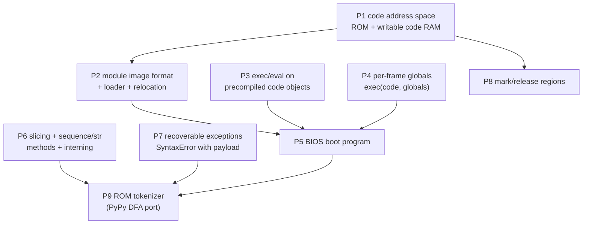

# Plan 1 — code loading, BIOS boot, and the tokenizer

**Status:** in progress — P1, P3, P4, P6.1 (strings), P7, P8 shipped; P2, P5, P6.2–6.4, P9 open. See §5
**Audience:** pycore RTL agent, bytecode agent, firmware agent, tooling agent
**Successor:** [`native_compiler_plan.md`](native_compiler_plan.md) (Plan 2)
**Supersedes:** the P1–P6 phases of `compile_exec_plan.md`

Plan 1 ends when PyCore can **boot a Python BIOS from ROM, load a code module
into writable code memory, `exec()` it, and tokenize Python source on-device**.
It deliberately stops short of parsing and code generation — those are Plan 2.

Everything Plan 1 builds is chosen so that Plan 2 (a self-hosted Python
compiler) can be dropped on top without redesign. §14 is the explicit contract
between the two plans.

---

## 1. Goals

1. **A real code-loading architecture.** Replace the read-only, image-only
   instruction memory with a ROM region plus a writable, *relocatable* code RAM
   and a loader — the way an actual CPU moves code around before running it.
2. **A BIOS.** A pure-Python boot program in ROM that is always the first thing
   PyCore runs. It initializes the machine, then hands control to a payload
   whose location is fixed and known. Today the payload is a test program; later
   it becomes the OS.
3. **`exec()` / `eval()` on precompiled code objects**, including a
   caller-supplied globals namespace.
4. **The string, sequence, and exception primitives a real tokenizer needs** —
   derived from an actual audit of PyPy's tokenizer (§3), not from guesswork.
5. **An on-device tokenizer** that turns Python source into a token list.

### 1.1 Non-goals (Plan 2 owns these)

Parsing, AST construction, symbol tables, code generation, assembly,
`compile()`, and string-form `exec` / `eval`.

### 1.2 Already shipped (phase 0 of the old plan)

| Item | Where |
| --- | --- |
| `s[i]` character-indexed string subscript | `CONT_SUBSCR_STR` |
| `ord` / `chr` | `BI_ORD` (10) / `BI_CHR` (11) |

---

## 2. Reusable open-source implementations — findings

The brief was: use pure-Python implementations where they exist, and reject
anything that bottoms out in C (or any other non-Python language) at any point.
Here is what an actual audit found. This section is shared with Plan 2.

### 2.1 Verdict table

| Candidate | Licence | Pure Python? | Usable? |
| --- | --- | --- | --- |
| **PyPy `pyparser/pytokenizer.py` + `automata.py`** | MIT | **Yes** — DFA tables, no `re`, no generators | **Yes, as a port source.** Best available |
| CPython `Lib/tokenize.py` | PSF | **No** — 3.12+ is a wrapper over the C `_tokenize`; ≤3.11 used `re` (C `_sre`) | No |
| `parso` / `blib2to3` (lib2to3 pgen2 forks) | MIT / PSF | **No** — regex-driven tokenizers | Tokenizer no; **pgen2 LL(1) table generator yes** (host-side) |
| `pegen` (PyPI) / CPython `Tools/peg_generator` | PSF/MIT | Generator yes; generated parser imports `tokenize` | **Host-side only** (see Plan 2) |
| `python-compiler` (facebookincubator / pfalcon) | PSF | AST→bytecode is Python, but **parses via the C `ast` module** | Codegen reference only, and targets 3.5 bytecode |
| `bytecode` (Stinner / Dartiailh) | MIT | **Yes** | **Host-side oracle** for jump/EXTENDED_ARG/exception-table assembly |
| CPython `ast` / `_ast` | PSF | **No** — C | No |
| RustPython, MicroPython, Nuitka | — | No — Rust / C / C++ | No |

### 2.2 Why PyPy's tokenizer is the right source

Audited against the actual files (fetched from `pypy/interpreter/pyparser/`):

- **No `re`, no `import` of anything C-backed.** The single `re.compile` in the
  file is inside a docstring inherited from CPython's `tokenize`.
- **No generators.** RPython forbids `yield`, so `generate_tokens` builds and
  returns a list. PyCore has no `YIELD_VALUE`, so this is exactly the shape we
  need — a coincidence of constraints that saves a rewrite.
- **No `try` / `except`, no decorators, no classes** in `pytokenizer.py`.
- Recognition is a **table-driven DFA** (`automata.py`, ~130 lines). Its
  runtime is `ord()`, string indexing, `len()`, and integer compares — all of
  which PyCore now has. The table-building `__init__` is explicitly marked
  `NOT_RPYTHON`: it is a **build-time** step, which maps onto our host image
  builder perfectly.

### 2.3 What porting it actually costs

Counted from the real source, this is what `pytokenizer.py` uses that PyCore
does not yet provide:

| Construct | Sites | Disposition |
| --- | --- | --- |
| Slicing `line[a:b]`, `token[:3]`, `indents[1:]` | **14** | **`BINARY_SLICE` — new hardware (§6)** |
| `list.append(x)` | **22** | Needs list-method dispatch, or mechanical rewrite to `lst += [x]` (§6.3) |
| `list.pop()` | 3 | Same |
| `"".join(parts)` | 2 | Needs `str.join` (§6.3) |
| `str.endswith(...)` | 2 | Needs `str.endswith`, or slice + `==` |
| `len`, `while`, `for`, `raise`, dict lookup | many | Already supported |
| `dict.iteritems()` (in `automata.py`) | 1 | Python 2 — PyPy's interpreter is RPython (py2 dialect); port to py3 |
| Class + inheritance (`NonGreedyDFA(DFA)`) | 1 | PyCore rejects bases; flatten to two functions |

**Conclusion: it is a port, not a drop-in** — because of PyCore's subset, not
because of C dependencies. The audit is still the single most valuable input to
this plan: it converted "we need string stuff" into a precise, closed list.

### 2.4 Licence handling

PyPy is MIT. Ported files carry the MIT notice plus a provenance header naming
the upstream file and revision. Add `pycore_firmware/THIRD_PARTY.md` recording
upstream project, licence, files, revision, and a summary of modifications, and
extend it whenever more is ported.

---

## 3. Current state and what blocks each goal

| Blocker | Evidence |
| --- | --- |
| **imem is read-only and image-only.** `pycore_imem.sv` is a `READ_ONLY` bank; fetch hardwires `imem_we_o = 1'b0`; the only load path is `$readmemh(PROG_HEX)`. Excore shares dmem but **not** imem. | §6.1 |
| **Code is not relocatable.** Code-object field 0 (`entry_slot`) is an absolute imem slot index assigned at serialize time (`entry_slot = len(program_slots)`). Nothing can move code. | §6.1 |
| **No loader, no module format.** A module is code slots *and* a dmem graph (`co_consts` / `co_names` / strings). There is no container that carries both, and no relocation concept. | §6.2 |
| **Boot jumps straight into the module.** Boot record pair 0 is the module code object; `S_BOOT` latches it and redirects fetch to its entry slot. There is no interposed program. | §7 |
| **One global namespace.** `globals_base_r` is latched once at boot; frames do not carry it, so a payload cannot get its own namespace. | §8 |
| **No slicing.** `BINARY_SLICE` / `STORE_SLICE` are in `DEFERRED_OPS`. | §6.3 |
| **No container/str methods.** `LOAD_ATTR` requires `PY_TAG_OBJECT`, so `lst.append(x)` type-traps. | §6.3 |
| **Long runtime strings are not interned.** `LONG_STR` dict-key equality is descriptor equality, so two separately built >15-byte names never match as globals/dict keys (deviation 4). | §6.4 |
| **No reclamation.** Heap and (once added) code RAM are bump allocators with no GC, so repeated work leaks. | §9 |

---

## 4. Standing requirements for every phase

These are not a phase; they apply to **all** work in this plan and in Plan 2.

### 4.1 Documentation is part of the change, not a follow-up

A phase is not done until every affected document is updated **in the same
commit** as the code:

| Document | Update when |
| --- | --- |
| `pycore/docs/architecture.md` | Memory map, code regions, boot flow change |
| `pycore/docs/bytecode_support.md` | Any opcode moves between the supported / partial / deferred tables, or any new semantic deviation |
| `pycore/docs/object_model.md` | New `BI_*` id, new object kind, new header field, attr behaviour |
| `pycore/docs/tags.md` | Any tag or payload-layout change |
| **`pycore/docs/code_loading.md`** (new, §6) | Code address space, module format, relocation, loader ABI |
| **`pycore/docs/boot.md`** (new, §7) | Boot record layout, BIOS contract, payload descriptor |
| `pycore/docs/preprocessing_breakdown.md` | Image-build pipeline changes |
| `pycore_firmware/builtins/builtins.md` | Any builtin status change (use the **native** status for `BI_*`-owned entries) |
| `pycore_firmware/README.md` | New firmware trees (`boot/`, `compiler/`) |
| `pycore_firmware/THIRD_PARTY.md` (new, §2.4) | Any newly ported upstream code |
| `excore/docs/mmio_map.md` | Any new MMIO register |
| `planning/README.md` + this file | Phase status, on every phase close |
| `README.md` | Tag map, test targets, quick-start changes |

Rule: if a reviewer must read the diff to learn a load-bearing invariant, that
invariant belongs in a doc. Every documented deviation from CPython gets a
numbered entry in `bytecode_support.md` and a test that pins it.

### 4.2 Test policy — edge cases are enumerated, not sampled

Every phase ships four layers:

1. **Host unit tests** (`pycore/tests/test_*.py`) for all tooling: image
   builders, module-image encode/decode, relocation math, DFA table generation.
   Property/round-trip style where possible (encode→decode→compare).
2. **Device differential tests** (`pycore/programs/img_*.py` +
   `PYCORE_IMAGE_RUN`) where host CPython can produce the golden.
3. **Device trap tests** (`PYCORE_IMAGE_TRAP_RUN`) for every documented error
   path, asserting the **exact** trap code.
4. **Aggregate target** per feature (e.g. `pycore-img-slice-all`), wired into
   the top-level image list *and* `all-tests` in the same commit.

For each new feature the plan below lists a required edge-case matrix. The
standing matrix that applies to every new operation:

| Class | Cases |
| --- | --- |
| Empty | zero-length string / list / dict / zero-count |
| Boundary | index 0, last index, one past the end, full range |
| Size classes | `SHORT_STR` (≤15 B) **and** `LONG_STR` (>15 B) for every string op |
| Encoding | 1-, 2-, 3-, 4-byte UTF-8 for every character op |
| Type errors | every rejected tag, each asserting its trap code |
| Negative / overflow | negative index, negative length, > 32-bit values |
| Aliasing | same object as both operands (`x[:] = x`, `a += a`) |
| Capacity | at the allocation limit and one past it (OOM trap) |
| Interaction | with excore enabled **and** disabled where a trap is recoverable |

No feature is "done" with only a happy-path test.

### 4.3 Regression discipline

- Fixture images (`pycore/programs/*_dmem.hex`, `*.meta`) are committed and are
  regenerated by `make`. Any change to boot-record size, builtins-dict contents,
  or heap base **shifts `HEAP_INIT_PTR`** and must be committed as a separate,
  clearly-labelled regeneration commit (precedent: the `ord`/`chr` work).
- Verilator warnings are diffed against a pre-change baseline; new warning
  classes must be explained in the PR.
- `make all-tests` green is the merge gate.

---

## 5. Phase map



**P3 was shippable immediately with no RTL** and went first, as planned.
P6 is the long pole and is independent of P1–P5, so it can run in parallel.

| Phase | Deliverable | Layer | Status |
| --- | --- | --- | --- |
| P1 | ROM + writable code RAM, fetch region mux | RTL | **Done** |
| P2 | Module image format, `_bi_load_module`, relocation | RTL + tooling | Open |
| P3 | `exec(code)` / `eval(code)` | firmware + tooling | **Done** |
| P4 | Per-frame globals, `exec(code, globals)` | RTL | **Done** |
| P5 | BIOS in ROM, boot descriptor, payload dispatch | firmware + RTL + tooling | Open |
| P6 | `BINARY_SLICE`, list/str methods, string interning | RTL | **P6.1 strings done**; methods / ordering / interning open |
| P7 | Exception types with messages | RTL + firmware | **Types + construction/unwind via #74**; `e.args` read open (follow-up F4); firmware `raise <int>` → F1 |
| P8 | Heap / code-RAM mark and release | RTL + firmware | **Done** |
| P9 | On-device tokenizer | firmware + tooling | Open |

### 5.1 What shipped, and what each phase learned

| Phase | Outcome |
| --- | --- |
| **P1** | `pycore_code_ram.sv` + `pycore_code_mem.sv` region mux; `--code-ram` build mode. `img_code_ram_call` runs the same program from ROM and from RAM (empty ROM in the second case) with identical results *and* identical cycle counts. Details in `pycore/docs/code_loading.md`. |
| **P3** | ROM `exec`/`eval` bodies plus the `SEED_CODE` pragma. Confirmed the plan's claim: no hardware change was needed. `exec`/`eval` do need **host stand-ins** (recorded in `HOST_STANDIN_BUILTINS`) because CPython code objects are not callable, so `run_image_test.py` binds them to the test namespace. |
| **P6.1** | `BINARY_SLICE` on strings via a new `string_mem` slice port. Two surprises about what CPython emits: all-literal slices (`s[1:3]`, `s[:]`) are folded to a `slice` **constant** + `NB_SUBSCR` and never reach `BINARY_SLICE`, and omitted bounds arrive as `None`. List/tuple slicing is still open. |
| **P7** | Four leaf exception types seeded. Testing exposed that **exceptions do not propagate across frames** (`RAISE_VARARGS` walks only the raising code object's table), now deviation 16 and pinned by `img_try_exc_cross_frame_fatal`. |
| **P8** | `code_ram_ptr_r` plus `_bi_heap_mark`/`_bi_heap_release`/`_bi_code_mark`/`_bi_code_release`. Releases validate the mark against its region and the current cursor, so a stale mark faults. `img_heap_mark_release` pins the property that matters: reallocating after a release lands at the same address. |
| **P4** | Frame slot 1 bits `[127:97]` save the caller's `globals_base_r[30:0]`. `_bi_exec_globals(code, dict)` rewrites a builtin CALL as a 0-arg code-object CALL with that dict as the callee's globals. `exec(code, globals=None)` / `eval(code, globals=None)` are ROM wrappers. Functions remain code objects with no `__globals__`: a helper called from an exec'd payload sees the exec dict, not the module where it was defined. |

---

## 6. P1 / P2 / P6 — the code memory revamp

This is the architectural heart of Plan 1 and the part that most needs to be
right, because Plan 2's compiler is far larger than today's whole instruction
memory.

### 6.0 Sizing: why "a writable arena" is not enough

PyPy's compiler is **~315 KB of Python** (`ast.py` 146 KB, `astbuilder.py`
60 KB, `codegen.py` 50 KB, `assemble.py` 24 KB, `symtable.py` 19 KB,
`optimize.py` 12 KB). Even a heavily reduced PyCore-subset compiler is
realistically a few thousand lines, and one line of Python is roughly 5–10
bytecode units, so **10 000–30 000 code slots (80–240 KB)** is the target
budget. Today's entire imem is **8192 slots (64 KB)** and already holds the
boot image and ROM firmware.

So the design must (a) provide code memory an order of magnitude larger than
today's imem, and (b) allow code to be **placed at load time rather than at
image-build time**, so a module can be loaded, replaced, or overlaid. That is
what a real CPU's loader does, and it is what §6.2 builds.

### 6.1 P1 — the code address space

Two regions in one PC space. `PYCORE_IMEM_BLOCK_COUNT` stays 16 so the ROM
region and every existing image keep their current addresses.

```text
slot 0x0000 .. 0x1FFF   CODE ROM   pycore_imem       READ_ONLY, $readmemh   64 KB /  8192 slots
slot 0x2000 .. 0xA1FF   CODE RAM   pycore_code_ram   writable, zero at reset 256 KB / 32768 slots
```

New parameters in `pycore_defs.svh`, mirrored in `pycore/tools/encoding.py`:

```systemverilog
localparam logic [31:0] PYCORE_CODE_RAM_SLOT_BASE  = 32'h0000_2000; // == imem slot count
localparam logic [31:0] PYCORE_CODE_RAM_SLOTS      = 32'h0000_8000; // 32768
localparam logic [31:0] PYCORE_CODE_RAM_SLOT_LIMIT =
    PYCORE_CODE_RAM_SLOT_BASE + PYCORE_CODE_RAM_SLOTS;
```

Steps:

1. `pycore/rtl/pycore_code_ram.sv` — a `pycore_mem_bank` instance with
   `READ_ONLY(0)`, `DATA_WIDTH(64)`, no `INIT_HEX` (test builds may take an
   optional `CODE_RAM_HEX` preload, see §6.1.1). Add to `PYCORE_RTL_SRCS`.
2. Fetch region mux in `pycore_fetch.sv` / `pycore_system.sv`:
   `sel_ram = (pc_r >= PYCORE_CODE_RAM_SLOT_BASE)`; RAM port addressed at
   `(pc_r - base) << 3`. Same bank type, so latency and the `awaiting_r`
   handshake are unchanged. `pc >= SLOT_LIMIT` → `PY_TRAP_MEM_FAULT` (never
   wrap silently).
3. `code_ram_ptr_r` in `pycore_core.sv` beside `heap_ptr_r`, reset to
   `PYCORE_CODE_RAM_SLOT_BASE`, exposed as a `CODE_RAM_INIT_SLOT` parameter so
   images can pre-place code.
4. **Keep ROM genuinely read-only.** Not laziness — it means a buggy loader or
   a runaway compiler cannot corrupt the BIOS, which is the same reason real
   machines boot from mask ROM. Writes to ROM slots stay a fault.

**Why not simply enlarge imem and make it writable?** It would work in
simulation and is one parameter, but it throws away the ROM guarantee above and
gives Plan 2 no relocation story. The two-region split costs one mux.

#### 6.1.1 Independent testability

Code RAM must be testable before any loader exists. Add `--code-ram-seed` to
`image_from_source.py`: emit a nominated function's slots to a separate
`code_ram.hex` with an `entry_slot` above the RAM base, and give the
testbenches a `CODE_RAM_HEX` parameter (test-only preload).

**Tests:** `img_code_ram_call` (a function executed from RAM returns the same
result as its ROM twin — the definitive check that region selection is
transparent), `img_code_ram_call_deep` (calls across the ROM/RAM boundary in
both directions), `img_code_ram_branch` (a backward jump within RAM),
`img_code_ram_oob_trap` (PC past `SLOT_LIMIT` → trap 7),
`img_code_ram_rom_write_trap` (a store aimed at a ROM slot → trap 7).
Acceptance: no change to any existing `pycore-img-*` result.

### 6.2 P2 — module image format, loader, and relocation

A module is **not** just code: it is code slots plus a dmem object graph
(`co_consts`, `co_names`, nested code objects, strings). Loading one means
placing both and fixing up the cross-references. This is the ELF-like step.

#### 6.2.1 Format

```text
PyCore module image  (byte-addressed blob, 16-byte aligned, in dmem)
  +0x00  magic          'PYCM' + format version
  +0x08  text_slots     count of 8-byte code words
  +0x0C  data_bytes     size of the dmem section
  +0x10  entry_offset   offset of the entry CODE_OBJECT within the data section
  +0x14  reloc_count
  +0x18  flags          (reserved: overlay-able, read-only data, …)
  text section          text_slots x 8 bytes; entry_slot fields are MODULE-RELATIVE
  data section          data_bytes; all handles are DATA-SECTION-RELATIVE
  reloc table           reloc_count x 8 bytes: { kind[7:0], offset[31:0] }
                        kind 0 = TEXT_SLOT_IN_DATA  (add text_base to an entry_slot INT)
                        kind 1 = DATA_ADDR_IN_DATA  (add data_base to a handle's addr)
```

Two relocation kinds are sufficient because those are the only two absolute
address spaces a module references. Keeping the kind byte gives room for a
third (e.g. an external symbol) without a version bump.

#### 6.2.2 `_bi_load_module(image_addr) -> CODE_OBJECT` (`PY_BI_LOAD_MODULE`)

1. Validate magic and version → `PY_TRAP_TYPE` on mismatch.
2. Reserve `text_slots` from `code_ram_ptr_r` → `text_base`; overflow →
   `PY_TRAP_MEM_FAULT`.
3. Copy the text section into code RAM.
4. Bump-allocate `data_bytes` on the heap → `data_base`; OOM →
   `PY_TRAP_MEM_FAULT`.
5. Copy the data section.
6. Walk the reloc table and add `text_base` / `data_base` as directed. Any
   offset outside its section → `PY_TRAP_MEM_FAULT`.
7. Return `{PY_TAG_CODE_OBJECT, data_base + entry_offset}`.

The copy loops are long but structurally identical to the bulk copies the
excore grow handlers already perform; the difference is that this one runs
on-core because **excore cannot reach code memory**.

**Phasing inside P2 (do not build it all at once):**

| Step | Scope |
| --- | --- |
| **P2a** | Loader with `reloc_count == 0` and a build-time-fixed load base. Proves copy + execute. |
| **P2b** | Text relocation (kind 0) — the same module image loads correctly at two different bases. |
| **P2c** | Data relocation (kind 1) — the data section is heap-position-independent. |
| **P2d** | Two modules loaded back to back; the second's base depends on the first. |

#### 6.2.3 Tooling

`pycore/tools/module_image.py`: build a module image from a Python source file
(reusing `image_from_source`'s serializer), emit relative `entry_slot`s, collect
relocations, and provide a decoder for tests. `--emit-module` on
`image_from_source.py` writes one as a dmem blob so a test program can load it.

**Host unit tests** (`pycore/tests/test_module_image.py`): header round-trip;
relocation applied at several bases yields byte-identical results to a direct
build at that base (**the** correctness property); reloc offsets are all
in-bounds; truncated / bad-magic / bad-version images are rejected; a module
with zero relocations, and one with thousands.

**Device tests:** `img_load_module_basic` (load, call, check result),
`img_load_module_relocated` (loaded at a non-default base),
`img_load_module_two` (two modules, second base derived),
`img_load_module_data_refs` (loaded module uses its own `co_consts`, `co_names`,
nested code objects, and long strings),
`img_load_module_call_rom` (loaded code calls a ROM builtin, and ROM code calls
back into the loaded module),
plus trap tests: `img_load_module_bad_magic_trap`,
`img_load_module_bad_version_trap`, `img_load_module_text_oom_trap`,
`img_load_module_data_oom_trap`, `img_load_module_bad_reloc_trap`.

### 6.3 P6 — slicing, sequence/string methods

Driven entirely by §2.3. This is the largest bytecode-side phase.

#### 6.3.1 `BINARY_SLICE` / `STORE_SLICE`

Remove from `DEFERRED_OPS`. Implement `BINARY_SLICE` for:

| Subject | Result |
| --- | --- |
| `SHORT_STR` / `LONG_STR` | New string; ≤15 bytes → inline `SHORT_STR`, else `LONG_STR` in `string_mem`. **Character-indexed**, consistent with `s[i]` and deviation 14 |
| `LIST` | New `LIST` (fresh object + element buffer) |
| `TUPLE` | New `TUPLE` |

Semantics to match CPython: clamp out-of-range bounds instead of trapping
(`"abc"[1:99] == "bc"`, `"abc"[5:6] == ""`), empty result when `start >= stop`,
omitted bound → 0 / length. Negative bounds trap for now (deviation 3);
**document it**, because Python code written against CPython uses `s[:-1]`
freely — this is the single most likely porting surprise, so §9's port must
audit for it. `STORE_SLICE` is only needed for lists and only if the port
requires it; defer with a note if not.

Note `BINARY_SLICE` takes `[stop, start, subject]` on the stack and CPython
also emits `BUILD_SLICE` + `NB_SUBSCR` for `x[a:b:c]`; step slices stay
deferred.

**Edge matrix (all required):** empty subject; `[:]`; `[0:0]`; `[0:len]`;
`[len:len]`; `[2:1]` (reversed → empty); `stop` past the end; both bounds past
the end; `SHORT_STR` result from a `LONG_STR` subject and vice versa; a slice
landing exactly on 15/16 bytes (the tag boundary); multi-byte UTF-8 spanning the
cut; slice of an empty list; slice producing a full copy; non-`INT` bound →
trap 1; negative bound → documented trap; slice of a `DICT`/`SET` → trap 1;
list slice at heap OOM → trap 7.

#### 6.3.2 Methods on built-in types

`LOAD_ATTR` currently demands `PY_TAG_OBJECT`, so `lst.append(x)` traps. Two
options:

| Option | Cost | Verdict |
| --- | --- | --- |
| **A. Rewrite the port** — `lst.append(x)` → `lst += [x]`, `"".join(p)` → concat loop, etc. | No RTL. But 22 `append` + 3 `pop` + 2 `join` + 2 `endswith` sites in the tokenizer alone, and far more in Plan 2's compiler. Every rewrite is a chance to introduce a bug that host CPython will not reproduce. | Fallback only |
| **B. Native method dispatch** — extend `CONT_LOAD_ATTR` so `MUT_COLLEC` / string receivers resolve a small fixed method table to an `OBK_BUILTIN` bound to the receiver. | One contained RTL change plus one `BI_*` per method. Ported code then reads like the upstream it came from, and the host differential runs the *same* source. | **Adopt** |

Minimum method set, chosen from the audit (§2.3) plus Plan 2's needs:

| Receiver | Methods |
| --- | --- |
| `list` | `append`, `pop` (no-arg and index), `extend` |
| `str` | `join`, `startswith`, `endswith`, `find` |
| `dict` | `get`, `keys` (list), `items` — only if the port needs them |

`BI_LIST_APPEND` already exists and is reused. Each new method gets its own
`BI_*` id and an entry in `object_model.md`.

**Edge matrix:** `append` with spare capacity, exactly full (grow via excore),
and at heap OOM; `pop` from length 1 and from empty (trap); `extend` with empty,
self, tuple, and non-iterable; `join` with 0/1/many parts, empty separator,
`LONG_STR` parts, and a result crossing the 15-byte boundary; `startswith` /
`endswith` with a needle longer than the subject, equal to it, and empty;
`find` with a hit at 0, a hit at the end, and a miss (−1); every wrong receiver
tag → trap 1; method called with wrong argc → `CALL_FILTER`.

#### 6.3.3 String ordering compare

`COMPARE_OP` `<`, `<=`, `>`, `>=` on same-tag strings — lexicographic by UTF-8
bytes (which equals code-point order for UTF-8). Needed by the port and by
`sorted`/`min`/`max` on strings, which have wanted it for three waves.

**Edge matrix:** equal strings; common prefix with different lengths (`"ab"` vs
`"abc"`); differing first byte; multi-byte characters; empty vs non-empty;
`SHORT_STR` vs `LONG_STR` of equal content (**must** compare by content — see
§6.4); every ordering operator; cross-tag string comparison.

### 6.4 P6 — string interning (a hard requirement, not a nicety)

Runtime-built `LONG_STR` uses **descriptor** equality (`{size, addr}`) in dict
probes, so two independently constructed 20-character identifiers never match
as keys. A tokenizer produces identifiers of arbitrary length and Plan 2 uses
them as `co_names` and symbol-table keys, so the 15-character cap the old plan
proposed is not survivable. Fix it in Plan 1.

Two routes:

| Route | Notes |
| --- | --- |
| **Content-based `LONG_STR` equality** in `pycore_dict_key_rich_eq` + `COMPARE_OP` + `pycore_elem_eq` | The honest fix; retires deviation 4 entirely. Requires the dict-probe path (dmem domain) to read `string_mem`, which is a cross-domain change to a hot path. Also requires content **hashing** of long strings so equal content lands in the same bucket. |
| **`BI_INTERN(s)` + an intern table** | Smaller RTL. Canonicalizes a `LONG_STR` to a unique handle, after which descriptor equality is correct. But *every* producer must remember to intern, and a missed call is a silent wrong answer. |

**Recommendation: content-based equality and hashing** (route 1), because
"silent wrong answer if you forget" is not an acceptable property for the
foundation of a compiler. Keep `BI_INTERN` as an optional dedup optimisation.

Note the hash must agree between `SHORT_STR` and `LONG_STR` for equal content,
or a name that starts short and grows will hash to two buckets.

**Edge matrix:** two runtime-built equal long strings as dict keys → one entry;
equal content across `SHORT_STR`/`LONG_STR` → equal and same hash; content
differing only in the final byte; content differing only in length; a long key
surviving a dict grow/rehash (excore path); a long key in a set; long-string
`==`, `!=`, ordering, and `in`; 4096-byte strings (the concat limit).

---

## 7. P5 — the BIOS

### 7.1 Contract

**The first Python that runs on PyCore is always the BIOS, from ROM.** It owns
machine bring-up and then transfers control to a payload it locates through a
fixed descriptor. Today the payload is a test program; later it is the OS.

### 7.2 Boot record grows to four pairs

```text
BOOT_RECORD_ADDR + 0    pair 0  BIOS code object    (CODE_OBJECT, in ROM)
BOOT_RECORD_ADDR + 32   pair 1  globals dict
BOOT_RECORD_ADDR + 64   pair 2  builtins dict
BOOT_RECORD_ADDR + 96   pair 3  boot descriptor     (see 7.3)
```

`PYCORE_BOOT_RECORD_BYTES` 96 → 128, so `PYCORE_HEAP_BASE` moves 0x0440 →
0x0460. This shifts `HEAP_INIT_PTR` in every image and **regenerates every
committed fixture** — do it as its own commit (§4.3).

`S_BOOT` gains phases to read pair 3, and redirects to the **BIOS** entry slot
rather than the payload's.

### 7.3 Boot descriptor

Pair 3 is a tagged entry, and its tag selects the dispatch — no new encoding:

| Tag | Meaning | BIOS action |
| --- | --- | --- |
| `CODE_OBJECT` | Payload is already a code object (image-resident) | `exec(payload)` |
| `INT` | Payload is a module-image address in dmem | `_bi_load_module(addr)` then `exec` |
| `CONTROL`/`None` | No payload | Report and halt |

### 7.4 `pycore_firmware/boot/bios.py`

v1 responsibilities, in order:

1. **Self-test.** Confirm the builtins the BIOS itself needs are present and
   callable (`len`, `ord`, `chr`, `exec`); a missing entry is a build error and
   must fail loudly rather than mysteriously.
2. **Record marks.** Capture the heap and code-RAM cursors (§8) so a payload's
   transient allocations can be released.
3. **Banner** to `CONSOLE_TX`, gated by a flag so stdout-golden tests are not
   perturbed.
4. **Dispatch** per §7.3.
5. **Return the payload's value** so the existing testbench
   `CHECK_ENTRY_RETURN` check still sees the payload's `RETURN_VALUE`.

Explicitly not in v1: interrupts, device enumeration, multiple payloads,
scheduling, filesystem.

### 7.5 Migration without breaking ~340 tests

Every existing `img_*` test expects the module to run first and its return
value to be checked. Introduce a `BIOS_EN` parameter:

- `BIOS_EN = 0` (initial default): boot record has three pairs, boot jumps
  straight to the module — today's behaviour, bit-identical.
- `BIOS_EN = 1`: four pairs, boot jumps to the BIOS, payload in pair 3.

Land the BIOS under `BIOS_EN = 1` with its own tests, migrate the image targets
in batches (verifying results are unchanged), then flip the default and delete
the old path in a final commit. This keeps every intermediate commit green,
which matters more than landing it in one step.

**Tests:** `img_bios_exec_payload` (BIOS runs a code-object payload),
`img_bios_load_payload` (BIOS loads a module image and runs it),
`img_bios_no_payload` (descriptor `None` → clean halt),
`img_bios_selftest_fail_trap` (builtins dict missing an entry → loud failure),
`img_bios_return_value` (payload's value reaches the TB unchanged),
`img_bios_banner` (stdout golden), plus a two-core run.

---

## 8. P3 / P4 — `exec` and namespaces

### 8.1 P3 — `exec` / `eval` on precompiled code objects (no RTL)

`CALL` on a `CODE_OBJECT` held in a variable already works
(`img_firmware_filter_pred`), and `STORE_NAME` / `LOAD_NAME` already target the
module globals dict — which *is* module-scope `exec` semantics. So:

```python
def exec(code):
    code()
    return None

def eval(code):
    return code()
```

Both go in `ROM_FIRMWARE_BUILTINS`. Add a `SEED_CODE` pragma to
`image_from_source.py` (mirroring `SEED_TYPE` / `SEED_INSTANCE`) that
host-`compile()`s a snippet in a given mode, validates it with
`validate_code_tree`, and binds the handle to a named global, with
`run_image_test.py` mirroring it via host `compile()`.

Needs a tag probe to tell a code object from a string once P-2 string forms
arrive; add **`_bi_code_kind(x) -> INT`** returning a small tag id rather than a
narrow `is_code` predicate — `callable`, `type`, `repr`, and `str` are all
blocked on exactly this and can then be finished.

**Tests:** `img_exec_code_basic`, `img_exec_code_globals_rw`,
`img_eval_code_expr`, `img_exec_code_returns_none`,
`img_exec_code_nested` (exec'd code that itself execs),
`img_exec_bad_arg_trap` (`exec(5)` → trap 1),
`img_exec_code_argcount_trap` (a code object that takes arguments).

### 8.2 P4 — per-frame globals

Save/restore `globals_base_r` across CALL/RETURN. The frame descriptor's slot 1
already carries `cur_code_r[31:0]`, `ret_discard_push_self`, and a 64-bit
`saved_instance_addr` (bits 33–96); **bits [127:97] are free**, so the caller's
32-bit `globals_base_r` fits with no size change — `FRAME_ENTRY_BYTES` stays 32
and the 512-frame capacity is preserved.

Then `_bi_exec_globals(code, globals_dict)` (`PY_BI_EXEC_GLOBALS`) enters a
code object with `globals_base_r` pointed at a supplied `MUT_DICT`:

```python
def exec(code, globals=None):
    if globals is None:
        code()
    else:
        _bi_exec_globals(code, globals)
    return None
```

`locals=` needs a real frame-locals mapping and an LEGB step in `LOAD_NAME`;
that stays deferred (Plan 2 §9) and `exec(code, g, l)` with a distinct `l`
raises.

**Tests:** `img_exec_globals_dict` (payload writes into a supplied dict, module
globals untouched), `img_exec_globals_read` (pre-seeded key),
`img_exec_globals_restore` (**the** regression: globals restored after return,
including after a trap-free nested call chain),
`img_exec_globals_nested` (two levels of distinct namespaces),
`img_exec_globals_type_trap`. Re-run `pycore-img-call-all` and
`pycore-img-for-loop-all` as the frame-repack gate.

---

## 9. P7 / P8 — exceptions and reclamation

### 9.1 P7 — exception types with messages

The tokenizer must reject bad input without halting the machine.

1. Seed `SyntaxError`, `ValueError`, `TypeError`, and `IndexError` as leaf
   `OBK_TYPE`s in `build_builtins_dict`, exactly like the existing
   `StopIteration`. One `alloc_type` each, and they unblock error reporting
   across all of `pycore_firmware`.
2. Verify `RAISE_VARARGS 1` sets `exc_type` from the raised handle so
   `except SyntaxError:` matches (`CHECK_EXC_MATCH` is exact-handle in v1).
3. **Messages.** `OBK_EXCEPTION.args` is always `()` and calling an `OBK_TYPE`
   builds an `OBK_INSTANCE`, not an exception — so `SyntaxError("msg")` does not
   work. Extend `RAISE_VARARGS` to accept a `(type, args_tuple)` shape and
   populate `args`. This was deferred in the old plan; the tokenizer makes it
   worth doing properly, because "error with no message" is useless for a
   compiler front end.

   **Status after exceptions PR #74:** construction (`raise SyntaxError("msg")`
   → `OBK_EXCEPTION` with a one-element args tuple) and cross-frame unwind
   landed. Reading `e.args` via `LOAD_ATTR` is still open — see
   [`exceptions_firmware_followup_plan.md`](exceptions_firmware_followup_plan.md)
   **F4**. Firmware sites that still do `raise 1` / `raise 0` are **F1** in
   that same plan (required before tokenizer helpers raise catchable types).
   Until F4, `img_try_syntaxerror_msg` keeps the global-stash workaround.

**Tests:** each new type raised and caught by exact match; a message round-trip
(`except SyntaxError as e: e.args[0]`); raise inside a called function caught by
the caller; raise inside a loop; unhandled raise → trap 17; wrong `except` type
falls through; nested handlers; re-raise.

### 9.2 P8 — mark / release regions

The heap and code RAM are bump allocators with no GC. A payload that compiles
something, or a BIOS that loads modules repeatedly, leaks until reset — fatal
for Plan 2, where each `compile()` consumes both.

Add `_bi_heap_mark()` / `_bi_heap_release(mark)` and
`_bi_code_mark()` / `_bi_code_release(mark)`: capture and restore the bump
cursors. Cheap, and adequate for strictly nested lifetimes (compile a unit,
keep the result, drop the scratch).

**This is not GC and must not pretend to be.** Releasing to a mark invalidates
every handle allocated after it; a surviving reference becomes a dangling
handle with no detection. Document the rule bluntly: **release only when no
allocation after the mark can still be reachable**, and have the BIOS own the
marks rather than scattering them. Real GC stays future work (`README.md`
already lists it).

**Tests:** allocate/release/reallocate returns the same addresses; release with
a stale mark (below base, above cursor) → trap; nested marks released in LIFO
order; code-RAM release then load a different module into the same space and
execute it; interaction with excore-driven container growth across a mark.

---

## 10. P9 — the tokenizer

### 10.1 Approach

Port PyPy's `pytokenizer.py` + `automata.py` (§2), with the DFA tables
**generated on the host** at image-build time — mirroring PyPy's own split,
where table construction is `NOT_RPYTHON` and only recognition runs on the
target.

`pycore_firmware/compiler/` (new tree):

| File | Role |
| --- | --- |
| `automata.py` | DFA recognizer: `dfa_recognize(states, defaults, accepts, max_char, s, pos)`, plus the non-greedy variant. Flattened out of PyPy's two classes into functions |
| `lexer.py` | Port of `generate_tokens`: line loop, indent/dedent stack, string continuation, paren depth, operator and keyword tables |
| `tokens.py` | Token kind constants (small `INT`s, so all comparisons are native) |
| `dfa_tables.py` | **Generated.** Emitted by the host tool below; never hand-edited |

`pycore/tools/gen_dfa_tables.py` builds the DFAs from the token regexes exactly
as PyPy's `genpytokenize.py` does, then emits `dfa_tables.py`.

### 10.2 Table representation — strings, not tuples

A DFA table is `states x max_char` entries; for Python's tokenizer that is on
the order of a few thousand. Representation matters enormously here:

| Representation | Cost per entry | 6 400 entries |
| --- | --- | --- |
| `TUPLE` of `INT` | **32 bytes** (tagged 128-bit value + tag) | **205 KB — exceeds the 109 KB heap** |
| String, read with `ord(s[i])` | **1 byte** (UTF-8, ASCII range) | **6.4 KB** |

So the tables must be **strings**, indexed with `ord(s[i])` — which is exactly
what PyPy does (`self.states = "".join(string_states)`), and exactly why P0's
`s[i]` and `ord` were the right first primitives. Keep every table byte in the
ASCII range (0–127) so one character is one byte; PyPy's `chr(255)` error state
and `chr(128)` non-ASCII marker must be remapped into ASCII (e.g. reserve 0x7F)
or the tables silently become multi-byte. **Add a host assertion** that every
emitted table byte is < 0x80.

Budget check: static strings live in `string_mem[0 .. 16383]` (16 KB, since
`STRING_RUNTIME_BASE = 16384`). A few KB of tables fits, but the whole boot
image shares that 16 KB, so `gen_dfa_tables.py` must report table size and the
image build must fail with a clear message if the static string region
overflows.

### 10.3 Token representation

A token is a 3-element list `[kind, value, pos]`; `tokenize` returns a list of
them. No classes (PyCore rejects bases and has no `__slots__`), and `kind` is a
small `INT` so dispatch is native integer compares.

Heap cost is the thing to watch: a 3-element list is a 32-byte object plus
3 x 32 bytes of elements = ~128 bytes per token, so ~800 tokens fills 100 KB.
`gen_dfa_tables.py`-style reporting applies here too: the tokenizer must raise a
clean error when the source is too large rather than tripping an OOM trap, and
P8's marks let the caller release the token list.

### 10.4 Port discipline

1. **Host first.** The ported source runs under CPython via
   `load_rom_firmware_callables()`, so develop and debug it entirely on the host
   against a differential oracle before any simulation.
2. **Differential oracle.** For a corpus of snippets, compare the port's token
   stream against CPython's own `tokenize` (normalising for known differences:
   no `ENCODING` token, comment handling, `NEWLINE` vs `NL`). Any divergence is
   either a port bug or a deliberate, documented deviation — never an unexplained
   difference.
3. **Subset lint.** A host test asserts every ported module passes
   `validate_code_tree`, so an unsupported opcode is caught at seed time rather
   than as an illegal-opcode trap on device.
4. **Negative-index audit.** Because negative indices trap (§6.3.1), a host test
   greps the ported sources for negative literals in subscripts/slices and fails
   on any that were not consciously rewritten.

### 10.5 Test matrix

Host (`pycore/tests/test_rom_lexer.py`), every case compared to CPython's
`tokenize` where semantics agree:

| Class | Cases |
| --- | --- |
| Names | short, exactly 15 bytes, 16+ bytes (interning, §6.4), non-ASCII identifiers, keyword vs name |
| Numbers | `0`, decimal, leading zeros, `0x`/`0o`/`0b`, floats, exponents, imaginary, underscores |
| Strings | `'`/`"`, triple-quoted, empty, escapes (`\n \t \\ \' \" \xNN \uNNNN`), raw, byte, adjacent literals, unterminated (error), multi-line continuation |
| Operators | every one- two- and three-character operator, walrus, arrows, augmented assignments |
| Indentation | increase, decrease, multiple dedents at once, inconsistent dedent (error), tabs (rejected), blank lines, comment-only lines, whitespace-only file |
| Continuation | explicit `\`, implicit inside `()`/`[]`/`{}`, unclosed bracket at EOF (error) |
| Structure | empty source, no trailing newline, CRLF, BOM, form feed |
| f-strings | either tokenized per 3.12+ rules or **explicitly rejected with a documented error** — decide and pin it |
| Errors | every raise path, each asserting the exception type and message |

Device: `img_lexer_count` (token count for a literal source),
`img_lexer_kinds` (a checksum over token kinds — one number, cheap to golden),
`img_lexer_indent`, `img_lexer_string_escapes`,
`img_lexer_unterminated_trap`, `img_lexer_bad_dedent_trap`,
`img_lexer_source_too_large_trap`, and `img_lexer_from_loaded_module` (the
tokenizer loaded as a module via P2 rather than ROM-resident — proving the
loader carries real code).

---

## 11. Definition of done for Plan 1

- [ ] Code RAM is fetchable and a function executes identically from ROM and RAM
- [ ] A module image loads at two different bases and runs correctly (relocation)
- [ ] `exec(code)` / `eval(code)` / `exec(code, globals)` work, globals restored on return
- [ ] The BIOS is the first thing that runs, and dispatches both descriptor kinds
- [ ] `BIOS_EN` default is 1 and the legacy direct-boot path is deleted
- [ ] Slicing, the chosen method set, string ordering, and content-based long-string equality all work
- [ ] `SyntaxError` with a message can be raised and caught (construction in #74; `e.args` read is [`exceptions_firmware_followup_plan.md`](exceptions_firmware_followup_plan.md) F4)
- [ ] Mark/release works for heap and code RAM
- [ ] The tokenizer tokenizes a non-trivial source file on device, and matches CPython's `tokenize` on the host corpus
- [ ] Every doc in §4.1 that the work touched is updated, in the same commits
- [ ] Every edge matrix in §6–§10 is covered by a test asserting exact values or exact trap codes
- [ ] `make all-tests` green; new aggregates wired in; fixtures regenerated in their own commit

---

## 12. Risks

| # | Risk | Mitigation |
| --- | --- | --- |
| R1 | **Boot-record growth churns every fixture.** `HEAP_BASE` moves, all `*.meta` / `*_dmem.hex` change. | Separate regeneration commit; `BIOS_EN` staged migration so no intermediate commit is red. |
| R2 | **Code RAM at 256 KB is a large chunk of "silicon".** | It is a parameter. Record the budget rationale (§6.0) in `code_loading.md`, and keep the loader/overlay path so a smaller RAM can page instead. |
| R3 | **Static string region (16 KB) overflows** once DFA tables land. | Host size report + hard build failure with a clear message; consider moving tables to a loadable module's data section, which P2 makes possible. |
| R4 | **Heap exhaustion from token lists** (~128 B/token, no GC). | Clean error not an OOM trap; P8 marks; keep device sources tiny and lean on host tests for breadth. |
| R5 | **Negative indices trap**, and ported CPython-idiomatic code uses them everywhere. | §10.4 audit test; consider implementing negative indices as a follow-on — cheaper than auditing forever. |
| R6 | **Content-based long-string equality touches a hot dict path.** | Land behind its own tests first (`img_str_*`), then the dict/set integration; re-run all dict/set aggregates including excore grow paths. |
| R7 | **Method dispatch on non-OBJECT receivers** could disturb `LOAD_ATTR`. | Branch before the existing OBJECT path, never inside it; re-run `pycore-img-attr-all`. |
| R8 | **Mark/release creates dangling handles.** | BIOS owns marks; document the LIFO rule; validate mark bounds and trap on a stale mark. |
| R9 | **Simulation time.** ~340 targets already; this adds many more. | Per-feature aggregates so contributors can run a subset; keep device programs minimal; host tests carry breadth. |

---

## 13. Owner split

| Track | Owner | First deliverable |
| --- | --- | --- |
| P1 code RAM | pycore RTL (fetch/mem) | `pycore_code_ram.sv` + `img_code_ram_call` |
| P2 loader | pycore RTL + tooling | `module_image.py` + `img_load_module_basic` |
| P3 exec | firmware + tooling | `SEED_CODE` + `img_exec_code_basic` |
| P4 globals | pycore RTL (frame) | `img_exec_globals_restore` |
| P5 BIOS | firmware + RTL + tooling | `img_bios_exec_payload` |
| P6 slicing/methods/interning | bytecode agent | `img_slice_str` then the method set |
| P7 exceptions | pycore RTL + firmware | `img_try_syntaxerror_msg`; remaining work in [`exceptions_firmware_followup_plan.md`](exceptions_firmware_followup_plan.md) |
| P8 marks | pycore RTL + firmware | `img_heap_mark_release` |
| P9 tokenizer | firmware compiler agent | `test_rom_lexer.py` green on host |

---

## 14. Contract with Plan 2

Plan 2 builds a parser, AST, symbol table, code generator, and assembler, and
must reach a self-hosted `compile()` with **no host involvement**. It depends on
Plan 1 delivering exactly these, so none of them may be dropped or narrowed:

| Plan 1 deliverable | Why Plan 2 needs it |
| --- | --- |
| **Code RAM ≥ 32 768 slots** (§6.0) | The compiler is 10 000–30 000 slots; it cannot live in the 8 192-slot ROM alongside the boot image |
| **Module format + relocation** (§6.2) | The compiler ships as loadable modules, can be overlaid, and its *output* uses the same load path |
| **`code_ram_ptr_r` + emit primitives** | Codegen writes new bytecode into code RAM and fabricates code objects |
| **Mark/release** (§9.2) | Every `compile()` consumes heap and code RAM; without release, repeated compilation dies |
| **Content-based long-string equality + hashing** (§6.4) | `co_names`, symbol tables, and the intern of arbitrary-length identifiers |
| **Slicing + list/str methods** (§6.3) | The parser and codegen are ordinary Python; hand-rewriting every `append`/slice across a compiler is not viable |
| **Exceptions with messages** (§9.1) | `SyntaxError` reporting from the parser; construction landed in #74; `e.args` read is follow-up F4 ([`exceptions_firmware_followup_plan.md`](exceptions_firmware_followup_plan.md)) |
| **`exec(code, globals)`** (§8) | Running compiled code in a fresh namespace — the payload of `compile` + `exec` |
| **BIOS** (§7) | Orchestrates load → compile → exec, and owns marks; becomes the OS entry point |
| **Tokenizer** (§10) | Stage 1 of the pipeline Plan 2 completes |
| **`_bi_code_kind`** (§8.1) | `compile` / `exec` / `eval` dispatch on string vs code object |

If a Plan 1 phase must be cut, the cut has to be reflected here first, because
each row is load-bearing for Plan 2.
