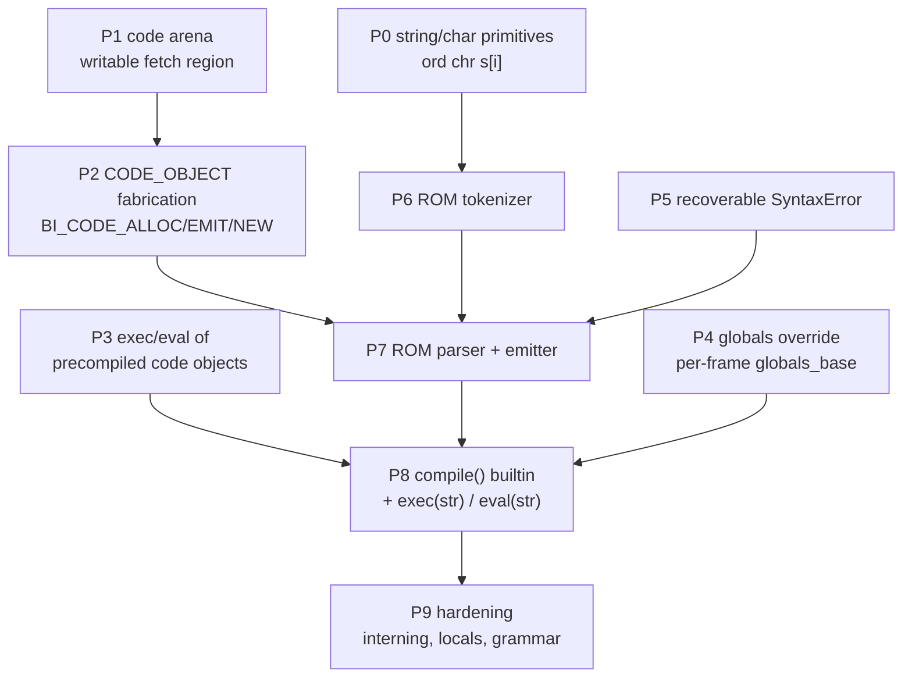

# Runtime `compile()` / `exec()` — full implementation plan

**Status:** proposed (no code written yet)
**Audience:** pycore RTL agent, bytecode agent, firmware builtins agent
**Supersedes the "next steps" sections of:**
[`pycore_firmware/builtins/compile.md`](../pycore_firmware/builtins/compile.md),
[`eval.md`](../pycore_firmware/builtins/eval.md),
[`exec.md`](../pycore_firmware/builtins/exec.md)

---

## 1. Goal

Make these work **on the device**, not on the host image builder:

```python
code = compile("x = 1 + 2\ny = x * 3\n", "<string>", "exec")
exec(code)                     # mutates module globals
v = eval(compile("x + y", "<string>", "eval"))
exec("z = v + 1")              # string form
```

### 1.1 Non-goals (explicitly out of scope)

| Not building | Why |
| --- | --- |
| CPython-identical bytecode output | Needs CPython's full optimizer + `CACHE` layout; we compare *results*, not `co_code` |
| Full Python grammar | `def`, `class`, `import`, `try`, `with`, `lambda`, decorators, comprehensions, f-strings, `*args`, generators, `async` |
| `ast` module / `compile(ast_obj, …)` | No `ast`, no imports |
| `dont_inherit` / `flags` / `optimize` semantics | Accepted and ignored (validated as 0/-1) |
| `single` mode | Interactive echo has no REPL to serve |
| Garbage collection of arena/heap | Bump allocators only; see §11 risk R4 |

---

## 2. Why this is currently blocked — the six real blockers

Everything below is verified against the tree, not inferred.

### B1. imem is physically read-only, and bytecode lives *only* in imem

Code objects hold **no `co_code`**. Field 0 is an `entry_slot` — an index into
imem — and imem is a `READ_ONLY` bank whose only master is fetch:

```3:5:pycore/rtl/pycore_imem.sv
// Instruction memory bank wrapper (Harvard, read-mostly). Each instruction is a
// 64-bit slot (40-bit folded word zero-padded to 8 bytes). The fetch unit drives
// byte addresses; writes are rejected (READ_ONLY) and surface as a fault_o.
```

```44:44:pycore/rtl/pycore_fetch.sv
    assign imem_we_o    = 1'b0;
```

Excore cannot help: the two cores share dmem but **not** imem.

```15:17:pycore/rtl/pycore_excore_system.sv
// Instruction memories are NOT shared: pycore's imem and the excore's
// private firmware imem are each their own array (Harvard per core).
```

**This is the #1 blocker.** Without a writable fetchable region, no amount of
firmware work can produce runnable code.

### B2. No runtime `CODE_OBJECT` fabrication

The 256-byte / 8-field layout is only ever built host-side by
`HeapImageBuilder.add_code_object`. `MAKE_FUNCTION` merely type-checks an
existing handle:

```848:853:pycore/rtl/pycore_core.sv
            // MAKE_FUNCTION: function is the code object itself; verify tag.
            PY_OP_MAKE_FUNCTION: begin
                if (ex_rs1_tag != PY_TAG_CODE_OBJECT) begin
                    exec_type_trap_pulse = (state_r == S_EXEC);
                end
```

### B3. No compiler anywhere on the device

pycore executes a bytecode subset; excore is 16 KB of hand-written RV32I with
no MUL/DIV and no byte stores, assembled by `excore/tools/asm_rv32.py`. Neither
hosts a tokenizer/parser today.

### B4. String primitives a tokenizer needs are missing

| Operation | Today |
| --- | --- |
| `s[i]` | **Works** — `CONT_SUBSCR_STR`, character-indexed (P0.2 landed; was a type trap) |
| `"x" in "abc"` | **Type-traps** — `CONTAINS_OP` routes strings to the LIST handler |
| `s1 < s2` | **Type-traps** — only same-tag `==` / `!=` is native |
| `ord` / `chr` | **Blocked** (wave-4 Priority C) |
| `s1 + s2` | Works (SHORT_STR inline, else LONG_STR in `string_mem`) |
| `s1 == s2` | Works — 128-bit descriptor/payload compare |
| `for c in s` | Works (`GET_ITER` STR kind) |
| `len(s)` | Works (`BI_LEN`) |

### B5. `exec`'s namespace arguments have nowhere to live

There is exactly one globals dict pointer, latched once at boot, with no
per-frame copy:

```186:191:pycore/rtl/pycore_core.sv
    // Globals dictionary base address (byte address of the DICT header).
    // Latched once by S_BOOT and read/written by LOAD_GLOBAL / LOAD_NAME /
    // STORE_NAME / STORE_GLOBAL.
    logic [31:0]                   globals_base_r;
```

`LOAD_NAME` has no locals step either (documented deviation 6 in
`bytecode_support.md`).

### B6. No recoverable `SyntaxError` with a payload

`RAISE_VARARGS 1` + exception tables + `CHECK_EXC_MATCH` exist (StopIteration),
but `CHECK_EXC_MATCH` is v1 **exact type-handle match**, and
`OBK_EXCEPTION.args` is always the empty tuple. There is no way to attach a
message.

### 2.1 One thing that is *not* blocked (important)

**Calling a `CODE_OBJECT` held in a Python variable already works on
hardware.** `filter` calls its predicate parameter, and
`img_firmware_filter_pred` passes a user `CODE_OBJECT` through it:

```15:18:pycore_firmware/builtins/filter.py
    for x in iterable:
        if function(x):
            out += [x]
    return out
```

Combined with `STORE_NAME`/`LOAD_NAME` already writing/reading the **module
globals dict**, this means a module-mode code object invoked with `CALL 0`
*already has exec semantics at module scope*. So `exec(code_object)` is nearly
free (Phase 3) and can land long before any compiler exists.

---

## 3. Architecture decision

### 3.1 Where the compiler runs: **self-hosted ROM Python on pycore**

Three candidates were considered.

| Option | Verdict |
| --- | --- |
| **Excore RV32 firmware** | **Reject.** 16 KB imem (2292/4096 words already used), no MUL/DIV, `LW`/`SW` only (no byte stores), hand-written assembly via a custom assembler. A tokenizer+parser+emitter is not writable or maintainable there. |
| **Host escape (DPI-C / TB magic MMIO)** | **Reject as the product**, adopt as a *test oracle*. Simulation-only; would make `compile` a lie on silicon. There is no host RPC today — the only escape is one-way `CONSOLE_TX` @ `0xF0`. |
| **ROM Python firmware on pycore** | **Adopt.** Exactly the existing `pycore_firmware/builtins/` pattern: write the compiler in Python, host-compile it into ROM `CODE_OBJECT`s, seed it in the builtins dict. It is testable on host CPython first, and it makes `compile()` a genuine device feature. |

The compiler therefore needs only **two new hardware capabilities**: a writable
fetchable code region, and primitives to fabricate a `CODE_OBJECT`.

### 3.2 Where new bytecode lives: **a writable code arena above imem**

Add a second, writable 64-bit-slot bank and mux fetch on the PC range. imem
stays true ROM (the silicon story: masked ROM image + code RAM).

```text
slot 0x0000 .. 0x1FFF   pycore_imem        (64 KB, READ_ONLY, $readmemh image)
slot 0x2000 .. 0x27FF   pycore_code_arena  (16 KB, writable, zeroed at reset)
```

`PYCORE_CODE_ARENA_SLOT_BASE = 32'h2000` is exactly imem's slot count
(16 blocks × 4 KB / 8 B = 8192), so the test is a single bit compare and
**`entry_slot` semantics do not change at all** — a code object in the arena is
just a code object with a large `entry_slot`.

`pycore_mem_bank` is already parameterized on `READ_ONLY`, so the arena is a
second instantiation with `READ_ONLY(0)`, not new memory RTL.

### 3.3 Consequences to accept up front

- **Not self-modifying:** writing a slot the core is currently executing is
  undefined. Arena code must be fully emitted before it is called.
- **No reclamation:** the arena is a bump allocator like the heap. Repeated
  `compile()` leaks arena slots until reset (§11 R4).
- **Identifiers ≤ 15 characters in compiled source (v1).** Runtime-built
  `LONG_STR` uses *descriptor* equality in dict probes, so two independently
  concatenated 20-char names would not compare equal as globals keys
  (`bytecode_support.md` deviation 4). Names built by the ROM compiler stay
  `SHORT_STR` while ≤ 15 bytes, where equality is a full payload compare and
  therefore correct. String *literals* may exceed 15 bytes — they are values,
  not dict keys. Lifting the limit needs interning (Phase 9.1).

---

## 4. Phase map and dependency graph



**P3 is independently shippable** and should go first for early value: it
delivers `exec(code_object)` / `eval(code_object)` with zero RTL work.
**P0, P1, P3 are mutually independent** and can proceed in parallel.

| Phase | Deliverable | Layer | Blocks |
| --- | --- | --- | --- |
| P0 | `ord`, `chr`, `s[i]` (**`s[i]` done**) | RTL + firmware | B4 |
| P1 | Writable code arena | RTL | B1 |
| P2 | `CODE_OBJECT` fabrication builtins | RTL | B2 |
| P3 | `exec(code)` / `eval(code)` | firmware + tooling | — |
| P4 | `exec(code, globals)` | RTL (frame) | B5 |
| P5 | `SyntaxError` with a message | RTL + firmware | B6 |
| P6 | Tokenizer | firmware | B3 |
| P7 | Parser + emitter | firmware | B3 |
| P8 | `compile()`, string `exec`/`eval` | firmware | — |
| P9 | Interning, `locals=`, wider grammar | RTL + firmware | §3.3 |

---

## 5. Phase 0 — string and character primitives

Prerequisite for any tokenizer. P0.1 is already queued as wave-4 Priority C in
[`builtins_wave4_plan.md`](builtins_wave4_plan.md) §3. **P0.2 (`s[i]`) is
done** — see §5.2.

### 5.0 Why the tokenizer needs so little

With `s[i]` shipped (§5.2), the lexer can index the source string directly and
no longer needs the `chars = list(src)` workaround, which cost a 32-byte heap
object per character. Character classes can be dict/set lookups
(`c in DIGITS`) since dict/set probes support `SHORT_STR` keys, so the tokenizer
can be written today with **no `ord` at all**.

We still want P0.1 because `ord` range compares are far cheaper than a dict
probe per character, and because `chr` is required to decode escapes in string
literals.

### 5.1 `BI_ORD` / `BI_CHR` (RTL, CALL FSM)

1. Assign `PY_BI_ORD = 32'd10`, `PY_BI_CHR = 32'd11` in
   `pycore/rtl/pycore_defs.svh` (next free after `PY_BI_SET = 9`); mirror
   `BI_ORD` / `BI_CHR` in `pycore/tools/encoding.py`.
2. `BI_ORD`: argc 1. `SHORT_STR` with a single UTF-8 character → `INT`
   code point, reusing the width-decode logic the STR `FOR_ITER` iterator
   already has in `pycore_cont_list.svh`. Wrong length or non-STR →
   `PY_TRAP_TYPE`. `LONG_STR` of one char routes through the same decode
   against `string_mem`.
3. `BI_CHR`: argc 1. `INT` in `0 .. 0x10FFFF`, surrogates
   `0xD800..0xDFFF` rejected → `PY_TRAP_TYPE`. Encode 1–4 UTF-8 bytes into an
   inline `SHORT_STR`.
4. Seed `ord` / `chr` as `OBK_BUILTIN` handles in `build_builtins_dict`.
5. Update `pycore/docs/object_model.md` builtin-id table and
   `pycore_firmware/builtins/builtins.md` (`ord`/`chr` → **in ROM**);
   delete the now-stale `ord.md` / `chr.md` blockers sections.

**Tests:** `img_builtin_ord.py`, `img_builtin_chr.py`,
`img_builtin_ord_unicode.py` (multi-byte round trip),
`img_builtin_ord_len_trap.py`, `img_builtin_chr_range_trap.py`
(`PYCORE_IMAGE_TRAP_RUN` with code 1). Then ROM-seed `ascii` and add
`img_firmware_ascii.py`.

### 5.2 STR subscript `s[i]` — **DONE**

Shipped as `CONT_SUBSCR_STR` (6'd44). Total cost was ~120 lines of RTL and
**no tooling change**, because `BINARY_OP` / `NB_SUBSCR` was already an accepted
oparg — `s[i]` built fine and only trapped at runtime.

What made it cheap: `pycore_string_mem.sv` already exposes a **combinational**
4-byte read port (`read_addr_i` / `read_data_o`) wired into the container path
for STR `FOR_ITER`, and `pycore_defs.svh` already had
`pycore_utf8_char_width`, `pycore_utf8_cont_valid`, `pycore_short_str_byte`,
and `pycore_make_short_str_entry`.

Implementation notes:

1. `pycore_core.sv` routes `NB_SUBSCR` on `pycore_is_string_tag` to the new arm,
   and muxes `string_read_addr` between the iterator and the subscript walk.
2. `cont_str_win` presents the **same 4-byte, lead-byte-first window** for both
   tags — `SHORT_STR` bytes come from the inline payload via
   `pycore_short_str_byte`, `LONG_STR` bytes from `string_read_data`. One decode
   path serves both, and **no `string_mem` snapshot is allocated** (unlike STR
   `GET_ITER`, which snapshots `SHORT_STR` and therefore leaks runtime string
   space on every call).
3. The arm walks one character per cycle (`container_probe_r` = byte offset,
   `container_src_len_r` = characters left to skip), so cost is O(i) — the same
   model as STR `FOR_ITER`. Reuses `CP_INIT` / `CP_VAL` / `CP_DONE`.
4. Index past the last character → `PY_TRAP_MEM_FAULT`; malformed UTF-8 →
   `PY_TRAP_TYPE`. Negative indices still trap (deviation 3).

**Tests (all passing):** `img_str_subscr`, `img_str_subscr_long`,
`img_str_subscr_unicode`, `img_str_subscr_loop`, `img_str_subscr_oob_trap`,
`img_str_subscr_char_oob_trap`.

Documented as `bytecode_support.md` deviation 14: `len(s)` is a **byte** count
while `s[i]` and `for c in s` are **character**-stepped. They agree for ASCII;
for non-ASCII `range(len(s))` overruns and faults rather than returning a
partial byte.

### 5.3 Deferred to P9

STR `COMPARE_OP` ordering (`<`, `<=`, `>`, `>=`) and substring `CONTAINS_OP`
are **not** required: the compiler uses `==` and dict/set lookups only.

---

## 6. Phase 1 — the writable code arena

### 6.1 New RTL

Create `pycore/rtl/pycore_code_arena.sv` as a thin wrapper over
`pycore_mem_bank` with `READ_ONLY(0)`, `DATA_WIDTH(64)`, 4 blocks (16 KB /
2048 slots), no `INIT_HEX`. Add it to `PYCORE_RTL_SRCS` in the `Makefile`.

New parameters in `pycore/rtl/pycore_defs.svh`, mirrored in
`pycore/tools/encoding.py`:

```systemverilog
// Writable code arena — fetchable slots above the read-only image imem.
// Runtime-compiled bytecode (compile()/exec()) is emitted here; entry_slot
// semantics are unchanged, the slot index is simply >= the arena base.
localparam logic [31:0] PYCORE_CODE_ARENA_SLOT_BASE  = 32'h0000_2000; // imem slots
localparam logic [31:0] PYCORE_CODE_ARENA_SLOTS      = 32'h0000_0800; // 2048
localparam logic [31:0] PYCORE_CODE_ARENA_SLOT_LIMIT =
    PYCORE_CODE_ARENA_SLOT_BASE + PYCORE_CODE_ARENA_SLOTS;
```

### 6.2 Fetch-side mux

In `pycore_fetch.sv` / `pycore_system.sv`, route the fetch request by slot
index. Keep the existing byte-address shift so nothing downstream changes:

```systemverilog
wire sel_arena = (pc_r >= PYCORE_CODE_ARENA_SLOT_BASE);
```

- `sel_arena == 0` → existing `pycore_imem` port, unchanged.
- `sel_arena == 1` → arena port at `(pc_r - PYCORE_CODE_ARENA_SLOT_BASE) << 3`.
- `pc_r >= PYCORE_CODE_ARENA_SLOT_LIMIT` → `PY_TRAP_MEM_FAULT` (do **not**
  silently wrap).

Latency must match imem (same one-cycle bank, same `awaiting_r` handshake) so
`pycore_fetch.sv` needs no new stall state.

### 6.3 Arena allocation pointer

Add `code_arena_ptr_r` to `pycore_core.sv` beside `heap_ptr_r`, reset to
`PYCORE_CODE_ARENA_SLOT_BASE`. It is bumped only by `BI_CODE_ALLOC` (P2).
Mirror the pattern already used for `HEAP_INIT_PTR`: expose
`CODE_ARENA_INIT_SLOT` as a parameter so images could pre-place arena code
later.

### 6.4 Tests (P1 alone, before P2 exists)

Arena fetch is testable without any fabrication builtin by having the image
builder place a code object *in the arena* at build time:

1. Add `--arena-seed` support to `image_from_source.py`: emit a nominated
   function's slots into a separate `arena.hex` and set its `entry_slot`
   above the arena base.
2. `tb_container.sv` / `tb_two_core.sv` gain an `ARENA_HEX` parameter
   `$readmemh`'d into the arena bank (test-only preload).
3. `img_arena_call.py` — call a function whose bytecode lives in the arena;
   compare against the host golden.
4. `img_arena_oob_trap.py` — jump past `SLOT_LIMIT` → trap 7.

**Acceptance:** identical results for a function executed from imem vs. arena;
no change in any existing `pycore-img-*` target.

---

## 7. Phase 2 — `CODE_OBJECT` fabrication primitives

Three new native builtins. All are pure dmem/arena writes on pycore — excore
is not involved (it cannot reach imem or the arena).

Ids continue from P0: `PY_BI_CODE_ALLOC = 12`, `PY_BI_CODE_EMIT = 13`,
`PY_BI_CODE_NEW = 14`.

### 7.1 `_bi_code_alloc(nslots) -> int`

Bump `code_arena_ptr_r` by `nslots` and return the **base slot index**. Arena
exhaustion (`ptr + nslots > PYCORE_CODE_ARENA_SLOT_LIMIT`) →
`PY_TRAP_MEM_FAULT`. Non-`INT`/negative/zero → `PY_TRAP_TYPE`.

### 7.2 `_bi_code_emit(slot, opcode, oparg) -> None`

Write one arena slot in the existing imem word format
(`bits[39:8] = arg`, `bits[7:0] = opcode`, per `format_imem_slot`).

- `slot` must be within `[PYCORE_CODE_ARENA_SLOT_BASE, code_arena_ptr_r)` —
  i.e. inside already-allocated arena space. Anything else, including any
  address in read-only imem, → `PY_TRAP_MEM_FAULT`.
- `opcode` must be `0..255`; `oparg` `0..0xFFFFFFFF`; else `PY_TRAP_TYPE`.
- **Absolute slot addressing on purpose:** this makes jump patching a re-emit
  of an already-written slot, with no separate patch API.

Because `OBK_BUILTIN` CALL paths are positional-only
(kwargs → `CALL_FILTER`), all three take positional args only.

### 7.3 `_bi_code_new(fields) -> CODE_OBJECT`

Takes a **LIST of exactly 8 elements** (avoids a 8-argument marshalling path in
the CALL FSM) and copies element *i* into code-object field *i* of a freshly
bump-allocated 256-byte object, then returns the `PY_TAG_CODE_OBJECT` handle.

| i | Field | Required tag | v1 constraint |
| --- | --- | --- | --- |
| 0 | `entry_slot` | `INT` | must be in `[ARENA_SLOT_BASE, code_arena_ptr_r)` |
| 1 | `co_consts` | `TUPLE` | built in Python via `(*lst,)` |
| 2 | `co_names` | `TUPLE` | all elements `SHORT_STR` (§3.3) |
| 3 | `metadata` | `INT` | see below |
| 4 | `co_defaults` | `TUPLE` | `()` |
| 5 | `co_varnames` | `TUPLE` | `()` for module mode |
| 6 | `co_kwdefaults` | `MUT_DICT` | `{}` |
| 7 | `co_exceptiontable` | `TUPLE` | `()` — no `try` in v1 |

Wrong length, wrong tag, or `heap_ptr + 256 > PYCORE_HEAP_LIMIT` → trap
(`PY_TRAP_TYPE` / `PY_TRAP_MEM_FAULT`).

**Metadata is built in Python, and only the low 48 bits are usable.** `INT` is
a signed i64 fast path, but `pack_code_metadata` puts `posonlyargcount` at bits
`[81:66]`. v1 compiled code therefore has `varargs = varkw = posonly = 0` and
`kwonlyargcount = 0`, leaving `argcount[15:0] | nlocals[31:16] |
stacksize[47:32]` — comfortably inside i64:

```python
meta = argcount | (nlocals << 16) | (stacksize << 32)
```

Note `stacksize` is not consumed by hardware today (deviation 10, no stack
overflow detection); emit a generous value.

### 7.4 Host stand-ins

`image_from_source.py` needs host equivalents so differential goldens still
run under CPython, alongside `_host_bi_print`:

- `_host_bi_code_alloc` / `_host_bi_code_emit` — accumulate `(opcode, oparg)`
  into a per-arena list.
- `_host_bi_code_new` — assemble the slot list into a real CPython
  `types.CodeType` via `CodeType.replace`, so the host `exec`/`eval` of a
  ROM-compiled code object exercises the *same emitted stream* the device runs.

This host assembler is the highest-value test asset in the whole plan: it lets
P6/P7 be developed and debugged entirely under CPython before any simulation.

### 7.5 Tests

- `pycore/tests/test_code_fabrication.py` — host unit tests for the stand-ins
  and for `pack_code_metadata` round trips.
- `img_code_new_call.py` — allocate 4 slots, emit
  `RESUME 0; LOAD_SMALL_INT 7; RETURN_VALUE`, `_bi_code_new`, call it, expect 7.
- `img_code_emit_range_trap.py` — emit outside the allocated span → trap 7.
- `img_code_new_bad_field_trap.py` — field 2 containing a non-tuple → trap 1.
- `img_code_arena_exhaust_trap.py` — allocate past the limit → trap 7.

**Acceptance:** a code object built entirely from Python at runtime executes and
returns the right value.

---

## 8. Phase 3 — `exec` / `eval` of precompiled code objects

**No RTL. Ship this first.** Per §2.1 the hardware already does what we need.

### 8.1 Firmware

```python
# pycore_firmware/builtins/exec.py
def exec(code):
    code()
    return None
```

```python
# pycore_firmware/builtins/eval.py
def eval(code):
    return code()
```

Correctness argument, all from existing behaviour:

- `CALL` on a `PY_TAG_CODE_OBJECT` in a local is proven by
  `img_firmware_filter_pred`.
- A `compile(src, f, "exec")` object has `co_argcount == 0`, so `CALL 0`
  binds cleanly.
- Its `STORE_NAME` / `LOAD_NAME` hit `globals_base_r`, i.e. the **real module
  globals** — module-scope `exec` semantics, for free.
- It ends in `RETURN_VALUE` of `None`; `exec` discards and returns `None`
  explicitly. `"eval"`-mode objects return the expression value.

Seed `exec` / `eval` in `ROM_FIRMWARE_BUILTINS`.

### 8.2 Tooling: a way to get a code object into globals

Add a `SEED_CODE` pragma to `image_from_source.py`, mirroring the existing
`SEED_TYPE` / `SEED_INSTANCE` pragmas documented in `object_model.md`:

```python
# pycore-inject: SEED_CODE snippet mode=exec source="x = 1 + 2"
```

It host-`compile()`s `source` in `mode`, validates it with
`validate_code_tree`, serializes it, and binds the handle to the named global.
`run_image_test.py` mirrors it with a plain host `compile()` so the
differential golden still works.

### 8.3 Tests

| Program | Intent |
| --- | --- |
| `img_exec_code_basic.py` | `exec(snippet)` where snippet is `x = 1 + 2`; then read `x` |
| `img_exec_code_globals_rw.py` | Snippet reads a pre-existing global and writes a new one |
| `img_eval_code_expr.py` | `eval(snippet)` in `"eval"` mode returns a value |
| `img_exec_code_returns_none.py` | `exec(...) is None` |
| `img_exec_bad_arg_trap.py` | `exec(5)` → trap 1 |

**Acceptance:** `exec` / `eval` marked **in ROM** in `builtins.md`, with
`compile`-less string forms still blocked.

---

## 9. Phase 4 — `globals=` override

Needed for `exec(code, g)` and for compiling into a sandbox namespace.

### 9.1 Make `globals_base_r` per-frame

Today it is latched once at boot. Save and restore it across CALL/RETURN:

1. `pycore_frame.sv`: the frame descriptor is two 128-bit slots, and slot 1
   already carries `cur_code_r[31:0]`, `ret_discard_push_self`, and a 64-bit
   `saved_instance_addr` (bits 33–96). Bits `[127:97]` are free — park the
   caller's 32-bit `globals_base_r` there. **No third slot, no size change**;
   `FRAME_ENTRY_BYTES` stays 32 and the 512-frame capacity is preserved.
2. On frame push, save the current value; on pop, restore it. Default
   behaviour is unchanged because the callee inherits the caller's value.

### 9.2 `_bi_exec_globals(code, globals_dict)` (`PY_BI_EXEC_GLOBALS = 15`)

A CALL-FSM variant of the ordinary `CODE_OBJECT` call that additionally sets
`globals_base_r` to the supplied `MUT_DICT` for the new frame. Non-dict →
`PY_TRAP_TYPE`. Firmware:

```python
def exec(code, globals=None):
    if globals is None:
        code()
    else:
        _bi_exec_globals(code, globals)
    return None
```

### 9.3 Tests

`img_exec_globals_dict.py` (snippet writes into a caller-supplied dict, module
globals untouched), `img_exec_globals_read.py` (snippet reads a pre-seeded key),
`img_exec_globals_type_trap.py`, `img_exec_globals_restore.py` (globals restored
after return — the regression that matters most), plus a re-run of
`pycore-img-call-all` to prove the frame repack broke nothing.

### 9.4 Deferred

`locals=` needs a real frame-locals mapping and an LEGB step in `LOAD_NAME`
(deviation 6). That is P9.2. Until then `exec(code, g, l)` with a distinct `l`
raises.

---

## 10. Phase 5 — recoverable `SyntaxError`

The compiler must be able to reject bad source without halting the machine.

1. **Seed the type.** Add `SyntaxError` as a leaf `OBK_TYPE` in
   `build_builtins_dict`, exactly like the existing `StopIteration` seed. Add
   `ValueError` and `TypeError` at the same time — they cost one `alloc_type`
   each and unblock error reporting across all of `pycore_firmware`.
2. **Confirm `raise <type>` populates `exc_type`.** `RAISE_VARARGS 1` already
   allocates `OBK_EXCEPTION` with an empty args tuple and walks code field 7;
   verify field0 is the raised handle so `CHECK_EXC_MATCH`'s exact-handle
   compare matches `except SyntaxError:`.
3. **Message convention (v1).** `OBK_EXCEPTION.args` is always `()` and
   `CALL` on an `OBK_TYPE` builds an `OBK_INSTANCE`, not an exception — so
   `SyntaxError("msg")` is *not* available. v1 convention: the compiler writes
   the message and source offset to module globals
   (`_compile_error_msg`, `_compile_error_pos`) immediately before
   `raise SyntaxError`. Document this as a deviation.
4. **P9.3 (optional):** teach `RAISE_VARARGS` to accept a
   `(type, args_tuple)` shape so `args` is populated properly.

**Tests:** `img_raise_syntaxerror.py` (fatal trap 17 with no handler),
`img_try_syntaxerror.py` (caught by `except SyntaxError:`),
`img_syntaxerror_msg_global.py`.

---

## 11. Phase 6 — the ROM tokenizer

New tree: `pycore_firmware/compiler/`, seeded through the same
`ROM_FIRMWARE_BUILTINS` mechanism (extend the registry to accept a
subdirectory, or add a parallel `ROM_FIRMWARE_COMPILER` tuple).

### 11.1 Constraints the source itself must obey

The compiler is ROM firmware, so **its own** bytecode must pass
`validate_code_tree`. That means: module-level `def`s only (no nested defs or
closures), no `import`, no `class`, no f-strings, no `*args`/`**kwargs` beyond
what the binder supports, no `while/else`, no augmented ops outside the
supported `BINARY_OP` set. `if/elif/else`, `while`, `for`, `return`, lists,
tuples, dicts, and (post-Track-C) list comprehensions are available.

### 11.2 Token representation

Avoid objects and per-token allocation pressure. A token is a **3-element
list** `[kind, value, pos]`, and the lexer returns a list of tokens.

`kind` is a small `INT` (`TOK_INT`, `TOK_STR`, `TOK_NAME`, `TOK_OP`,
`TOK_NEWLINE`, `TOK_INDENT`, `TOK_DEDENT`, `TOK_EOF`) so all comparisons are
native `INT` compares.

### 11.3 `pycore_firmware/compiler/lexer.py`

```python
def tokenize(src):
    chars = list(src)          # STR GET_ITER + list(); avoids needing s[i]
    ...
```

- Character classification by `ord(c)` range compares (P0.1); dict lookups
  (`c in _OPS1`) for operator tables.
- Numbers: decimal `INT` only in v1; accumulate `n = n * 10 + DIGIT[c]`.
- Strings: `'` and `"`, with `\\n`, `\\t`, `\\\\`, `\\'`, `\\"` escapes decoded
  via `chr` (P0.1). Result strings are built by concatenation.
- Names: accumulate by concatenation; **reject > 15 characters** with a
  `SyntaxError` (§3.3) so the interning hazard is a clean, explicit error
  rather than silent misbehaviour.
- Indentation: emit `INDENT` / `DEDENT` from a stack of column counts; spaces
  only, tabs rejected.
- Comments (`#`) skipped; blank lines produce no `NEWLINE`.

### 11.4 Tests

- `pycore/tests/test_rom_lexer.py` — host unit tests over the ROM source
  (import it via the existing `load_rom_firmware_callables()` mechanism) for
  every token kind, escapes, indent/dedent, and each `SyntaxError` case.
- `img_lexer_count.py` — device: tokenize a literal and return the token count.
- `img_lexer_name_too_long_trap.py` — the > 15-char rejection on hardware.

---

## 12. Phase 7 — the ROM parser and emitter

### 12.1 Design: single-pass, no AST

Emit bytecode directly during a precedence-climbing parse. Rationale:

- **Heap pressure.** The heap is 109,504 bytes of bump allocator with **no
  GC**. An AST would double or triple live allocation for no benefit.
- **RF depth.** Frames share one flat `RF_DEPTH = 256` register file and
  `MAX_CALL_DEPTH_CORE = 128`; `img_deep_callgraph` already exercises ~25 live
  frames. Precedence climbing keeps expression recursion to one frame per
  precedence level (~6) instead of one per AST node.

### 12.2 `pycore_firmware/compiler/emitter.py`

A code-builder "object" represented as a plain list (no classes in ROM):

```text
[base_slot, n_emitted, consts_list, names_list, max_slots]
```

- `emit(cb, opcode, oparg)` → `_bi_code_emit(base + n, opcode, oparg)`; `n += 1`.
- `const_index(cb, value)` / `name_index(cb, name)` → append-and-return-index,
  with a linear `==` scan for dedup (`SHORT_STR` `==` is native).
- `patch(cb, slot, opcode, oparg)` → re-emit an absolute slot (§7.2).
- `finish(cb, argcount, nlocals, stacksize)` → build the 8-element field list
  and call `_bi_code_new`.

**Two-pass sizing.** `_bi_code_alloc` needs a slot count before emission.
Simplest correct approach: run the parse twice — pass 1 counts slots into a
null emitter, pass 2 emits for real. Both passes are deterministic, so counts
agree. (Alternative: allocate a generous block and waste the tail. Prefer two
passes — arena space is scarcer than cycles.)

**Jump patching.** Always emit a forward jump as the **pair**
`EXTENDED_ARG 0` + `JUMP_* <lo>`, reserving room for a 16-bit delta so
patching never resizes the stream. Deltas are computed in code units the same
way CPython does — target offset minus the offset *after* the jump — and
because we emit no `CACHE` slots, our deltas are self-consistent (§12.4).

### 12.3 `pycore_firmware/compiler/parser.py`

v1 grammar, chosen so every construct maps onto opcodes already listed as
fully supported in `bytecode_support.md`:

| Construct | Emits |
| --- | --- |
| int / str literal | `LOAD_SMALL_INT` (0–255) or `LOAD_CONST` |
| `True` / `False` / `None` | `LOAD_CONST` |
| name load | `LOAD_NAME` |
| `name = expr` | `STORE_NAME` |
| `+ - * // % & \| ^ << >>` | `BINARY_OP` with the validated oparg |
| unary `-` / `not` | `UNARY_NEGATIVE` / `TO_BOOL` + `UNARY_NOT` |
| `== != < <= > >=` | `COMPARE_OP` with the CPython 3.14 packed oparg |
| `is` / `is not` | `IS_OP` |
| `in` / `not in` | `CONTAINS_OP` |
| `f(a, b)` | `PUSH_NULL` + args + `CALL n` |
| `x[k]` | `BINARY_OP` `NB_SUBSCR`; `x[k] = v` → `STORE_SUBSCR` |
| `x.attr` | `LOAD_ATTR` / `STORE_ATTR` |
| list / tuple / dict / set display | `BUILD_LIST` / `BUILD_TUPLE` / `BUILD_MAP` / `BUILD_SET` |
| `if` / `elif` / `else` | `TO_BOOL` + `POP_JUMP_IF_FALSE` + `JUMP_FORWARD` |
| `while` | `TO_BOOL` + `POP_JUMP_IF_FALSE` + `JUMP_BACKWARD` |
| `for x in it:` | `GET_ITER` / `FOR_ITER` / `STORE_NAME` / `END_FOR` / `POP_ITER` |
| `pass` | nothing |
| expression statement | expr + `POP_TOP` |
| module end | `LOAD_CONST None` + `RETURN_VALUE` |

Precedence table (loosest → tightest): `or`, `and`, `not`, comparisons/`in`/
`is`, `|`, `^`, `&`, `<< >>`, `+ -`, `* // %`, unary, call/subscript/attribute,
atom.

`break` / `continue` are easy follow-ons (patch lists) but are P9.4.

Anything unrecognized → `SyntaxError` per §10.3. **Never** emit an opcode
outside the supported set: add a firmware-side assertion table mirroring
`SUPPORTED_OPS` so a compiler bug surfaces as `SyntaxError`, not an illegal
opcode trap.

### 12.4 Deviations to document

1. **No `CACHE` padding.** CPython 3.14 emits inline cache units after
   `LOAD_GLOBAL`, `CALL`, `BINARY_OP`, `COMPARE_OP`, etc. PyCore's fetch skips
   `CACHE` slots, so ROM-compiled code omits them entirely. Jump deltas are
   internally consistent; the stream is **not** byte-identical to
   `CPython compile()` output for the same source. Differential tests compare
   *program results*.
2. **`LOAD_NAME` everywhere, no fast locals.** Module-mode only, so
   `nlocals = 0`.
3. **`LOAD_GLOBAL` low-bit convention.** If the compiler ever emits
   `LOAD_GLOBAL`, `namei = oparg >> 1` and bit 0 requests the `NULL` push.
   v1 uses `LOAD_NAME` and sidesteps this.

### 12.5 Tests

- `pycore/tests/test_rom_compiler.py` — host: for ~40 snippets, run the ROM
  compiler through the P7.4 host assembler, `exec` the result under CPython,
  and compare against CPython's own `exec` of the same source. This is where
  the grammar actually gets validated.
- `img_compile_expr_arith.py`, `img_compile_if_else.py`,
  `img_compile_while_sum.py`, `img_compile_for_list.py`,
  `img_compile_call_builtin.py` (compiled code calling `len`),
  `img_compile_dict_subscr.py` — device differentials.
- `img_compile_syntax_error_trap.py` — malformed source raises.

---

## 13. Phase 8 — the `compile()` builtin and string `exec` / `eval`

### 13.1 `pycore_firmware/builtins/compile.py`

```python
def compile(source, filename, mode, flags=0, dont_inherit=False, optimize=-1):
    if flags != 0:
        raise ValueError
    toks = tokenize(source)
    if mode == "exec":
        return compile_module(toks)
    if mode == "eval":
        return compile_expression(toks)
    raise ValueError            # "single" unsupported
```

`filename` is accepted and ignored (there are no tracebacks). `mode` compares
`SHORT_STR` `==` — native. Defaults are folded at seed time by
`seed_firmware_function`, so the keyword form works via `CALL_KW`.

### 13.2 String `exec` / `eval`

```python
def exec(source, globals=None):
    if _is_code(source):
        code = source
    else:
        code = compile(source, "<string>", "exec")
    ...
```

`_is_code` needs a tag probe — `callable`/`type` have the same gap
(`builtins.md` marks both **in progress**). Add
`PY_BI_IS_CODE = 16` returning `BOOL` for `PY_TAG_CODE_OBJECT`; it also
unblocks `callable`. Alternatively try `_bi_code_kind(x)` returning a small
`INT` tag id, which would additionally unblock `type` / `repr` / `str`
dispatch — **preferred**, since several in-progress builtins need exactly this.

### 13.3 Wiring

- Add `compile`, `exec`, `eval` to `ROM_FIRMWARE_BUILTINS`.
- Extend `load_rom_firmware_callables()` so host goldens use the ROM bodies,
  with `_bi_code_*` bound to the P7.4 host stand-ins.
- Mark `compile` / `eval` / `exec` **in ROM** in `builtins.md`; rewrite
  `compile.md` / `eval.md` / `exec.md` from "blocked" to a description of the
  shipped subset and its deviations.
- Update `bytecode_support.md` (arena, STR subscript, new builtin ids) and
  `object_model.md` (builtin-id table, code-arena section).
- `pycore/docs/architecture.md`: add the code arena to the memory map.

### 13.4 Tests

| Program | Intent |
| --- | --- |
| `img_compile_exec_roundtrip.py` | `exec(compile("x = 1 + 2", "<s>", "exec"))`, read `x` |
| `img_compile_eval_expr.py` | `eval(compile("2 * 21", "<s>", "eval"))` |
| `img_exec_str_direct.py` | `exec("y = 5")` string form |
| `img_eval_str_direct.py` | `eval("y + 1")` |
| `img_compile_exec_nested.py` | Compiled code that itself calls `compile` + `exec` |
| `img_compile_mode_trap.py` | `mode="single"` raises |
| `img_compile_arena_reuse.py` | Several `compile()` calls in one run; arena bump correctness |

Add `pycore-img-compile-all` aggregating them, and wire it into `all-tests`
alongside `pycore-img-attr-all` / `pycore-img-call-all`.

**Acceptance for the whole plan:** `img_compile_exec_roundtrip` and
`img_eval_str_direct` pass on the two-core top, and `make all-tests` is green.

---

## 14. Phase 9 — hardening and follow-ons

| # | Item | Unlocks |
| --- | --- | --- |
| 9.1 | **Runtime string interning.** Either content-based `LONG_STR` equality in `pycore_dict_key_rich_eq` + `COMPARE_OP` (needs the dict-probe path to reach `string_mem`, which is a cross-domain change), or a `BI_INTERN` canonicalizing table. | Identifiers > 15 chars; retires deviation 4 |
| 9.2 | **Frame-locals mapping + LEGB `LOAD_NAME`.** | `exec(code, g, l)`; `locals()`; `vars()`; class bodies; `LOAD_BUILD_CLASS` |
| 9.3 | `RAISE_VARARGS` with an args tuple. | Real exception messages, not the globals convention |
| 9.4 | `break` / `continue`, `and`/`or` short-circuit polish, chained comparisons, `+=`. | Wider grammar |
| 9.5 | `def` inside compiled source. | Needs `MAKE_FUNCTION` on a runtime code object — mostly already works; needs nested `_bi_code_new` and fast locals |
| 9.6 | Arena reclamation / GC. | Long-running `compile()` workloads (§15 R4) |
| 9.7 | STR ordering `COMPARE_OP`, substring `CONTAINS_OP`. | `sorted`/`min`/`max` on str; nicer lexer |

---

## 15. Risks

| # | Risk | Mitigation |
| --- | --- | --- |
| R1 | **Compiler exceeds practical ROM size.** Lexer + emitter + parser is realistically 800–1500 lines of Python, all serialized as `CODE_OBJECT`s + consts into imem and the heap. imem is only 8192 slots and already holds the whole boot image. | Measure early: after P6 land a size report in `image.meta` (slots + heap bytes per ROM module). imem is a `PYCORE_IMEM_BLOCK_COUNT` parameter — raising 16 → 32 is a one-line change if needed. |
| R2 | **RF exhaustion during parse.** One flat 256-entry RF shared by all frames; `MAX_CALL_DEPTH_CORE = 128`. Precedence climbing plus statement nesting could reach ~20 frames with locals. | Precedence climbing (not per-node recursion); keep locals per function small; `RF_DEPTH` is a parameter. Add `img_compile_deep_expr.py` with a deliberately nested expression as a depth regression. |
| R3 | **Heap exhaustion from token lists.** ~128 B/token with no GC, on a 109 KB heap shared with everything else. | Free-form: tokenize into a flat list of small lists; drop the token list before emission (pass 2 re-tokenizes rather than holding both). Cap source length and raise on overflow rather than trapping. |
| R4 | **No reclamation of arena or heap.** Every `compile()` permanently consumes arena slots and heap. | Document as a known limit; `img_compile_arena_reuse.py` pins the behaviour; GC is already a stated future milestone in `README.md`. |
| R5 | **Simulation cycle budget.** Existing firmware targets already run at 500 k cycles; a full compile is far heavier. | Give compile tests their own generous cycle caps; keep device programs to tiny sources and rely on host tests (§12.5) for grammar breadth. |
| R6 | **Frame-descriptor repack (P4) breaks CALL.** Slot 1 is dense. | The 31 free high bits are sufficient with no size change; re-run `pycore-img-call-all` and `pycore-img-for-loop-all` as the gate. |
| R7 | **Arena fetch latency mismatch** stalls or corrupts the pipeline. | Instantiate the same `pycore_mem_bank` so timing is identical; `img_arena_call.py` compares an arena-resident function against its imem twin. |

---

## 16. Suggested owner split

| Track | Owner | First deliverable |
| --- | --- | --- |
| P0 strings/chars | pycore RTL (CALL FSM + container) | `BI_ORD` / `BI_CHR` + `img_builtin_ord` |
| P1 arena | pycore RTL (fetch/mem) | `pycore_code_arena.sv` + `img_arena_call` |
| P2 fabrication | pycore RTL (CALL FSM) + tooling | `img_code_new_call` |
| P3 exec/eval | firmware + tooling | `SEED_CODE` + `img_exec_code_basic` |
| P4 globals | pycore RTL (frame) | `img_exec_globals_dict` |
| P5 exceptions | pycore RTL + firmware | `img_try_syntaxerror` |
| P6/P7 compiler | firmware compiler agent | `test_rom_compiler.py` green on host |
| P8 wiring | firmware agent | `img_compile_exec_roundtrip` |

---

## 17. Shortest path to a demo

If the goal is the earliest possible end-to-end `exec("x = 1 + 2")`:

**P3 → P1 → P2 → P0.1 → P6 → P7 (expressions + assignment only) → P8.**

P4 (globals override), P5 (SyntaxError), and the rest of the grammar can all
follow, because module-scope `exec` needs neither. P3 on its own is worth
landing immediately: it turns two "blocked" builtins into "in ROM" with no
hardware change at all.
