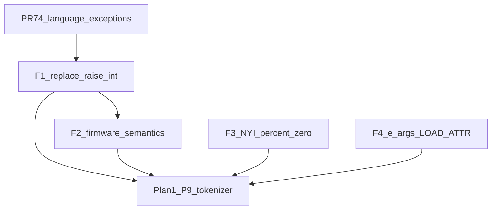

# Exceptions post-merge follow-up — firmware raises and related leftovers

**Status:** F1 implemented and verified; F2–F4 pending  
**Audience:** firmware agent (primary); host-test / Makefile agent; RTL only for F4  
**Parent:** [`exceptions_full_support_plan.md`](exceptions_full_support_plan.md) (language-level exceptions landed)  
**Prerequisite:** PR #74 on `main` (`raise TypeError` / construction / cross-frame unwind / bare raise). Branch from post-merge `main`; do **not** pile this onto `cursor/for-loop-full-impl`.  
**Unblocks:** catchable firmware errors (`except ValueError:` around `range(..., 0)`), Plan 1 tokenizer error paths that raise from ROM helpers, honest NYI stubs, and (separately) `e.args` message round-trips for P7/P9

Related:

- Exception type tracker: [`pycore/docs/exception_support.md`](../pycore/docs/exception_support.md) + `pycore.json` `exceptions.types`
- Firmware index: [`pycore_firmware/builtins/builtins.md`](../pycore_firmware/builtins/builtins.md)
- Plan 1 P7 / tokenizer: [`code_loading_bios_tokenizer_plan.md`](code_loading_bios_tokenizer_plan.md) §9.1
- Wave-4 attr helpers: [`builtins_wave4_plan.md`](builtins_wave4_plan.md)

---

## 0. Handoff (implementing agent)

**What #74 already did:** user bytecode can `raise TypeError`, `raise TypeError("x")`, match via MRO / tuples, unwind across frames, and bare-`raise` inside `except`. Unhandled raise still ends in fatal `PY_TRAP_RAISE` (17). Nothing prints a traceback.

**What this plan is for:** ROM Python and a few docs/tests still use **pre-exception halt hacks**. After Track 2, `raise 1` is **not** an unhandled Python raise — it is “TOS is neither a type nor an exception” → `PY_TRAP_TYPE` (1). Callers cannot `except ValueError:` around those sites. Fix the firmware sources; do not re-open matching / construction / unwind RTL.

**Preflight:**

```bash
git log -1 --oneline origin/main   # must contain PR #74
rg -n 'raise [0-9]+' pycore_firmware/
rg -n 'return 1 % 0' pycore_firmware/
```

**Regression that must stay green:**

- `make PYTHON=python3.14 pycore-python-tests`
- `make PYTHON=python3.14 pycore-img-exc-all`
- Firmware aggregates already on `main` (`pycore-img-firmware-*`, especially `wave3-pow`, `attr-helpers`)

**Do not:**

- Seed `NotImplementedError` / Wave B only to please NYI stubs (exceptions T5-B)
- Convert hardware traps (`1+"a"` → catchable `TypeError`) — that is exceptions **T6**
- Implement `assert` / `with` / user subclasses / `except*` / generators (T7 / T9–T12)
- Gate F1 on `LOAD_ATTR args` / traceback objects
- Use `raise T(a, b)` (argc > 1) until CALL exception packing supports it
- Treat `hasattr` as a raise-1 bug (it must not raise; MRO gaps stay wave-4)

---

## 1. Verdict

`raise TypeError` on **user** programs already works. The leftover is **ROM `.py` bodies** (and a short list of related firmware lies) that never switched off the halt hacks.

| Track | What | Layer | Ship as |
| --- | --- | --- | --- |
| **F1** | Replace every `raise <int>` with a CPython type | firmware + host tests + docs | **Required first PR** |
| **F2** | Firmware that still avoids raising (`getattr`, empty `min`/`max`) | firmware + images | Second PR (or F1 if tiny) |
| **F3** | NYI stubs `return 1 % 0` → `raise TypeError` | firmware | Optional / later PR |
| **F4** | Read `e.args` so Plan 1 message round-trips work | RTL + image | Separate RTL track; catalog here only |



Hardware traps (`PY_TRAP_TYPE`, `PY_TRAP_DIV_ZERO`, …) stay fatal until exceptions T6. This plan only changes **Python-level** `raise` sites in ROM.

---

## 2. Baseline (after #74 — do not re-implement)

| Piece | Lock |
| --- | --- |
| Wave A types in boot builtins | `TypeError`, `ValueError`, `StopIteration`, `AttributeError`, `SyntaxError`, … with MRO parents |
| `CALL` of exception type | `OBK_EXCEPTION`; argc 0 empty args; argc 1 one-element tuple |
| `RAISE_VARARGS` 1 | TYPE → alloc; EXCEPTION → reuse; other kinds → `PY_TRAP_TYPE` |
| Cross-frame unwind | callee miss → caller table; module miss → trap 17 |
| Protocol `FOR_ITER` StopIteration | identity vs `iter_exhaust_type_r`, not MRO |

Docs that are **stale** until F1 lands:

- [`builtins.md`](../pycore_firmware/builtins/builtins.md) row: “`RAISE_VARARGS` oparg 1 is fatal-only … Prefer `raise` over `% 0`”
- Comments in `range.py` / `pow.py` / `ord.py` / `chr.py` that say “fatal until exception objects exist”
- [`test_rom_firmware_seed.py`](../pycore/tests/test_rom_firmware_seed.py) `test_pow_negative_exp_with_mod_raises` expects `TypeError` only because `raise 0` is a TypeError on **host** CPython

---

## 3. F1 — Replace firmware `raise <int>` (required)

### 3.1 Mapping (CPython type, not the old int code)

Prefer bare `raise ValueError` / `raise TypeError` / `raise StopIteration`. Optional `raise T("msg")` is legal after #74 (one-arg CALL). Do **not** use argc > 1.

| File | Site | Replace with | Notes |
| --- | --- | --- | --- |
| [`range.py`](../pycore_firmware/builtins/range.py) | `step == 0` | `ValueError` | CPython: `range() arg 3 must not be zero` |
| [`pow.py`](../pycore_firmware/builtins/pow.py) | negative `exp` with `mod` | `ValueError` | CPython; host test must flip from `TypeError` |
| [`iter.py`](../pycore_firmware/builtins/iter.py) | sentinel form unsupported | `TypeError` | Unsupported arity / form |
| [`next.py`](../pycore_firmware/builtins/next.py) | exhausted, no default | `StopIteration` | **Not** TypeError; matches CPython `next` |
| [`int.py`](../pycore_firmware/builtins/int.py) | parse failures | `ValueError` | Bad digit / empty / sign |
| [`float.py`](../pycore_firmware/builtins/float.py) | parse failures | `ValueError` | Same family as `int` |
| [`ord.py`](../pycore_firmware/builtins/ord.py) | dead tail (`BI_ORD` owns entry) | `TypeError` | Unreachable on device; needed so the grep gate is total |
| [`chr.py`](../pycore_firmware/builtins/chr.py) | dead tail (`BI_CHR` owns entry) | `TypeError` | Same |

Inventory command after the edit:

```bash
rg -n 'raise [0-9]+' pycore_firmware/   # must be empty
```

### 3.2 Docs and host tests (same PR as F1)

1. Update [`builtins.md`](../pycore_firmware/builtins/builtins.md) cross-cutting table: remove the “fatal-only RAISE / no TypeError objects” row; note that firmware raises real Wave A types and unhandled raise → trap 17.
2. Fix [`test_rom_firmware_seed.py`](../pycore/tests/test_rom_firmware_seed.py) `test_pow_negative_exp_with_mod_raises` → `assertRaises(ValueError)`.
3. Add a **grep gate** host test (prefer `test_exception_support.py` or a small method on `test_rom_firmware_seed.py`): walk `pycore_firmware/**/*.py` and fail if any line matches `raise` of an integer literal (`raise 0`, `raise 1`, …). Do not ban `1 % 0` here — that is F3.
4. Tick the open checkboxes in [`exceptions_full_support_plan.md`](exceptions_full_support_plan.md) §6.3 (“Firmware grep gate”) and §11 (“Wave A firmware raises use real types”) when F1 merges.

### 3.3 New image programs (catch, not fatal)

Wire under `pycore/programs/`; add Makefile targets and include them in a firmware or exceptions aggregate (prefer extending an existing `pycore-img-firmware-*` aggregate rather than inventing a third all-tests path).

| Program | Intent | Expect |
| --- | --- | --- |
| `img_fw_range_zero_step.py` | `try: range(0, 1, 0) except ValueError:` | success golden |
| `img_fw_next_exhausted.py` | `try: next([]) except StopIteration:` | success golden |
| `img_fw_pow_neg_mod.py` | `try: pow(2, -1, 5) except ValueError:` | success golden |

Optional: one intentional **unhandled** path (`raise ValueError` from a one-liner with no `try`) still traps 17 — only if no existing image already covers that.

### 3.4 F1 definition of done

- [x] No `raise <int>` under `pycore_firmware/`
- [x] Grep-gate host test green
- [x] `test_pow_negative_exp_with_mod_raises` expects `ValueError`
- [x] New catch images green; firmware / exc aggregates green
- [x] `builtins.md` no longer claims RAISE is fatal-only for lack of TypeError objects
- [x] Parent plan checkboxes updated

**F1 implementation note (2026-08-24):** all mapped firmware sites now raise
their Wave A type, and the grep gate scans every firmware Python source. The
range and next catch images use image-local copies of those firmware bodies:
the production `range` name is owned by native `BI_RANGE`, while `next` is not
currently in `ROM_FIRMWARE_BUILTINS`; changing those bindings or converting the
native range trap would exceed F1. The actual source bodies are covered by host
semantics tests. `pycore-python-tests`, all three new image targets, and
`pycore-img-exc-all` pass with Python 3.14.

---

## 4. F2 — Firmware still pretending exceptions do not exist

Same class of workaround as F1, but the source never used `raise 1` — it returned a lie instead. Do **not** mix into F1 unless the diff stays tiny.

### 4.1 `getattr` missing attribute

[`getattr.py`](../pycore_firmware/builtins/getattr.py) returns `default` (always the formal default `None`) when the name is absent, with a comment that this “avoids AttributeError (RAISE deferred)”.

After #74:

- Two-arg `getattr(obj, name)` must `raise AttributeError` on miss.
- Three-arg `getattr(obj, name, default)` must return `default` (including when `default is None`).

**Sentinel:** a module-level unique object (e.g. `_MISSING = []` or a dedicated instance) compared with `is`, because `None` is a valid caller-supplied default. Re-run `pycore-img-firmware-attr-helpers` and add an image that catches `AttributeError` from two-arg `getattr`.

### 4.2 Empty `min` / `max`

[`min.py`](../pycore_firmware/builtins/min.py) and [`max.py`](../pycore_firmware/builtins/max.py) return `None` on an empty iterable; CPython raises `ValueError`. After F1, raise `ValueError` when `seen == 0` at the end of the one-arg path. Two-arg `min(a, b)` / `max(a, b)` unchanged.

### 4.3 Out of F2

- [`hasattr.py`](../pycore_firmware/builtins/hasattr.py) — must stay non-raising; instance-dict-only probe is a wave-4 completeness gap, not an exceptions leftover.
- Native `BI_*` paths that type-trap in hardware — T6, not firmware.

### 4.4 F2 definition of done

- [ ] Two-arg `getattr` raises `AttributeError`; three-arg still returns default
- [ ] Empty `min`/`max` raise `ValueError`
- [ ] Attr-helper and any new images green

---

## 5. F3 — NYI stubs: `return 1 % 0` → `raise TypeError` (optional)

Many stubs halt with **`PY_TRAP_DIV_ZERO` (3)** via `return 1 % 0`. After #74 they can `raise TypeError` (or later `NotImplementedError` once T5-B seeds it — **not** in this plan). Unhandled → trap 17, which is the same family as other Python raises and is catchable if a caller wraps the stub.

**Inventory (complete as of this plan’s authorship):**

`aiter`, `anext`, `ascii`, `breakpoint`, `bytearray`, `bytes`, `classmethod`, `compile`, `complex`, `dir` (no-arg path), `format` (fallback), `from_bytes`, `frozenset`, `globals`, `hash`, `help`, `id`, `input`, `locals`, `memoryview`, `object`, `open`, `property`, `slice`, `staticmethod`, `super`, `to_bytes`, `type`

**Policy:**

- Prefer `raise TypeError` with an optional short message (`"builtin not implemented"`).
- Do **not** seed Wave B types just for stubs.
- Ship as a **separate PR** if any image / host test actually invokes a stub and asserted trap 3.
- Grep gate for F3 (optional second gate): ban `1 % 0` / `% 0` halt patterns under `pycore_firmware/` once F3 lands, **or** leave a documented allowlist — pick one in the PR description.

### 5.1 F3 definition of done

- [ ] Listed stubs raise a Wave A type instead of dividing by zero
- [ ] Any caller that expected trap 3 is updated (trap 17 if unhandled, or a catch image)
- [ ] Document the choice in `builtins.md`

---

## 6. F4 — Plan 1 P7 messages (`e.args`) — catalog only

Construction already stores args when `CALL` builds `OBK_EXCEPTION` (`raise SyntaxError("msg")`). **Reading** `e.args` via `LOAD_ATTR` was an explicit non-goal of #74.

[`img_try_syntaxerror_msg.py`](../pycore/programs/img_try_syntaxerror_msg.py) still stashes `_err_pos` in a global. Tokenizer / Plan 1 P9 wants a real message round-trip:

```python
try:
    raise SyntaxError("msg")
except SyntaxError as e:
    return e.args[0]   # needs LOAD_ATTR on OBK_EXCEPTION
```

**This is a separate RTL track** (exception object attribute), not a firmware one-liner. Blocked only in the weak sense that F1 makes firmware raises honest; construction already exists. Track here so Plan 1 §9.1 / “args payload open” has a single follow-up pointer. Do not implement F4 in the F1 PR.

When F4 lands: flip `img_try_syntaxerror_msg` off the global-stash workaround; tick Plan 1 “SyntaxError with a message can be raised and caught.”

---

## 7. Test matrix

| Layer | Target | Track |
| --- | --- | --- |
| Host | `pycore-python-tests` (seed + new grep gate + pow ValueError) | F1 |
| Image | `img_fw_range_zero_step`, `img_fw_next_exhausted`, `img_fw_pow_neg_mod` | F1 |
| Image | getattr AttributeError + empty min/max | F2 |
| Image | optional stub unhandled / catch | F3 |
| Image | `img_try_syntaxerror_msg` → `e.args[0]` | F4 |
| Regression | `pycore-img-exc-all`, `pycore-img-firmware-*` | every PR |

---

## 8. Owner split

| Track | Primary files | Owner |
| --- | --- | --- |
| F1 | `pycore_firmware/builtins/{range,pow,iter,next,int,float,ord,chr}.py`, `builtins.md`, `test_rom_firmware_seed.py`, grep gate, new `img_fw_*` | firmware + tests |
| F2 | `getattr.py`, `min.py`, `max.py`, attr-helper images | firmware |
| F3 | NYI stub `.py` list in §5 | firmware |
| F4 | `pycore_cont_object.svh` (or exc attr path), `img_try_syntaxerror_msg.py` | bytecode / RTL |

---

## 9. Explicit non-goals

- Exceptions T6 trap→raise, T7 `assert`, T9 `with`, T10 user subclasses, T11 `except*`, T12 generators
- `raise X from Y` / `RAISE_VARARGS` oparg 2
- Seeding Wave B (`NotImplementedError`, `OSError`, …) only for stub cosmetics
- Formatted traceback printing / `sys.excepthook`
- Changing protocol `FOR_ITER` StopIteration identity matching
- Rewriting Plan 2 compiler error reporting before F1 + F4

---

## 10. Cross-references

| Document | Relationship |
| --- | --- |
| [`exceptions_full_support_plan.md`](exceptions_full_support_plan.md) | Language-level exceptions (#74); open firmware grep-gate / “Wave A firmware raises” checkboxes → **this plan** |
| [`code_loading_bios_tokenizer_plan.md`](code_loading_bios_tokenizer_plan.md) | Plan 1 P7 messages / P9 tokenizer error reporting; F4 is the remaining `e.args` read |
| [`builtins_wave4_plan.md`](builtins_wave4_plan.md) | Attr helpers already shipped; F2 tightens `getattr` semantics |
| [`exception_support.md`](../pycore/docs/exception_support.md) | Which types are seeded for firmware to raise |
| [`builtins.md`](../pycore_firmware/builtins/builtins.md) | Cross-cutting firmware constraints (update in F1) |

---

## 11. Acceptance checklist (roadmap)

### F1

- [x] Every live / dead `raise <int>` under `pycore_firmware/` replaced per §3.1
- [x] Host grep gate forbids `raise <int>` in firmware
- [x] Pow host test expects `ValueError`
- [x] Catch images for range / next / pow green
- [x] Parent exceptions plan §6.3 / §11 firmware checkboxes ticked

### F2

- [ ] `getattr` two-arg raises `AttributeError`
- [ ] Empty `min` / `max` raise `ValueError`

### F3

- [ ] NYI stubs raise `TypeError` instead of `1 % 0` (optional PR)
- [ ] Callers that assumed trap 3 updated

### F4

- [ ] `LOAD_ATTR` (or dedicated path) returns `args` for `OBK_EXCEPTION`
- [ ] `img_try_syntaxerror_msg` uses `e.args[0]`; Plan 1 P7 message checkbox ticked

**Placement recommendation:** new branch from post-#74 `main` (e.g. `cursor/exceptions-firmware-followup`). Land F1 alone first; F2 next; F3 when convenient; F4 as its own RTL PR before Plan 1 P9 relies on messages.
