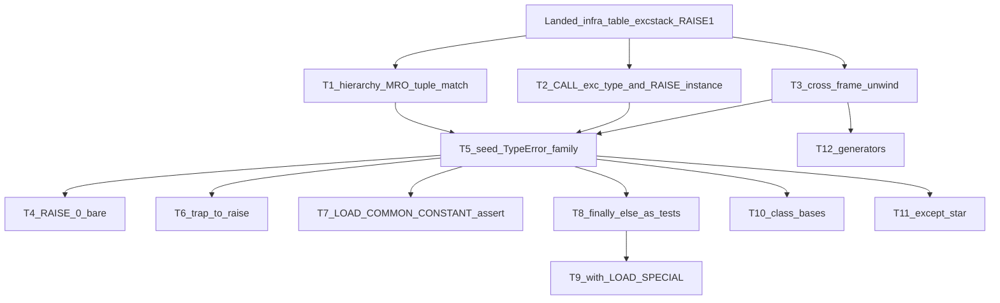
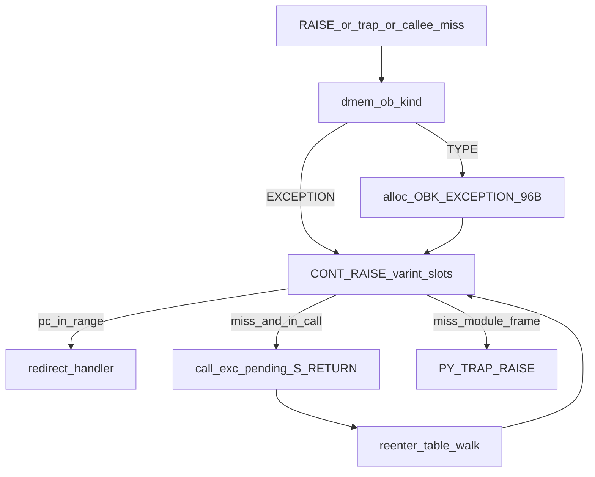

# Exceptions full support — implementation plan

**Status:** Active — T1–T5-A (except T4 oparg 2) + T8 landed on `cursor/exceptions-full-t1-match` (next: T6 / T7 / T9 / T10)
**Audience:** bytecode / pycore RTL agent (primary); firmware agent (raise-site follow-up)  
**Parent:** PR #66 Track B (for-loop exception infrastructure) + [`planning/for_loop_full_support_plan.md`](for_loop_full_support_plan.md) §15  
**Prerequisites:** Branch is rebased on current `main` (Plan 1 P7 builtins + Wave A types including `SyntaxError`). Do **not** pile more commits onto `cursor/for-loop-full-impl`.
**Unblocks:** `except Exception:`, `raise TypeError(...)`, cross-frame `try: f() except T:`, trap→raise, `assert`, `with`, user exception subclasses, firmware `raise TypeError` instead of `raise 1`

Related:

- **CPython type tree (source of truth for names/parents):** [Built-in Exceptions](https://docs.python.org/3/library/exceptions.html) (Python 3.14). Copy the hierarchy from that page when seeding; do not invent parents.
- For-loop / Track B locks: [`planning/for_loop_full_support_plan.md`](for_loop_full_support_plan.md) §5, [`planning/HANDOFF.md`](HANDOFF.md)
- **Exception type tracker (source of truth for what is seeded):** [`pycore/docs/exception_support.md`](../pycore/docs/exception_support.md) + `exceptions.types` in [`pycore/targets/pycore.json`](../pycore/targets/pycore.json)
- Opcode matrix: [`pycore/docs/bytecode_support.md`](../pycore/docs/bytecode_support.md)
- Object model: [`pycore/docs/object_model.md`](../pycore/docs/object_model.md) D2
- RTL: [`pycore/rtl/pycore_cont_raise.svh`](../pycore/rtl/pycore_cont_raise.svh), [`pycore/rtl/pycore_cont_exc.svh`](../pycore/rtl/pycore_cont_exc.svh), [`pycore/rtl/pycore_exc_stack.sv`](../pycore/rtl/pycore_exc_stack.sv), [`pycore/rtl/pycore_core.sv`](../pycore/rtl/pycore_core.sv)
- Image tooling: [`pycore/tools/image_from_source.py`](../pycore/tools/image_from_source.py), [`pycore/tools/heap_image.py`](../pycore/tools/heap_image.py), [`pycore/tools/exception_table.py`](../pycore/tools/exception_table.py)
- OBJ_EXC group: [`pycore/targets/pycore.json`](../pycore/targets/pycore.json)
- Plan 1 (merged and absorbed by this branch): [`planning/code_loading_bios_tokenizer_plan.md`](code_loading_bios_tokenizer_plan.md) P7
- Firmware post-#74 leftovers: [`planning/exceptions_firmware_followup_plan.md`](exceptions_firmware_followup_plan.md)
- Existing regression: `img_try_stopiteration*`, `img_for_iter_*`, `img_list_comp_*`, `pycore-img-call-all`, plus Plan 1 `img_try_exc_*` / `img_try_syntaxerror*`

PR #66 has merged. `cursor/exceptions-full-t1-match` was rebased onto current `main`; Tracks 1–4 (except oparg 2) and Track 8 are now implemented. Do not add further tracks onto `cursor/for-loop-full-impl`.

---

## 0. Handoff package (implementing agent)

**Branch:** `cursor/exceptions-full-t1-match`, rebased onto `main` after its original cut from `cursor/for-loop-full-impl`. Do not add more tracks onto `cursor/for-loop-full-impl`.

**Preflight (Python 3.14, every track, every claim):**

```bash
python3.14 -c "import opcode; print(opcode.opmap['NAME'], opcode.stack_effect(opcode.opmap['NAME'], ARG or None))"
python3.14 -c "import dis; from dis import _parse_exception_table; co=compile(SRC,'<x>','exec'); ..."
```

Never state stack effect, emission, or PyCore status from memory. Grep in the same turn:

- [`pycore/targets/pycore.json`](../pycore/targets/pycore.json) (opcode rows **and** `exceptions.types`)
- [`pycore/docs/exception_support.md`](../pycore/docs/exception_support.md)
- [`pycore/tools/image_from_source.py`](../pycore/tools/image_from_source.py) (`DEFERRED_OPS` / allowed set)
- [`pycore/rtl/*.sv`](../pycore/rtl) / `*.svh`
- [`pycore/docs/bytecode_support.md`](../pycore/docs/bytecode_support.md)
- [`pycore/programs/`](../pycore/programs)

**Must read before coding:** [Built-in Exceptions](https://docs.python.org/3/library/exceptions.html) (hierarchy + matching rule), [`exception_support.md`](../pycore/docs/exception_support.md) (what is seeded today), §2.4 hardware locks, for-loop plan §5 design locks, [`planning/HANDOFF.md`](HANDOFF.md), [`pycore/docs/object_model.md`](../pycore/docs/object_model.md) D2, [`pycore/rtl/pycore_cont_raise.svh`](../pycore/rtl/pycore_cont_raise.svh), [`pycore/rtl/pycore_cont_exc.svh`](../pycore/rtl/pycore_cont_exc.svh), protocol CALL handoff reset in [`pycore/rtl/pycore_core.sv`](../pycore/rtl/pycore_core.sv) (~2211).

**Regression that must stay green:**

- `make PYTHON=python3.14 pycore-img-for-loop-all` (46: try/StopIteration, object iterators, list comps)
- `make PYTHON=python3.14 pycore-img-call-all` (50: defaults / varkw / posonly — #67/#68)
- `make PYTHON=python3.14 pycore-python-tests` (269 currently)
- Collision spot-checks from HANDOFF: `varkw-no-wipe`, `default-multi-zero-argc`, `for-iter-object-next`, `try-stopiteration`, `list-comp-basic`
- Plan 1 exception images: `img_try_exc_types`, `img_try_syntaxerror`, `img_try_syntaxerror_msg`, `img_raise_syntaxerror_fatal`. Track 3 flipped `img_try_exc_cross_frame_fatal` to catch across the frame.

**New tests:** one image program per behavior; `# pycore-expect:` when CPython cannot run it; Makefile aggregate `pycore-img-exc-all`. Host goldens via [`run_image_test.py`](../pycore/tools/run_image_test.py).

**Do not:**

- Bake a type name into `CHECK_EXC_MATCH`
- Implement `SETUP_FINALLY` / `SETUP_WITH` / `POP_BLOCK` (CPython 3.14 pseudo-ops; never in `co_code`)
- Convert `PY_TRAP_MEM_FAULT` wholesale
- Treat protocol `StopIteration` as table dispatch
- Block a track on exception-object API completeness (`e.args` attr, `__cause__`, traceback objects, `sys.exc_info`, formatted printing)
- Expand `OBK_EXCEPTION` layout unless a later track needs a new field — then update host + RTL + `object_model.md` together
- Shrink code objects or clobber field-3 varkw/posonly metadata when touching `serialize_code` / `alloc_code`
- Restore a pre-#68 CALL entry sequence that drops the protocol-CALL binder-scratch reset
- Walk `tp_base` on every `CALL` of a user class to discover exception types (use an `ob_flags` bit set at seed time)
- Invoke `LOAD_ATTR` or `BUILD_TUPLE` as a nested opcode from `CHECK_EXC_MATCH` / exception `CALL`
- Add a new core FSM state (`S_EXC`) if `CONT_RAISE` + `call_exc_*` + `S_RETURN` already cover the path
- Probe the builtins dict at trap time for `TypeError` / `AttributeError` handles (boot-latch like `iter_exhaust_type_r`)
- Convert a combinational `exec_type_trap_pulse` into a raise in the same EX cycle
- Drop Plan 1 builtins (`ord`/`chr`, heap/code marks, `_bi_exec_globals`) or Plan 1’s `SyntaxError` name when rebasing
- Keep Plan 1’s four exception types as `tp_base=None` leaves once Wave A lands on `main`

**API availability is out of scope.** Raise / table dispatch / match / unwind are the product. Store `args` on `OBK_EXCEPTION` when `CALL` provides them so construction is correct; do not gate matching or unwind on `LOAD_ATTR args` or chaining fields.

---

## 1. Verdict

**Doable in twelve tracks** on top of landed Track B. Do not re-implement the exception table, exc-info stack, or `RAISE_VARARGS` 1 path.

The true roots (order matters):

1. **Matching** — `CHECK_EXC_MATCH` MRO + type tree so `except Exception:` works
2. **Construction** — `CALL` on exception types → `OBK_EXCEPTION`; `RAISE_VARARGS` 1 accepts type or instance
3. **Cross-frame unwind** — callee miss walks caller tables (largest RTL gap)

Everything else (bare raise, trap→raise, assert, finally/else tests, with, subclasses, except*, generators) hangs off those roots.

Plan 1 on `main` already widened **exact-match** image tests beyond StopIteration (`TypeError` / `ValueError` / `IndexError` / `SyntaxError`). Keep those green. MRO / `except Exception:` tests stay on this branch’s `pycore-img-exc-all` until rebase.

**Which types belong to which track** is locked in [`exception_support.md`](../pycore/docs/exception_support.md) (human) and `pycore.json` `exceptions.types` (machine). Each track below repeats **Seeds** / **Uses** so an agent does not have to reverse-engineer it. Update both trackers in the same PR that seeds or relinks a type.

| Track | Seeds (builtin `OBK_TYPE`s) | Uses (must already exist) |
| --- | --- | --- |
| landed-B (#66) | `StopIteration` (leaf, `tp_base=None`) | — |
| **T1 Matching** | `BaseException`, `Exception`; **relink** `StopIteration.tp_base→Exception` | `StopIteration` handle (do not re-allocate) |
| **T2 Construction** | none | any seeded exception type (tests: `StopIteration`, `TypeError`) |
| **T3 Unwind** | none | the already-built `OBK_EXCEPTION` object |
| **T4 RAISE 0/2** | none | `RuntimeError` (T5-A) for bare `raise` with no active exc |
| **T5-A** | `ArithmeticError`, `ZeroDivisionError`, `LookupError`, `IndexError`, `KeyError`, `NameError`, `UnboundLocalError`, `TypeError`, `ValueError`, `AttributeError`, `RuntimeError`, `AssertionError` | T1 parents |
| **T5-B** | `OverflowError`, `MemoryError`, `ImportError`, `ModuleNotFoundError`, `NotImplementedError`, `RecursionError`, stub `OSError` (+ aliases); **not** errno subclasses | T5-A parents |
| **T5-C** | `SystemExit`, `KeyboardInterrupt`; `SyntaxError` **on the T1 rebase** (already a leaf on `main`); later `IndentationError` / `UnicodeError` trees | `BaseException` / `Exception` / `ValueError` |
| **T6 Trap→raise** | none (boot-sidecar **handles** of already-seeded types) | `TypeError`, `AttributeError`, `ZeroDivisionError`; later `IndexError`/`KeyError`/`NameError`/`UnboundLocalError` |
| **T7 assert** | none | `AssertionError` |
| **T8 forms** | none | whatever the test raises |
| **T9 with** | none | whatever `__exit__` receives |
| **T10 subclasses** | user types only (`class MyError(Exception)`) | Wave A bases |
| **T11 except\*** | `BaseExceptionGroup`, `ExceptionGroup` | T1 parents |
| **T12 generators** | `GeneratorExit`, `StopAsyncIteration` | `StopIteration`, `RuntimeError` (PEP 479) |

Tracks 1–4 (except `RAISE_VARARGS` oparg 2), T5-A, and Track 8 are implemented on `cursor/exceptions-full-t1-match`. Next work is T6 / T7 / T9 / T10.

---

## 2. Baseline (already landed — do not re-implement)

From PR #66 Track B (verified in RTL + docs):

| Piece | Location / lock |
| --- | --- |
| 8-field / 256 B code objects; field 7 = raw `co_exceptiontable` as `TUPLE` of `INT` bytes | [`heap_image.py`](../pycore/tools/heap_image.py), [`exception_table.py`](../pycore/tools/exception_table.py) |
| Field 3 metadata | `{posonlyargcount, CO_VARKEYWORDS, CO_VARARGS, kwonlyargcount, stacksize, nlocals, argcount}` — #68; must survive |
| Host byte→slot conversion (`start>>1`); RTL compares `cur_pc_r` in slots only | [`pycore_cont_raise.svh`](../pycore/rtl/pycore_cont_raise.svh) |
| dmem exc-info arena `0x1B000–0x1BFFF` | [`pycore_exc_stack.sv`](../pycore/rtl/pycore_exc_stack.sv) |
| Heap limit `PYCORE_HEAP_LIMIT = 0x1B000` | frames `0x1C000–0x1FFFF` |
| Live opcodes | `RAISE_VARARGS` **oparg 0/1**, `PUSH_EXC_INFO`, `CHECK_EXC_MATCH` (identity + MRO + tuples), `POP_EXCEPT`, `RERAISE` 0/1 |
| Boot | Wave A exception `OBK_TYPE`s with documented parents; `StopIteration` remains latched at `ITER_EXHAUST_TYPE_ADDR` (`0x1BFE0`). |
| Protocol CALL stitch (#66) | handoff zeros `call_kw_*`, `call_varkw_*`, `call_posonly_r` |
| Tests | [`img_try_stopiteration.py`](../pycore/programs/img_try_stopiteration.py), nested, fatal unhandled, list comps. **On `main`:** also Plan 1 P7 images (§2.0). |

### 2.0 Rebase completion record

The branch absorbed the following `main` work while preserving the exception changes:

| On `main`, not on this branch | What it means for exceptions |
| --- | --- |
| PR #66 merge commit + CI timeout bump | Same Track B infra; no extra RTL |
| #70 string subscript `s[i]` + compile/exec plan | Unrelated RTL; docs/`pycore.json` overlap on rebase |
| #71 native `ord()` / `chr()` | New `BI_ORD` / `BI_CHR` entries in `build_builtins_dict` — **keep** |
| #73 Plan 1 (code loading / BIOS / tokenizer, in progress) | Code RAM, `exec`/`eval` globals, heap/code marks, **P7 leaf exception types** |

**Plan 1 P7** ([`code_loading_bios_tokenizer_plan.md`](code_loading_bios_tokenizer_plan.md) §9.1) seeded four **leaf** `OBK_TYPE`s (`tp_base = None`) next to `StopIteration`: `SyntaxError`, `ValueError`, `TypeError`, `IndexError`. `CHECK_EXC_MATCH` on `main` is still exact-handle. Tests:

| Program | Contract on `main` | After this branch rebases |
| --- | --- | --- |
| `img_try_exc_types` | Distinguishable exact-match arms for those four types | Still pass (identity first, then MRO). Relink `IndexError` under `LookupError`, the others under `Exception`. |
| `img_try_syntaxerror` / `img_raise_syntaxerror_fatal` | `SyntaxError` exists as a boot name | Must still exist. Seed it as `Exception`’s child on rebase (pull T5-C `SyntaxError` forward). Do **not** drop the name. |
| `img_try_syntaxerror_msg` | Workaround: stash message in a global; `OBK_EXCEPTION.args` is always `()` | Stays until **T2**. Plan 1 P7 step 3 (messages via `CALL`) **is** T2. |
| `img_try_exc_cross_frame_fatal` | Callee raise → trap 17 (Plan 1 deviation 16) | Keep expecting trap 17 until **T3**, then flip to a catch (`img_try_callee_raise`). |

`main` has **no** `exceptions.types` catalog in `pycore.json`. This branch adds that key; verify the rebase merge of `pycore.json` by hand.

**Git dry-run vs `main`:** content conflicts in `pycore/docs/object_model.md` and `pycore/tools/image_from_source.py`. Auto-merge: `Makefile`, `pycore.json`, `pycore_defs.svh`, `encoding.py`, architecture/bytecode docs. `pycore_cont_exc.svh` is branch-only since the merge-base (take ours).

**`build_builtins_dict` absorb (the real rebase work):**

1. Keep every Plan 1 builtin this branch lacks: `ord` / `chr`, `_bi_heap_mark` / `_bi_heap_release` / `_bi_code_mark` / `_bi_code_release`, `_bi_exec_globals`.
2. Replace Plan 1’s four leaf `alloc_type` calls with this branch’s `WAVE_A_EXCEPTION_TYPES` loop (`tp_base` + `OB_FLAG_EXC_TYPE`). Do **not** allocate a second `TypeError` / `ValueError` / `IndexError`.
3. Add `("SyntaxError", "Exception")` to that seed list so Plan 1 tests still `LOAD_GLOBAL`. IndentationError / TabError stay T5-C.
4. Relink `StopIteration.tp_base → Exception` as T1 already does; keep the same handle for `iter_exhaust_type_r`.

Do not start T2 on the unrebased branch.

### 2.1 Three orthogonal layers (locked)

From for-loop plan §5 — do not merge them:

1. **`FOR_ITER` internal StopIteration catch** — not table dispatch; identity vs `iter_exhaust_type_r`
2. **`co_exceptiontable` + table walk + stack unwind to depth**
3. **Exc-info stack** for nested handlers (`PUSH_EXC_INFO` / `POP_EXCEPT`)



### 2.2 Design locks agents must not guess

| Decision | Choice |
| --- | --- |
| Active exc on table hit | Do **not** set `active_exc_r` until `PUSH_EXC_INFO`; miss/fatal may latch |
| Cross-frame unwind | Preserve the **exception object**; do not rebuild per frame |
| FOR_ITER exhaust | Handle **identity** vs `iter_exhaust_type_r` (not MRO) |
| `except T:` match | Docs: that clause also handles classes **derived from** `T`, not classes `T` is derived from. Two types with the same name are not equivalent unless they are the same object / subclass-related. Hardware: MRO walk on `tp_base` (depth 8, same as LOAD_ATTR). |
| User subclasses | Docs: derive from `Exception`, not `BaseException`. Track 10 only allows builtin exception bases. |
| SETUP_* / POP_BLOCK | Compiler-only pseudo-ops; leave deferred |
| Recoverable traps | Stay mailbox/excore — not Python exceptions |
| Exception API | Out of scope (`with_traceback`, `add_note`, `__notes__`, formatted display). Store constructor `args` (docs: associated value) when CALL provides them. |

### 2.3 CPython 3.14 hierarchy (seed from this, not from memory)

Source: [Built-in Exceptions — Exception hierarchy](https://docs.python.org/3/library/exceptions.html#exception-hierarchy). All built-in exceptions are instances of a class that derives from `BaseException`. `tp_base` links **must** match this tree. Do not parent a leaf to `Exception` if its documented parent is a more specific base that is (or will be) seeded.

```
BaseException
 ├── BaseExceptionGroup          # Track 11; dual-inherit ExceptionGroup below
 ├── GeneratorExit               # Track 12; NOT Exception (bare except catches it)
 ├── KeyboardInterrupt           # Wave C; NOT Exception
 ├── SystemExit                  # Wave C; NOT Exception
 └── Exception                   # user subclasses start here
      ├── ArithmeticError
      │    ├── FloatingPointError   # docs: not currently used
      │    ├── OverflowError
      │    └── ZeroDivisionError
      ├── AssertionError
      ├── AttributeError
      ├── BufferError
      ├── EOFError
      ├── ExceptionGroup            # also BaseExceptionGroup (multiple inheritance)
      ├── ImportError
      │    └── ModuleNotFoundError
      ├── LookupError
      │    ├── IndexError
      │    └── KeyError
      ├── MemoryError
      ├── NameError
      │    └── UnboundLocalError
      ├── OSError                   # EnvironmentError/IOError/WindowsError are aliases
      │    └── (errno subclasses — Wave B stub OSError only)
      ├── ReferenceError
      ├── RuntimeError
      │    ├── NotImplementedError
      │    ├── PythonFinalizationError
      │    └── RecursionError
      ├── StopAsyncIteration
      ├── StopIteration             # already seeded; relink tp_base → Exception
      ├── SyntaxError
      │    └── IndentationError → TabError
      ├── SystemError
      ├── TypeError
      ├── ValueError
      │    └── UnicodeError → Unicode{Decode,Encode,Translate}Error
      └── Warning → (11 warning categories)
```

**Matching rule (docs, Track 1):** `except T:` also handles classes **derived from** `T`, not classes from which `T` is derived. `except Exception:` therefore does **not** catch `SystemExit`, `KeyboardInterrupt`, `GeneratorExit`, or `BaseExceptionGroup`. Bare `except:` is `BaseException` (already `PUSH_EXC_INFO; POP_TOP` with no matcher).

**Single-inheritance ceiling:** PyCore `OBK_TYPE.tp_base` is one parent. That is enough for every node except `ExceptionGroup`, which docs say extends **both** `Exception` and `BaseExceptionGroup` so `except Exception` catches `ExceptionGroup` but not `BaseExceptionGroup`. Track 11 v1: set `ExceptionGroup.tp_base = Exception` (so `except Exception` works) and treat `BaseExceptionGroup` as a sibling under `BaseException`. Do not fake a second MRO parent until a later dual-base design.

**Depth:** longest builtin chains are length 5 (`TabError`, `UnicodeDecodeError`, `BrokenPipeError`). LOAD_ATTR’s depth-8 guard covers builtins + a few user subclasses.

### 2.4 Hardware locks (RTL must stay an FSM, not a CPython interpreter)

PyCore is one-instruction-in-flight, one outstanding dmem beat, shared `container_*` scratch, no nested opcode dispatch. Later agents implement tracks inside those constraints.

| Lock | Why |
| --- | --- |
| **Stay in the existing op’s FSM** | `CHECK_EXC_MATCH` extends [`pycore_cont_exc.svh`](../pycore/rtl/pycore_cont_exc.svh) phases. Do **not** jump to `CONT_LOAD_ATTR` to “reuse MRO.” Copy the depth-8 `tp_base` loop pattern (`container_count_r >= 8` in [`pycore_cont_object.svh`](../pycore/rtl/pycore_cont_object.svh) ~1211). |
| **One dmem beat** | Each MRO step is: read field1 val, then tag (or packed compare). Same `container_dmem_pending_r` handshake as today. |
| **Exact compare is combinational; subclass is a loop** | First check handle identity (today’s `CP_TAG` compare). Only on miss, walk `tp_base`. FOR_ITER exhaust stays **identity only** vs `iter_exhaust_type_r` ([`pycore_cont_list.svh`](../pycore/rtl/pycore_cont_list.svh) ~884) — never MRO on that path. |
| **Tuple handlers are one-level, length-capped** | `except (A, B):` TOS is `TUPLE`. Iterate `container_idx_r` over elements, run identity-or-MRO per element. Cap length at 8 (same as MRO depth). Nested tuples (`except (A, (B, C))`) → `TYPE` in v1. |
| **Exception-type bit, not a CALL-time MRO** | `ob_flags` bit on `OBK_TYPE`, set by host when seeding §2.3 types (and Track 10 subclasses). `CALL` phase 12 reads `ob_head` once; if the bit is set, allocate `PYCORE_OBJ_EXCEPTION_BYTES` (96), **not** INSTANCE+dict (`CALL_TYPE_ALLOC_BYTES`). Walking `tp_base` to `BaseException` on every `Point()` construction is illegal. |
| **RAISE type vs instance = one `ob_kind` read** | TOS `OBJECT` → read head. `PY_OBK_EXCEPTION` → use handle, skip alloc. `PY_OBK_TYPE` → existing `CONT_RAISE` alloc. Anything else → `TYPE`. Do not allocate-then-discard. |
| **Exception CALL argc** | argc 0: empty args tuple `{size=0,addr=0}` (already in `CONT_RAISE`). argc 1: build a 1-element `TUPLE` in the CALL exception path (one buffer). argc > 1: same packing or `TYPE` until a later track. Do **not** dispatch `BUILD_TUPLE` as a nested opcode. |
| **No new core state for unwind** | Table miss in a callee: set `call_exc_handle_r` / `call_exc_pending_r`, pop via existing `S_RETURN` / protocol unwind, then re-enter `CONT_RAISE` at the **table-walk** phase (`CP_VAL`), skipping alloc. Preserve the exception object. Do not add `S_EXC`. |
| **Trap→raise is a deferred entry, not a combo pulse** | Today `exec_type_trap_pulse` goes to `S_HALT`. Converted sites latch `raise_type_entry_r` from a **boot sidecar** (clone `ITER_EXHAUST_TYPE_ADDR`) and enter `CONT_RAISE` next cycle. Never probe the builtins dict in the trap path. Recoverable traps stay mailbox. |
| **Shared scratch** | `CONT_RAISE` owns `container_range_*` / `container_order_*`. `CHECK_EXC_MATCH` may use `container_count_r` / `container_idx_r` / `container_val_r`. Do not overlap those overlays inside one op. Protocol CALL must keep the #66 binder-scratch reset. |
| **Keep `OBK_EXCEPTION` at 96 B** | `field0` type + `field1` args. No `__traceback__` / `__cause__` fields until a track that needs them (and then bump host+RTL+`object_model.md` together). |
| **Wave A types are empty `OBK_TYPE`s** | 128 B + small empty `tp_dict` each, like today’s `StopIteration`. Do not put methods on them. |



---

## 3. What is still false (agents will hit these immediately)

Verified against CPython 3.14 `dis` / `stack_effect` and current RTL. **On `main` without this branch:** `except Exception:` is also still false (exact-handle only; no Wave A parents). After rebase, the first row below is true.

| Symptom | Why |
| --- | --- |
| `except Exception:` | **Landed (same frame)** — `CHECK_EXC_MATCH` walks `tp_base`; Wave A types seeded |
| `raise TypeError("x")` | `CALL` on `OBK_TYPE` allocates `OBK_INSTANCE` (CALL FSM phase 12); `CONT_RAISE` always builds a new `OBK_EXCEPTION` treating TOS as the type |
| `raise e` (instance) | Same — wraps instance as if it were a type |
| `RAISE_VARARGS` 0 / 2 | Type-trap in decode/exec; stack effects 0 / −1 / −2 |
| `try: f() except T:` | Table miss → `PY_TRAP_RAISE` unless protocol-launched container CALL; no callee→caller unwind. **Pinned on `main`** by `img_try_exc_cross_frame_fatal` (Plan 1 deviation 16). |
| Firmware `raise 1` | `TypeError` **is** seeded (leaf on `main`, Wave A on this branch). Firmware still raises ints; that becomes a latent bug once Track 2 treats TOS as a type handle. |
| Plan 1 `SyntaxError("msg")` | Same as `raise TypeError("x")` — CALL still allocates `OBK_INSTANCE`. `img_try_syntaxerror_msg` stashes the message in a global until T2. |
| `class MyError(Exception):` | [`fold_module_classes`](../pycore/tools/image_from_source.py) rejects bases |
| Real `try/finally` / `with` | Use exception table + `RERAISE`, **not** `SETUP_FINALLY` / `SETUP_WITH` |
| `assert` | Emits `LOAD_COMMON_CONSTANT 0` (`AssertionError`) — still in `DEFERRED_OPS` |
| `with` | Emits `LOAD_SPECIAL` + `WITH_EXCEPT_START` + `RERAISE 2` |
| `except*` | Emits `CHECK_EG_MATCH` + `CALL_INTRINSIC_2` (`INTRINSIC_PREP_RERAISE_STAR`) — XL; last |

---

## 4. Tracks

Each track is independently PR-able once its blockers are green.

### Track 1 — Matching (root of every `except T:`) — **landed**

**Why first:** bytecode already did the right thing; hardware matching was the lie.

**Seeds:** `BaseException`, `Exception`. **Relinked:** `StopIteration.tp_base = Exception`. **Also seeded in this PR:** T5-A. **Opcodes:** `CHECK_EXC_MATCH` is `execute` (identity + MRO + one-level tuples).

- Seed `BaseException` then `Exception` as `OBK_TYPE` with `tp_base` links **exactly as in §2.3**. Relink existing `StopIteration` so `tp_base = Exception` (**keep the same handle**; `iter_exhaust_type_r` is identity, not MRO). Set the exception-type `ob_flags` bit on every seeded type (§2.4).
- `CHECK_EXC_MATCH` in [`pycore_cont_exc.svh`](../pycore/rtl/pycore_cont_exc.svh): keep the field0 dmem reads. On identity miss, loop `tp_base` (field1) with `container_count_r`, cap 8, one beat at a time. If TOS tag is `TUPLE`, iterate elements (cap 8, one level). Push BOOL as today (`[exc, type] → [exc, bool]`).
- Do **not** call into `CONT_LOAD_ATTR`. Do **not** bake the name `Exception` into the matcher — the handler type is whatever bytecode left on TOS.
- Bare `except:` is already `PUSH_EXC_INFO; POP_TOP; …` — no matcher; equivalent to `except BaseException:`.
- **Correctness risk:** `risky-partial` if the walk is wrong or a leaf skips a documented parent. Prefer trap-until-walk-complete; do not ship exact-match-only for `Exception`.
- Files: [`image_from_source.py`](../pycore/tools/image_from_source.py) `build_builtins_dict`, [`pycore_cont_exc.svh`](../pycore/rtl/pycore_cont_exc.svh), [`object_model.md`](../pycore/docs/object_model.md).
- **Rebase (done):** absorbed Plan 1 `build_builtins_dict` entries (§2.0) and seeded `SyntaxError` under `Exception`.

### Track 2 — Construction (root of `raise T(...)` and `raise e`)

**Why second:** tests that use `raise TypeError("m")` need this; firmware later needs it. **Plan 1 P7 step 3** (exception messages / `SyntaxError("msg")`) is this track — do not invent a parallel constructor path.

**Seeds:** none. **Uses:** any T1/T5-A type (tests: `StopIteration`, `TypeError`; Plan 1 also wants `SyntaxError("msg")` after rebase). **Opcodes:** `CALL` (exception `ob_flags` bit → `OBK_EXCEPTION`); `RAISE_VARARGS` 1 type-vs-instance. Flip JSON `construct` from `raise-type` to `call` on those types when this lands.

- `RAISE_VARARGS` 1: one `ob_kind` read on TOS (§2.4). `PY_OBK_EXCEPTION` → skip alloc, enter table walk. `PY_OBK_TYPE` → existing `CONT_RAISE` 96 B alloc, empty args. Do not wrap an instance as a type.
- `CALL` of a type with the exception `ob_flags` bit: **do not** take phase-12 INSTANCE+dict. Allocate `OBK_EXCEPTION`, `field0` = the type, `field1` = args (argc 0 empty / argc 1 one-element tuple). User `class C:` without the bit stays phase 12.
- Keep protocol-CALL binder-scratch reset when touching the CALL FSM.
- Tests: `raise StopIteration()`, `raise TypeError("x")`, `raise e` with a prebuilt instance. After rebase, `img_try_syntaxerror_msg` can move from the global-stash workaround to `e.args` once T2 + a public args read exist; **do not** block T2 on `LOAD_ATTR args`.

### Track 3 — Cross-frame unwind (root of `try: f() except T:`)

**Seeds:** none. **Uses:** the already-built `OBK_EXCEPTION` (no new builtin names). **Opcodes:** `RAISE_VARARGS` / `RERAISE` miss path + `S_RETURN` / `call_exc_*`.

On table miss in a callee: do **not** `PY_TRAP_RAISE` immediately. Latch `call_exc_handle_r` (the already-built object), pop the frame through existing `S_RETURN` / protocol unwind, then re-enter `CONT_RAISE` at `CP_VAL` (table walk on the **caller’s** `cur_code_r` + return PC). Repeat until a handler hits or the module frame misses → `PY_TRAP_RAISE`.

Do **not** merge with FOR_ITER protocol StopIteration (for-loop §6.1.1 / identity vs `iter_exhaust_type_r`). Other pending exc from a protocol CALL should take this unwind, not stay v1-fatal.

No new `S_EXC` state. Spike with a two-function image before touching firmware. Preserve the #66 binder-scratch reset.

**Plan 1 contract change:** [`img_try_exc_cross_frame_fatal.py`](../pycore/programs/img_try_exc_cross_frame_fatal.py) currently **expects** trap 17. When T3 lands, flip it to a catch (or replace with `img_try_callee_raise`). That is intentional, not a regression.

### Track 4 — Remaining `RAISE_VARARGS` arities — **oparg 0 landed**

**Seeds:** none. **Uses:** `RuntimeError` (T5-A) when oparg 0 has no active exception. **Opcodes:** `RAISE_VARARGS` (`supported_opargs` grows from `[1]` to `[0,1]` then optionally `[0,1,2]`).

- Oparg 0: re-raise `active_exc_r` (CPython `raise` inside `except:`) landed. It reuses the live handle with stack effect 0 and enters the normal table walk. Without an active exception it is fatal `PY_TRAP_RAISE`; constructing `RuntimeError` is deferred until a boot sidecar exists (no raise-time builtins probe).
- Oparg 2: `raise X from Y`. Optional after oparg 0; chaining fields are not a prerequisite for the rest of the plan. `RERAISE 2` appears in `with` (Track 9), not here.

### Track 5 — Exception type tree (seed order)

**Seeds:** the Wave A/B/C tables below (and in [`exception_support.md`](../pycore/docs/exception_support.md)). **Uses:** T1 parents must exist before children. **Opcodes:** none required; this is boot/`build_builtins_dict` + JSON `status: seeded`. Flip each type’s row when it lands.

Do not seed all of CPython at once. Boot dict size and 128 B per `OBK_TYPE` matter. Stay under `PYCORE_HEAP_LIMIT` (`0x1B000`); `allocator_list` already adapted after the exc arena steal.

**Seed parents before children**, using §2.3. Never set `tp_base = Exception` for a type whose documented parent is `LookupError` / `ArithmeticError` / `NameError` / etc. Every seeded exception `OBK_TYPE` sets the exception `ob_flags` bit (§2.4) so `CALL` can branch without an MRO walk.

**Wave A (landed with Track 1)** — these nodes are in boot builtins with documented parents:

| Type | `tp_base` |
| --- | --- |
| `BaseException` | none |
| `Exception` | `BaseException` |
| `StopIteration` | `Exception` (relink existing handle) |
| `ArithmeticError` | `Exception` |
| `ZeroDivisionError` | `ArithmeticError` |
| `LookupError` | `Exception` |
| `IndexError` | `LookupError` |
| `KeyError` | `LookupError` |
| `NameError` | `Exception` |
| `UnboundLocalError` | `NameError` |
| `TypeError` | `Exception` |
| `ValueError` | `Exception` |
| `AttributeError` | `Exception` |
| `RuntimeError` | `Exception` |
| `AssertionError` | `Exception` |
| `SyntaxError` | `Exception` — **not on this branch yet**; seed on rebase (Plan 1 already has a leaf) |

**On `main` today** those `TypeError` / `ValueError` / `IndexError` / `SyntaxError` names exist as **leaves** (`tp_base=None`, no `OB_FLAG_EXC_TYPE`). Rebase must relink them into the table above, not keep the Plan 1 `alloc_type` loop.

**Wave B (as traps/firmware need them):** remaining `Exception` children from §2.3 that PyCore can actually raise — `OverflowError` (under `ArithmeticError`), `MemoryError`, `ImportError`/`ModuleNotFoundError`, `NotImplementedError`/`RecursionError` (under `RuntimeError`), stub `OSError` (do **not** implement errno→subclass constructor; `EnvironmentError`/`IOError`/`WindowsError` are aliases of `OSError` if seeded). Skip `FloatingPointError` (docs: not currently used). Warnings family: low, only if something emits them.

**Wave C (language features):** `BaseException` siblings `SystemExit`, `KeyboardInterrupt`, `GeneratorExit` (Track 12 — docs: inherit from `BaseException` so `except Exception` does not catch them); `StopAsyncIteration`; `BaseExceptionGroup` / `ExceptionGroup` (Track 11). `UnicodeError` tree when codecs exist.

**`SyntaxError` is not “later.”** Plan 1 already seeds a **leaf** `SyntaxError` on `main` and tests exact-match raise/except. On the T1 rebase, insert `("SyntaxError", "Exception")` into the Wave A seed list (documented parent, `OB_FLAG_EXC_TYPE`). Leave `IndentationError` / `TabError` in T5-C. Do not keep Plan 1’s `tp_base=None` leaves for `TypeError` / `ValueError` / `IndexError` / `SyntaxError`.

`except Exception:` is the ubiquity test for Wave A. `issubclass` / `isinstance` firmware already walk `__base__` (depth 8) — keep the same guard.

After Wave A, replace firmware `raise 1` / `raise 0` with `raise TypeError` / `raise ValueError`. Leave a grep gate so `raise <int>` cannot return. Docs split: wrong **type** → `TypeError`; right type, wrong **value** → `ValueError`; sequence OOB → `IndexError`; missing mapping key → `KeyError`.

### Track 6 — Trap → raise (makes hardware errors catchable)

**Seeds:** none (latches **handles** of types T5-A already put in builtins, same sidecar style as `ITER_EXHAUST_TYPE_ADDR`). **Uses:** `TypeError`, `AttributeError`, `ZeroDivisionError`; later `IndexError` / `KeyError` / `NameError` / `UnboundLocalError` after `MEM_FAULT` site split. **Opcodes:** none new; trap pulses enter `CONT_RAISE`. Fill JSON `trap_map` on those types when a site converts.

Fatal traps that should become Python exceptions — **not** all traps. Map to the **documented** type, not a convenient sibling:

| Trap | Target (docs) |
| --- | --- |
| `PY_TRAP_TYPE` (1) | `TypeError` (operation on inappropriate type). Wrong **value** is `ValueError`, not this. |
| `PY_TRAP_ATTR_ERROR` (15) | `AttributeError` (missing attr). Docs: if the object does not support attribute access at all, that is `TypeError` instead — keep those sites as TYPE. |
| `PY_TRAP_DIV_ZERO` (3) | `ZeroDivisionError` (under `ArithmeticError`) |

**Hardware:** these pulses are combinational into `pycore_trap` / `S_HALT` today. Conversion latches a boot-sidecar type handle (`TypeError` / `AttributeError` / `ZeroDivisionError`, same style as `ITER_EXHAUST_TYPE_ADDR`) and enters `CONT_RAISE` on the **next** cycle — same alloc + table walk as `RAISE_VARARGS`. Do not probe builtins. Do not raise in the EX combinational block.

**Do not** blindly convert `PY_TRAP_MEM_FAULT` (7): it is overloaded. Split **sites** (not one global remap) before converting:

- sequence OOB → `IndexError`; non-integer index stays `TypeError`
- missing dict key → `KeyError`
- missing global/name → `NameError`
- unbound local → `UnboundLocalError`
- heap OOM → keep `MEM_FAULT` until `MemoryError` is seeded **and** the site is not an align/fault class

Recoverable traps (LIST_GROW, DICT_GROW, …) stay mailbox/excore.

**Correctness risk:** `risky-partial`. A TYPE→TypeError path that skips table walk will make `try: 1+"a" except TypeError` halt or resume wrong.

### Track 7 — `assert` / `LOAD_COMMON_CONSTANT`

**Seeds:** none. **Uses:** `AssertionError` (T5-A). **Opcodes:** `LOAD_COMMON_CONSTANT` (`trap` → `execute`; remove from `DEFERRED_OPS`).

CPython 3.14 `_common_constants[0]` is `AssertionError`. Opcode 81 is a **register write** of a boot-latched handle (sidecar or tiny ROM of handles), not a builtins-dict probe. Decode like `LOAD_CONST`. Unlock in [`image_from_source.py`](../pycore/tools/image_from_source.py) `DEFERRED_OPS`. Needs Track 5 `AssertionError`.

### Track 8 — Language forms that are mostly tests — **landed**

**Seeds:** none. **Uses:** whatever the image raises (Wave A). **Opcodes:** none new (`try/finally` is already table + `RERAISE`).

Once Tracks 1–4 work, these are bytecode already accepted:

- `try/except/else` (else is fallthrough; table does not cover else)
- `try/finally` (table over try; handler is `PUSH_EXC_INFO` + finally body + `RERAISE` 0; lasti already handled in `CONT_RAISE` `CP_LIST_WB`)
- `try/except/finally` (two table regions — verify with `dis`)
- `except T as e:` (`STORE_FAST` + handler-exit `STORE None` / `DELETE_FAST`)

Image coverage landed for `try/except/else`, `try/finally`, `except T as e`, and nested bare re-raise. `try/finally` is the regression for lasti.

### Track 9 — `with` (bundle)

**Seeds:** none. **Uses:** whatever `__exit__` receives (Track 2 instances). **Opcodes:** `LOAD_SPECIAL`, `WITH_EXCEPT_START` (`trap` → `execute`); `RERAISE` oparg 2 (`supported_opargs` adds `2`). Do **not** implement `SETUP_WITH` (compiler pseudo).

Cluster: `LOAD_SPECIAL`, `WITH_EXCEPT_START`, `RERAISE` 2. Needs Track 2 (exception instance to `__exit__`) and Track 3. Context-manager objects need `__enter__`/`__exit__` on `tp_dict` (user classes or a tiny seeded CM). Separate from `SETUP_WITH` (pseudo).

### Track 10 — User exception subclasses

**Seeds:** user types only (not builtins). **Uses:** Wave A bases (`Exception` and seeded children). **Opcodes:** none; unlock `fold_module_classes`. Do not add user names to `exceptions.types` (that catalog is builtins only).

Unlock `class MyError(Exception)` in `fold_module_classes` (bases = seeded builtin exception types). Docs: derive from `Exception`, not `BaseException`; reject multiple exception bases. Host copies `tp_base` **and** the exception `ob_flags` bit onto the new type so `raise MyError("x")` takes the 96 B `OBK_EXCEPTION` CALL path, not phase-12 INSTANCE. Do this after Wave A types exist.

### Track 11 — `except*` / ExceptionGroup (XL, last among catch syntax)

**Seeds:** `BaseExceptionGroup`, `ExceptionGroup`. **Uses:** T1 parents; constructor needs `TypeError` (T5-A). **Opcodes:** `CHECK_EG_MATCH`, `CALL_INTRINSIC_2` (`INTRINSIC_PREP_RERAISE_STAR`).

Docs: `BaseExceptionGroup` extends `BaseException` and can wrap any exception; `ExceptionGroup` extends `Exception` and can only wrap `Exception` subclasses — so `except Exception` catches `ExceptionGroup` but not `BaseExceptionGroup`. The `ExceptionGroup` constructor raises `TypeError` if any contained exception is not an `Exception`. `except*` matches subgroups.

Opcodes: `CHECK_EG_MATCH`, `CALL_INTRINSIC_2` PREP_RERAISE_STAR. Split-and-reraise protocol. Do not start until Tracks 1–4 are boring. See §2.3 for the single-`tp_base` ceiling on dual inheritance.

### Track 12 — Generators (separate plan)

**Seeds:** `GeneratorExit`, `StopAsyncIteration`. **Uses:** `StopIteration` (landed-B + T1 relink), `RuntimeError` (T5-A, PEP 479). **Opcodes:** `YIELD_VALUE` / `SEND` / `CLEANUP_THROW` (OBJ_GEN — separate plan).

Docs: `GeneratorExit` inherits from `BaseException`, not `Exception`. `StopIteration.value` is the constructor argument (default `None`); generator `return` becomes `StopIteration(value)`. PEP 479: a `StopIteration` raised inside a generator is transformed into `RuntimeError` (cause retained). Also `CLEANUP_THROW`, `throw()`, `StopAsyncIteration`. Blocked on OBJ_GEN (`YIELD_VALUE` / `SEND`). Mention only as a blocker; do not implement here.

---

## 5. Issues agents will hit

| Issue | Guidance |
| --- | --- |
| **Identity vs subclass** | FOR_ITER exhaust = combinational handle `==` vs `iter_exhaust_type_r`. `CHECK_EXC_MATCH` = identity then depth-8 `tp_base` loop. Mixing those paths breaks loops or matching. |
| **Skipped intermediate bases** | If `ZeroDivisionError.tp_base` is `Exception` instead of `ArithmeticError`, later `except ArithmeticError:` is wrong. Seed §2.3 parents before children. |
| **Exception-type bit** | `CALL` must not MRO-walk every type. Host sets `ob_flags`; hardware tests one bit after the existing `ob_head` read. |
| **Nested opcode fantasy** | No `LOAD_ATTR` / `BUILD_TUPLE` from inside `CHECK_EXC_MATCH` or exception `CALL`. One FSM, one dmem beat. |
| **Trap in EX combo logic** | Cannot allocate/walk a table in the combinational `S_EXEC` trap pulse. Latch + enter `CONT_RAISE`. |
| **ExceptionGroup dual base** | Docs: `Exception` **and** `BaseExceptionGroup`. PyCore has one `tp_base`. Track 11 v1: parent `ExceptionGroup` to `Exception` only. |
| **BaseException siblings** | `SystemExit` / `KeyboardInterrupt` / `GeneratorExit` must **not** be under `Exception`. |
| **Empty args vs message** | Empty-tuple args OK for `raise T`; `raise T("m")` is CALL argc 1 + 1-element tuple in hardware, not a stringified type name. |
| **Active exc latch timing** | No `active_exc_r` until `PUSH_EXC_INFO` on table hit; miss/fatal may latch. Unwind preserves the object. |
| **Heap pressure** | Wave A ≈ 15 × 128 B types + empty dicts under `0x1B000` (16 after rebase `SyntaxError`). Do not seed OSError subclasses in Wave A. |
| **Plan 1 leaf types** | `main` seeded `SyntaxError`/`ValueError`/`TypeError`/`IndexError` as `tp_base=None`. Absorb into Wave A parents on rebase; never two handles for one name. |
| **Twocore** | Each core owns its exc stack; handler bytecode runs on primary in current tests. |
| **Shared scratch** | `CONT_RAISE` varint regs vs `CHECK_EXC_MATCH` idx/count — §2.4. |
| **Firmware `raise 1`** | After #74 Track 2, integer raises are `PY_TRAP_TYPE` — replace in [`exceptions_firmware_followup_plan.md`](exceptions_firmware_followup_plan.md) F1. |
| **CALL binder scratch** | Tracks 2–3 must keep protocol-CALL reset of `call_kw_*` / `call_varkw_*` / `call_posonly_r`. |
| **Code-object field 3** | Field 7 = table; field 3 = varkw/posonly metadata. Both must survive `serialize_code` / `alloc_code`. |
| **`pycore.json` rebase** | This branch adds `exceptions.types`; `main` has no such key. Confirm the auto-merge; do not drop the catalog. |

---

## 6. Test matrix

### 6.1 Regression (every track)

| Aggregate | Intent |
| --- | --- |
| `pycore-img-for-loop-all` | try/StopIteration, object iterators, list comps |
| `pycore-img-call-all` | CALL defaults / varkw / posonly |
| `pycore-python-tests` | Host unit tests (recount after rebase) |
| Plan 1 P7 images (after rebase) | `img_try_exc_types`, `img_try_syntaxerror`, `img_try_syntaxerror_msg`, `img_raise_syntaxerror_fatal`; `img_try_exc_cross_frame_fatal` until T3 |

### 6.2 New image programs (suggested)

Wire under `pycore/programs/`; Makefile aggregate `pycore-img-exc-all`.

| Program | Track | Intent |
| --- | --- | --- |
| `img_try_exception.py` | 1 + 5 **landed** | `raise StopIteration` + `except Exception:` → 7 |
| `img_try_typeerror.py` | 1 + 5 **landed** | `raise TypeError` (bare type) + `except Exception:` → 8 |
| `img_try_lookuperror.py` | 1 + 5 **landed** | nested `except LookupError:` around `KeyError` then `IndexError` → 10 |
| `img_try_tuple_match.py` | 1 **landed** | `except (StopIteration, ValueError):` + `raise ValueError` → 9 |
| `img_try_except_miss.py` | 1 **landed** | `except ValueError:` + `raise TypeError` → trap 17 |
| `img_try_exc_types.py` | Plan 1 / rebase | exact-match arms for TypeError/ValueError/IndexError/SyntaxError — **keep** |
| `img_try_syntaxerror.py` | Plan 1 / rebase | `raise SyntaxError` + `except SyntaxError:` — needs the name on rebase |
| `img_try_syntaxerror_msg.py` | Plan 1; T2 later | global-stash message workaround until construction |
| `img_try_exc_cross_frame_fatal.py` | Plan 1; **flip at T3** | callee raise → trap 17 until unwind lands |
| `img_raise_typeerror_call.py` | 2 | `raise TypeError("x")` constructed |
| `img_raise_instance.py` | 2 | `raise e` with prebuilt `OBK_EXCEPTION` |
| `img_try_callee_raise.py` | 3 | `try: f() except T:` cross-frame (replaces the fatal pin) |
| `img_bare_raise.py` | 4 | `raise` inside `except:` |
| `img_try_type_trap.py` | 6 | `try: 1+"a" except TypeError:` (after trap→raise) |
| `img_assert.py` | 7 | `assert False` / `assert 0` |
| `img_try_finally.py` | 8 | lasti + finally + RERAISE |
| `img_try_except_else.py` | 8 | else fallthrough |
| `img_try_except_as.py` | 8 | `except T as e:` + clear |
| `img_with_simple.py` | 9 | custom CM `__enter__`/`__exit__` |
| `img_class_myerror.py` | 10 | `class MyError(Exception)` |

### 6.3 Unit / docs

- [x] Boot Wave A types round-trip; `StopIteration` handle identity preserved for `iter_exhaust_type_r`
- [x] `CHECK_EXC_MATCH` tuple + MRO cases in RTL or host-visible goldens
- [x] Update [`exception_support.md`](../pycore/docs/exception_support.md) **and** `pycore.json` `exceptions.types` (status / `tp_base_actual` / match / construct / trap_map)
- [x] Update [`bytecode_support.md`](../pycore/docs/bytecode_support.md) and opcode rows in [`pycore.json`](../pycore/targets/pycore.json) when an OBJ_EXC ceiling moves
- [x] Update [`object_model.md`](../pycore/docs/object_model.md) boot-builtins paragraph if `StopIteration` / parents changed
- [x] Rebase onto `main`: keep Plan 1 builtins; Wave A parents; seed `SyntaxError`; keep `exceptions.types`
- [x] Firmware grep gate: no `raise <int>` after Wave A — landed in [`exceptions_firmware_followup_plan.md`](exceptions_firmware_followup_plan.md) F1

---

## 7. Initial implementation record — **landed and rebased**

**Track 1 Wave A types + MRO/tuple `CHECK_EXC_MATCH`** is on `cursor/exceptions-full-t1-match` (`2a12099`). Hardware below was measured **before** Plan 1; re-run after rebase.

Trackers: Wave A rows `seeded` / `match=mro` / `construct=raise-type`; `CHECK_EXC_MATCH` is `execute`. Aggregate: `pycore-img-exc-all`.

Hardware results (`make PYTHON=python3.14 …`):

| Target | Result |
| --- | --- |
| `pycore-img-try-stopiteration` | PASS tag=1 value=0x7 cycles=513 (identity regression) |
| `pycore-img-try-exception` | PASS tag=1 value=0x7 cycles=519 (`except Exception` / StopIteration MRO) |
| `pycore-img-try-typeerror` | PASS tag=1 value=0x8 cycles=525 (`except Exception` / TypeError MRO) |
| `pycore-img-try-tuple-match` | PASS tag=1 value=0x9 cycles=666 (`except (StopIteration, ValueError)`) |
| `pycore-img-try-lookuperror` | PASS tag=1 value=0xa cycles=808 (`except LookupError` / KeyError then IndexError) |
| `pycore-img-try-except-miss` | PASS trapped code=17 cycles=742 (`except ValueError` misses TypeError) |

Current host suite: `pycore-python-tests` 269 OK. `CALL` of exception types allocates `OBK_EXCEPTION` (Track 2). FOR_ITER exhaust remains identity vs `iter_exhaust_type_r`.

**Next:** Tracks 6 / 7 / 9 / 10. Track 4 oparg 2 remains explicitly out of scope.

---

## 8. Owner split

| Track | Primary files | Owner |
| --- | --- | --- |
| 1 Matching | `image_from_source.py`, `pycore_cont_exc.svh`, `object_model.md`, `exception_support.md`, `pycore.json` | bytecode / RTL |
| 2 Construction | `pycore_cont_raise.svh`, `pycore_call_fsm.svh` | bytecode / RTL |
| 3 Cross-frame unwind | `pycore_core.sv`, raise/exc include paths | bytecode / RTL |
| 4 RAISE arities | `pycore_decode.sv`, `pycore_core.sv`, `pycore_cont_raise.svh` | bytecode / RTL |
| 5 Type tree | `build_builtins_dict`, firmware raise sites | bytecode + firmware |
| 6 Trap→raise | `pycore_trap.sv`, container/call trap sites | bytecode / RTL |
| 7 assert | decode + boot latch + `DEFERRED_OPS` | bytecode / RTL |
| 8 forms | programs + Makefile | either |
| 9 with | `LOAD_SPECIAL`, `WITH_EXCEPT_START`, RERAISE 2 | bytecode / RTL |
| 10 subclasses | `fold_module_classes` | image tooling |
| 11 except* | OBJ_EXC remaining + intrinsic | later |
| 12 generators | separate plan | — |

---

## 9. Explicit non-goals (this plan)

- CPython exception-object API completeness (`e.args` public attr, `__cause__` / `__context__` / `__traceback__` / `__suppress_context__`, `with_traceback()`, `add_note()`, traceback objects, `sys.exc_info`, formatted printing) — store `args` when CALL provides them; do not gate tracks on the rest
- OSError errno→subclass constructor and the OSError alias types beyond a stub `OSError`
- Warning categories / `warnings` module
- Dual `tp_base` for `ExceptionGroup` (v1 parents to `Exception` only)
- Nested `except` tuples and MRO walks deeper than 8
- Walking the type tree at `CALL` time instead of an `ob_flags` bit
- A dedicated `S_EXC` core state
- Implementing `SETUP_FINALLY` / `SETUP_WITH` / `SETUP_CLEANUP` / `POP_BLOCK` / `EXIT_INIT_CHECK`
- Converting all `PY_TRAP_MEM_FAULT` sites without splitting trap codes onto the documented names
- Generators / async / `StopAsyncIteration` protocol (Track 12 / separate plans)
- Implementing further tracks on `cursor/for-loop-full-impl` (PR #66 has merged)
- Custom opcodes

---

## 10. Cross-references

| Document | Relationship |
| --- | --- |
| [Built-in Exceptions](https://docs.python.org/3/library/exceptions.html) | **Names, parents, matching rule, trap mapping** — copy the hierarchy; do not invent |
| [`for_loop_full_support_plan.md`](for_loop_full_support_plan.md) | Track B infra + §15 follow-on → **this plan** |
| [`code_loading_bios_tokenizer_plan.md`](code_loading_bios_tokenizer_plan.md) | Plan 1 on `main`: P7 leaf types, deviation 16 (no cross-frame unwind), message workaround |
| [`exceptions_firmware_followup_plan.md`](exceptions_firmware_followup_plan.md) | **After #74:** firmware `raise <int>` → real types; getattr / min-max; NYI stubs; F4 `e.args` catalog |
| [`HANDOFF.md`](HANDOFF.md) | Design locks + verified counts for #66 |
| [`exception_support.md`](../pycore/docs/exception_support.md) | **Exception type status** — seeded / absent / alias / skip + seed_track |
| [`pycore.json`](../pycore/targets/pycore.json) `exceptions.types` | Machine catalog the analyzer validates |
| [`bytecode_support.md`](../pycore/docs/bytecode_support.md) | Opcode status rows (including OBJ_EXC) |
| [`object_model.md`](../pycore/docs/object_model.md) | `OBK_EXCEPTION` / `OBK_TYPE` layout |
| [`builtins_wave4_plan.md`](builtins_wave4_plan.md) | Broader builtins backlog |

---

## 11. Acceptance checklist (roadmap level)

### Track 1

- [x] `BaseException` / `Exception` seeded with §2.3 parents; `StopIteration.tp_base = Exception` (same handle)
- [x] Tracker rows for those types are `seeded` with `match=mro` (`exception_support.md` + `pycore.json`)
- [x] Intermediate Wave A bases exist: `ArithmeticError`, `LookupError`, `NameError`
- [x] `except Exception:` catches `raise StopIteration` / `raise TypeError` (same frame)
- [x] `except LookupError:` catches `KeyError` / `IndexError` once those are raised
- [x] `except (A, B):` tuple match works
- [x] FOR_ITER StopIteration exhaust still identity-based (`pycore-img-for-iter-object-next` PASS tag=1 value=0x6 cycles=2201)
- [x] Rebase onto `main`: Plan 1 builtins kept; Wave A replaces leaf TypeError/ValueError/IndexError; `SyntaxError` seeded under `Exception`; Plan 1 P7 images green; `exceptions.types` present in `pycore.json`

### Track 2

- [x] `raise TypeError("x")` builds `OBK_EXCEPTION` with args tuple
- [x] `raise e` reuses instance; does not wrap as type
- [x] `raise TypeError` (bare type) still allocates empty-args exception
- [ ] `pycore-img-call-all` still green

### Track 3

- [x] `try: f() except T:` catches raise inside `f`
- [x] Unhandled through module frame still `PY_TRAP_RAISE`
- [x] Protocol StopIteration still exhaust-redirects, not fatal
- [x] Flip `img_try_exc_cross_frame_fatal` (Plan 1 trap-17 pin) to a catch

### Track 4 / Track 8

- [x] Bare `raise` reuses `active_exc_r` and reaches an outer handler
- [x] Bare `raise` without an active exception has a documented/tested fatal fallback
- [x] `try/except/else`, `try/finally`, and `except T as e` image coverage
- [ ] Optional `raise X from Y` / `RAISE_VARARGS` oparg 2

### Later tracks

- [x] Wave A firmware raises use real types — landed in [`exceptions_firmware_followup_plan.md`](exceptions_firmware_followup_plan.md) F1
- [ ] Selected fatal traps → same raise path
- [ ] `assert` / `with` / user subclasses as scheduled

**Placement recommendation:** merge PR #74, then land firmware follow-up F1 from [`exceptions_firmware_followup_plan.md`](exceptions_firmware_followup_plan.md). Hardware next on the exceptions roadmap remains T6 / T7 / T9 / T10. Keep T4 oparg 2 deferred.
