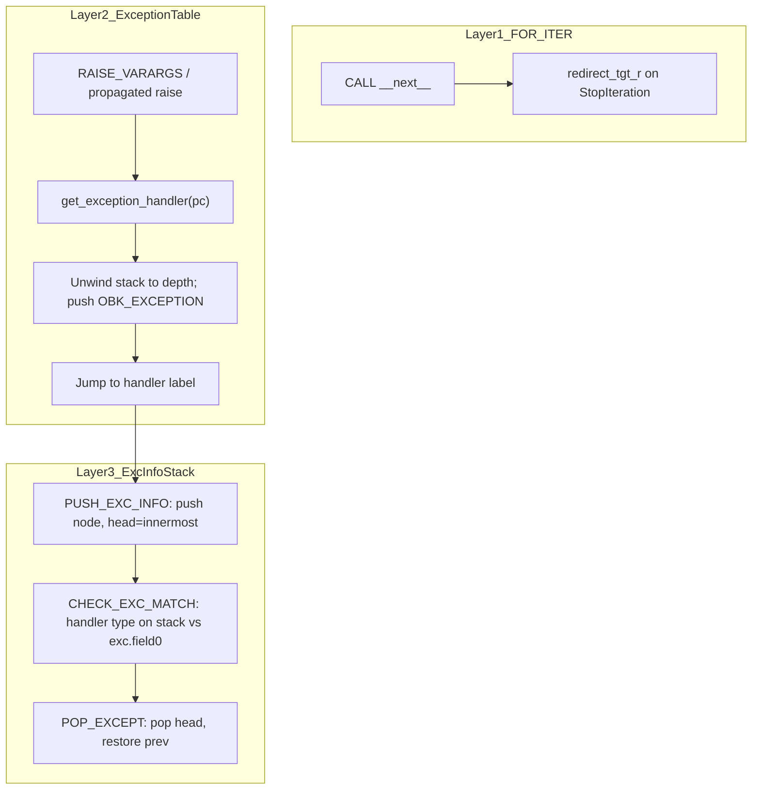

# For-loop full support — implementation plan

**Status:** Ready for handoff  
**Audience:** bytecode / pycore RTL agent (primary); firmware agent (iter/next follow-up)  
**Parent:** `planning/builtins_wave4_plan.md` §4 (Priority D) + `planning/builtins_next_steps_plan.md` §3  
**Prerequisites on `main`:** `CALL` / `CALL_KW` / `CO_VARARGS` ([planning/call_kw_support_plan.md](call_kw_support_plan.md)); LOAD_ATTR dunder specials ([planning/builtins_wave4_plan.md](builtins_wave4_plan.md) §2); native GET_ITER/FOR_ITER for LIST/TUPLE/RANGE/STR/DICT/SET  
**Unblocks:** `for x in obj`, list/dict comprehensions from real `compile()` output, `try/except StopIteration`, ROM `iter`/`next` on real protocol

Related:

- Prior iterator notes: `planning/builtins_bytecode_support_plan.md` §4.4 (historical; implementation detail **here**)
- Opcode matrix: `pycore/docs/bytecode_support.md`
- Iteration architecture: `pycore/docs/architecture.md` (LIST/TUPLE/RANGE/STR/DICT/SET iteration)
- RTL: `pycore/rtl/pycore_cont_list.svh`, `pycore/rtl/pycore_cont_object.svh`, `pycore/rtl/pycore_core.sv`
- Image tooling: `pycore/tools/image_from_source.py`, `pycore/tools/heap_image.py`
- OBJ_EXC opcode group: `pycore/targets/pycore.json`
- Existing regression: `pycore/programs/img_for_iter_*.py` (~35 programs)

---

## 0. Handoff package (implementing agent)

**Branch:** `cursor/for-loop-full-*` (or feature branch of choice); push after each phase; open draft PR → `main`.

**Preflight (Python 3.14 required):**

```bash
python3.14 -c "import dis; dis.dis('for x in [1]: pass')"
python3.14 -c "import dis; dis.dis(compile('def f(): return [x for x in range(3)]','<x>','exec'))"
python3.14 -c "
from dis import _parse_exception_table
co = compile('def f(): return [x for x in range(3)]','<x>','exec').co_consts[0]
print(list(_parse_exception_table(co)))
"
python3.14 -c "
import dis
co = compile('''def f():
    it = iter([])
    try:
        next(it)
    except StopIteration:
        return 1
''','<x>','exec').co_consts[0]
dis.dis(co)
"
```

**Do not merge RTL until:** native `img_for_iter_*` regression stays green; new tests in §10 pass.

**Scope lock (tests):** v1 image tests exercise **StopIteration** only. **Architecture** must implement the general CPython path (table dispatch, exc-info stack, stack-based `CHECK_EXC_MATCH`) so other types plug in later without redesign. Unhandled non-StopIteration raises remain **fatal** (`PY_TRAP_RAISE`) until a follow-on plan seeds more types and enables broader tests.

---

## 1. Verdict

**Doable in three tracks.** Native container loops already work. Fully working for loops requires:

1. **Track A** — object iterator protocol (`__iter__` / `__next__`) with CPython-aligned StopIteration handling inside `FOR_ITER`.
2. **Track B** — exception infrastructure (table, exc stack, raise path, opcodes); v1 tests StopIteration only.
3. **Track C** — list/dict comprehensions from real `compile()` (depends on B; A only for custom iterators in comps).

No custom opcodes. Extend standard CPython 3.14 opcodes and existing `S_CONTAINER` / `S_CALL` FSMs.

The hardest engineering item is **container ↔ CALL re-entrancy** (pause `S_CONTAINER`, run `S_CALL` for `__iter__`/`__next__`, resume).

---

## 2. End goal

**Fully working for loops** means:

| Program shape | Track | Status today |
| --- | --- | --- |
| `for x in list/tuple/range/str/dict/set` | — | **Works** (regression only) |
| `for x in Custom()` (`__iter__` / `__next__`) | A | TYPE trap on GET_ITER |
| Nested `for` / `break` / `continue` / `for/else` | A + jumps | Works for native; verify for object iterators |
| `try: next(it) except StopIteration:` | B | Deferred opcodes |
| `[x for x in it]` from `compile()` | B + C | Policy C; RERAISE rejected |
| `{k: v for ...}` dict comp | B + C | Second milestone |

---

## 3. Current baseline

### 3.1 Already shipped (do not re-derive)

- **`GET_ITER`** on LIST, TUPLE, STR, DICT, SET, `PY_TAG_RANGE` → internal `PY_TAG_ITER` hybrid ([`pycore_cont_list.svh`](../pycore/rtl/pycore_cont_list.svh) `CONT_GET_ITER`).
- **`FOR_ITER`** advances native kinds 0–3, 5–6; exhaustion redirects over `END_FOR` to `POP_ITER` via `redirect_pending_r` + `PY_CACHE_FOR_ITER` ([`architecture.md`](../pycore/docs/architecture.md) § iteration).
- **`END_FOR` / `POP_ITER` / `JUMP_BACKWARD`** — implemented.
- **~35** `img_for_iter_*` programs in [`Makefile`](../Makefile) `pycore-img-attr-all`.
- **Iterator layout** in [`pycore_defs.svh`](../pycore/rtl/pycore_defs.svh): kinds 0–3, 5–6 live; **`PY_ITER_KIND_HEAP_ITER` (kind 4) reserved** but `pycore_iter_valid` returns false for kind 4.
- **`GET_ITER` on unknown tags** → `container_type_trap_r` ([`pycore_cont_list.svh`](../pycore/rtl/pycore_cont_list.svh) ~380–381).

### 3.2 Gaps

| Area | Today | Blocks |
| --- | --- | --- |
| `co_exceptiontable` | Not serialized (7-field code object) | Comps + `try/except` |
| `PUSH_EXC_INFO`, `CHECK_EXC_MATCH`, `POP_EXCEPT`, `RERAISE` | Rejected in `image_from_source.py` | Comp cleanup |
| `RAISE_VARARGS` | Oparg 1 → fatal `PY_TRAP_RAISE` only | Non-fatal raise + table dispatch (Track B) |
| Exc-info stack | None | Nested `try/except` (`PUSH_EXC_INFO` / `POP_EXCEPT`) |
| `GET_ITER` on `OBJECT` | TYPE trap | `for x in obj` |
| Container ↔ CALL re-entrancy | None | `__iter__()` / `__next__()` |
| `FOR_ITER` on heap iterator | No kind-4 case | Custom iterators |
| Comprehension policy | Option C ([`bytecode_support.md`](../pycore/docs/bytecode_support.md)) | Real comps |

---

## 4. CPython 3.14 behavior (source of truth)

Verify with §0 commands before changing RTL claims.

### 4.1 Plain `for` statement

```text
GET_ITER
L1: FOR_ITER  Δ (to L2)
    STORE_FAST x
    ... body ...
    JUMP_BACKWARD → L1
L2: END_FOR          # skipped on natural exhaustion
    POP_ITER
```

- **`co_exceptiontable` is empty** for simple `for x in [1,2,3]:`.
- **`FOR_ITER` (opcode 70, stack +1)** calls the iterator's `__next__` internally. On **`StopIteration`**, the interpreter **clears** the exception and **jumps by oparg** (past loop body to `END_FOR`/`POP_ITER` region). This is **not** exception-table dispatch.

### 4.2 List comprehension

```text
LOAD_FAST_AND_CLEAR x
BUILD_LIST / SWAP / ...
L2: FOR_ITER ...
    LIST_APPEND
    JUMP_BACKWARD → L2
L3: END_FOR / POP_ITER
...
L5: RERAISE 0
ExceptionTable: L1 to L4 → L5 [depth]
```

- Non-empty **`co_exceptiontable`** + **`RERAISE`** cleanup.
- Other opcodes already supported: `LOAD_FAST_AND_CLEAR`, `BUILD_LIST`, `LIST_APPEND`, `SWAP`, `JUMP_BACKWARD`.

### 4.3 Exception table entry format

Conceptual 5-tuple per handler (CPython InternalDocs/exception_handling.md):

1. `start-offset` (inclusive)  
2. `end-offset` (exclusive)  
3. `target`  
4. `stack-depth`  
5. `push-lasti` (boolean)

Host parser: `dis._parse_exception_table(code.co_exceptiontable)`.

Example list-comp entry (verify locally): `start=28, end=48, target=54, depth=2, lasti=False`.

### 4.4 Opcode numbers (CPython 3.14, verified)

| Opcode | Number | Stack effect (typical) |
| --- | --- | --- |
| `GET_ITER` | 16 | 0 |
| `FOR_ITER` | 70 | +1 |
| `END_FOR` | 9 | −1 |
| `POP_ITER` | 30 | −1 |
| `RAISE_VARARGS` | 104 | 0 |
| `RERAISE` | 105 | −1 |
| `PUSH_EXC_INFO` | 32 | +1 |
| `CHECK_EXC_MATCH` | 6 | 0 |
| `POP_EXCEPT` | 29 | −1 |

### 4.5 `try/except` handler bytecode (CPython pattern)

Compiled handlers do **not** hard-code a boot type inside the matcher. Example (`except StopIteration:`):

```text
L3: PUSH_EXC_INFO
    LOAD_GLOBAL StopIteration    # handler type from LEGB / co_names
    CHECK_EXC_MATCH              # compare TOS type vs active OBK_EXCEPTION.field0
    POP_JUMP_IF_FALSE → L5
    POP_TOP                        # discard matched exc instance
L4: POP_EXCEPT
    ... handler body ...
L5: RERAISE 0
```

Nested `try/except` adds multiple table entries and multiple `PUSH_EXC_INFO` / `POP_EXCEPT` pairs — see §5.5.

---

## 5. Architecture

Exception handling uses **three orthogonal mechanisms**. Do not merge them.

| Layer | Mechanism | Answers | Used for |
| --- | --- | --- | --- |
| **1 — Loop exhaustion** | `FOR_ITER` internal catch | “Iterator done?” | Plain `for x in obj:` (empty `co_exceptiontable`) |
| **2 — Raise dispatch** | `co_exceptiontable` + `get_exception_handler` | “Which handler label for this PC?” | `try/except`, comprehension cleanup |
| **3 — Nested handlers** | Exc-info stack (`PUSH_EXC_INFO` / `POP_EXCEPT`) | “What was the previous active exc?” | Nested `try A` / `try B` / `except B` / `except A` |

Native LIST/TUPLE/… iterators keep **layer 1 only** — hardware redirect, **no** StopIteration objects.



### 5.2 Design locks (agent must not guess)

| Decision | Choice |
| --- | --- |
| StopIteration on plain `for` | **FOR_ITER internal catch** (layer 1); uses Track B **`exc_type_matches`** + **`call_exc_pending`** (§6.1.1) — no separate type seed in Track A |
| Native iterators | Unchanged hardware exhaustion redirect |
| Exception table storage | **Code object field 8**: raw bytes mirroring `co.co_exceptiontable` |
| Table lookup in RTL | **Slot indices only** — host converts byte offsets at image build (§5.6); RTL compares `cur_pc_r` to `[start,end)` slots |
| Table encoding in dmem | **TUPLE of INT** (one byte per entry, 0–255) — raw blob for host parse; optional second host artifact: precomputed slot triples if needed |
| Unwind on table hit | **pycore RTL** (core/trap path), not excore firmware |
| **`CHECK_EXC_MATCH`** | Pop handler type(s) from operand stack; compare to **`active_exc.field0`** via `exc_type_matches` |
| Exc-info stack | **dmem LIFO chain** at fixed arena (§5.5); not heap `OBK_*` per `try:` |
| Unhandled raises (v1 tests) | Only StopIteration covered by tests; other types → fatal until follow-on |
| Comprehension policy | Move **Option C → Option B** when Track C lands |

### 5.3 Code object schema extension

Extend [`encoding.py`](../pycore/tools/encoding.py) / [`heap_image.py`](../pycore/tools/heap_image.py):

| Field | Contents |
| --- | --- |
| 0–6 | unchanged (entry_slot, co_consts, co_names, metadata, co_defaults, co_varnames, co_kwdefaults) |
| **7** | `co_exceptiontable` — `TUPLE` of `INT` byte values (length = len(co.co_exceptiontable)); empty tuple if none |

- Bump `CODE_OBJECT_NFIELDS` 7 → **8**; `CODE_OBJECT_BYTES` 224 → **256**.
- [`image_from_source.py`](../pycore/tools/image_from_source.py) `serialize_code()`: copy `co.co_exceptiontable`.
- RTL: table lookup reads field 7 from the active frame’s **`cur_code_r`** (already saved in frame slot 1 — [`pycore_frame.sv`](../pycore/rtl/pycore_frame.sv)). No extra frame slot required unless re-entrancy review says otherwise.

### 5.4 HEAP_ITER (kind 4) layout

Reuse reserved socket in [`pycore_defs.svh`](../pycore/rtl/pycore_defs.svh):

```text
magic[127:120], kind=4[119:116], aux[115:96], index[95:64], size[63:32], addr[31:0]
```

- **`addr`**: dmem address of iterator `OBK_INSTANCE` (or iterator object).
- **`index` / `size` / `aux`**: object-owned state if needed v1; may start as `index=0, size=0, aux=0`.
- **`pycore_iter_valid`**: accept kind 4 when magic valid and `addr != 0`.

### 5.5 Exc-info stack (nested `try/except`)

CPython keeps a **stack of active exception contexts** (LIFO chain with `prev`). PyCore mirrors this in **dmem** — not operand-stack spill, not heap `OBK_*` per `try:`.

**Arena (hardware lock):**

```text
0x1B000 – 0x1BFFF   4 KB exc-info stack (below frame stack at 0x1C000)
```

- **`exc_sp_r`**: bump pointer; each node **32 bytes** (`prev_ptr`, saved `active_exc`, saved `active_exc_valid`, padding).
- **`exc_head_r`**: address of top node (or 0 if empty).
- **Max depth:** 128 nodes → **`PY_TRAP_MEM_FAULT`** on overflow (same class as heap OOM).
- **Per-core in twocore tops:** each core owns its own `exc_sp_r` / `exc_head_r` (secondary core does not run handler bytecode in v1 comp tests).

**Opcodes:**

- **`PUSH_EXC_INFO`:** push node; node saves previous `(active_exc, active_exc_valid)`; link `prev`; copy current raised exc from operand stack into **`active_exc_r`** / stack contract (§7.6).
- **`POP_EXCEPT`:** pop head; restore saved `active_exc_*` from node; free node (decrement `exc_sp_r`).

**Interaction with layer 2:** table dispatch lands at handler label bytecode; **`PUSH_EXC_INFO`** runs there, then **`LOAD_GLOBAL` + `CHECK_EXC_MATCH`**.

### 5.6 PC / table addressing (hardware lock)

Image build maps **one `co_code` byte pair → one imem slot** ([`image_from_source.py`](../pycore/tools/image_from_source.py)). CPython’s exception table uses **byte offsets**; RTL should **not** divide/multiply at runtime.

**Host (`exception_table.py`) converts each entry to slot indices** when validating or when emitting a helper blob:

```text
start_slot = entry.start >> 1
end_slot   = entry.end   >> 1   # exclusive, same as CPython byte end
target_slot = code_entry_slot + (entry.target >> 1)
```

**RTL lookup** (relative to active code object):

```text
rel_pc = cur_pc_r - code_entry_slot   // code field 0, already latched at CALL
match if start_slot <= rel_pc < end_slot
redirect_tgt_r = target_slot          // absolute imem slot (or entry_slot + rel target — pick one, document in RTL)
```

Use **`redirect_tgt_r`** like existing branch/`FOR_ITER` redirects. No byte-offset math in hardware.

### 5.7 Hardware defaults (Track A / C misc)

| Topic | Decision |
| --- | --- |
| **`GET_ITER` after `__iter__()`** | If return is native container → existing GET_ITER paths. Else **one** kind-4 wrap. If return is already `PY_TAG_ITER` → use as-is (no double-wrap). |
| **`__iter__` missing** | `PY_TRAP_TYPE` in v1 (TypeError follow-on). |
| **List comp exception region** | Table protects **`LOAD_FAST_AND_CLEAR` … `LIST_APPEND`** region; inner **`FOR_ITER` exhaustion** stays layer-1 redirect — separate mechanisms. |
| **Twocore comp tests** | Primary core runs module + comp bytecode + exception dispatch; secondary core LIST grow only ([`PYCORE_IMAGE_RUN_TWOCORE`](../Makefile)). |
| **Exception type objects (Track B)** | v1 **`StopIteration`**: leaf `OBK_TYPE` (`tp_base = 0`). Seeding details **only in §7.4**. |

**Memory:** exc nodes live in §5.5 arena. Raised exceptions remain **`OBK_EXCEPTION`** on the object heap (96 B) when `raise` occurs.

---

## 6. Track A — Object iterator protocol

### 6.1 Spike: container ↔ CALL re-entrancy (do first)

**Problem:** `GET_ITER` / `FOR_ITER` run in `S_CONTAINER`. Calling `__iter__` / `__next__` requires **`S_CALL`** (frame push, bytecode execution, return).

**Deliverable:** Document and implement pause/resume in [`pycore_core.sv`](../pycore/rtl/pycore_core.sv):

1. Save container op (`container_op_r`, `container_phase_r`, TOS, iterator state).
2. Transition to `S_CALL` with bound method or `CODE_OBJECT` + self.
3. On `return_valid`, restore container FSM and continue with return value on stack.

Reference shared RF wiring: `rs1_addr_eff` for both `S_CONTAINER` and `S_CALL` ([`pycore_core.sv`](../pycore/rtl/pycore_core.sv) ~631).

**Acceptance:** Unit/sim test that calls a trivial `def __iter__(self): return [1,2,3]` from synthetic GET_ITER path (may land after 6.2).

### 6.1.1 Container protocol raise boundary

`GET_ITER` / `FOR_ITER` (kind 4) invoke **`__iter__` / `__next__`** through **`S_CALL`**. Those callees typically **`raise StopIteration`** (`RAISE_VARARGS`) with an **empty** `co_exceptiontable`, so layer-2 table lookup on the callee would always miss.

**Hardware decision:**

1. Mark container-launched **`S_CALL`s** as **protocol-launched** for the duration of the call.
2. On callee exit via **`RAISE_VARARGS`**, set **`call_exc_pending`** + **`call_exc_handle`** (build **`OBK_EXCEPTION`** as in §7.5) instead of **`PY_TRAP_RAISE`** when protocol-launched.
3. Before resuming **`CONT_*`**, if **`exc_type_matches(call_exc_handle, iter_exhaust_type_r)`** → **`for_iter_exhaust_redirect()`** on **`FOR_ITER`** (same slot math as native); on **`GET_ITER`**, treat as failure (fatal v1) unless spike shows a needed path.
4. Any other pending exc from a protocol-launched **`CALL`** → **fatal** in v1.
5. Non-protocol **`S_CALL`** raises use §7.5 table dispatch on the **caller’s** code object.

Requires Track B: **`exc_type_matches`**, **`iter_exhaust_type_r`** (§7.4). Ship Track B steps 4–5 before Track A step 6.

### 6.2 `GET_ITER` on `OBJECT`

In `CONT_GET_ITER` when native tags fail:

1. Require `PY_TAG_OBJECT` / `OBK_INSTANCE`.
2. Resolve **`__iter__`** — instance `__dict__` then type `tp_dict` (same order as normal attr; dunder name is ordinary string key unless later special-cased).
3. If missing → `PY_TRAP_TYPE` (or `PY_TRAP_ATTR_ERROR` if match CPython `TypeError` later).
4. **`CALL`** 0-arg with bound self.
5. On return:
   - If native container tag → existing GET_ITER paths (§5.7).
   - If already `PY_TAG_ITER` → use as-is.
   - Else wrap **kind 4** once (`addr = iterator object`).

### 6.3 `FOR_ITER` on `PY_ITER_KIND_HEAP_ITER`

Add case in `CONT_FOR_ITER`:

1. Load iterator object from `cont_iter_addr`.
2. Resolve **`__next__`**; **`CALL`** 0-arg bound.
3. **Success:** push value (reuse `CP_VAL`/`CP_TAG`/`CP_ITER_WB`/`CP_ITEM_WB` path like LIST/TUPLE).
4. **`call_exc_pending` + exhaustion type:** **`for_iter_exhaust_redirect()`** (§6.1.1) — same slot math as native:

```systemverilog
redirect_tgt_r <= cur_pc_r + 32'd1 + {24'b0, PY_CACHE_FOR_ITER} + cur_arg_r + 32'd1;
```

5. **Other `call_exc_pending`:** fatal in v1 (or caller table dispatch if not protocol-launched).

### 6.4 Firmware follow-up (after A green)

- [`pycore_firmware/builtins/iter.py`](../pycore_firmware/builtins/iter.py) — use real protocol instead of list materialize + inner `for`.
- [`pycore_firmware/builtins/next.py`](../pycore_firmware/builtins/next.py) — call `__next__` protocol instead of list-pop hack.
- Optional ROM seed in `ROM_FIRMWARE_BUILTINS` after image tests pass.

---

## 7. Track B — Exception infrastructure (v1 tests: StopIteration)

Implement the **general** three-layer architecture (§5). v1 **tests** cover StopIteration only; do not bake StopIteration into opcode logic beyond what compiled bytecode already does (`LOAD_GLOBAL` + `CHECK_EXC_MATCH`).

### 7.1 Host tooling

Add `pycore/tools/exception_table.py` (or section in existing module):

- `parse_exception_table(data: bytes) -> list[Entry]` mirroring `dis._parse_exception_table`.
- `entries_to_slots(entries, code_entry_slot) -> list[SlotEntry]` per §5.6 (host-only; RTL uses slots).
- `serialize_exception_table(data: bytes) -> Tagged` → tuple of INT bytes for field 7.

Unit tests in `pycore/tests/test_exception_table.py`: golden vectors from §0 preflight + slot conversion round-trip.

### 7.2 Runtime: `get_exception_handler`

**Input:** `cur_pc_r` (absolute imem slot) and active code object **`code_entry_slot`** (field 0).

**Output:** `(target_slot, depth, lasti)` or miss.

**On hit:**

1. Pop operand stack to `depth`.
2. If `lasti`: push raising **slot** offset (store as INT; §5.6).
3. Push active exception object (`OBK_EXCEPTION`); set **`active_exc_r`** (§7.6).
4. Set `redirect_pending_r`; **`redirect_tgt_r = target_slot`**.

**On miss:** fatal `PY_TRAP_RAISE` (v1).

**Entry points:**

- Normal **`S_EXEC`**: `RAISE_VARARGS` oparg 1 (§7.5).
- **Not** callee empty-table raises from container protocol `CALL`s — those use §6.1.1 first.

### 7.3 Opcodes (general semantics)

Remove from `_DEFERRED_OPCODES` in [`image_from_source.py`](../pycore/tools/image_from_source.py) as each lands:

| Opcode | Semantics (implement fully) |
| --- | --- |
| `PUSH_EXC_INFO` | Push exc-info stack node (§5.5); save previous active exc |
| `CHECK_EXC_MATCH` | Pop handler **type object(s)** from operand stack; compare to **`active_exc_r.field0`** via `exc_type_matches`; push match bool |
| `POP_EXCEPT` | Pop exc-info stack head; restore **`active_exc_*`** (§7.6) |
| `RERAISE` 0 | Re-raise **`active_exc_r`** through **`get_exception_handler`** |
| `RERAISE` 1 | Pop **`active_exc_r`**, restore from exc-info stack top, re-raise (§7.6) |

Shared helper:

```text
exc_type_matches(handler_type, exc) → bool
  # v1: OBK_EXCEPTION.field0 handle == handler_type
  # follow-on: walk OBK_TYPE.tp_base
```

Update [`pycore/targets/pycore.json`](../pycore/targets/pycore.json) `OBJ_EXC` members when executing.

**Not in v1:** `CHECK_EG_MATCH`, `WITH_EXCEPT_START`, `SETUP_FINALLY`, `SETUP_WITH`, MRO/subclass, additional exception types in tests.

### 7.4 Builtin exception types + boot latch (Track B only)

All **type seeding and boot-time latch** for exception matching lives here — not in Track A prose.

1. Seed **`StopIteration`** in boot builtins (`OBK_TYPE`, **`tp_base = 0`**) so `LOAD_GLOBAL` / `raise StopIteration` work in bare images.
2. During **`S_BOOT`**, latch **`iter_exhaust_type_r`** = builtins `StopIteration` handle (used by §6.1.1 + `exc_type_matches` in tests).
3. Document layout in [`object_model.md`](../pycore/docs/object_model.md).
4. Follow-on: `BaseException` / `Exception` hierarchy + more builtins names.

`RAISE_VARARGS` 1: TOS = type object → build **`OBK_EXCEPTION`** (`field0 = type`, `field1 = args tuple`) → enter §7.5 raise path.

### 7.5 `RAISE_VARARGS` raise path (replaces fatal trap on handler hit)

Today: `RAISE_VARARGS` 1 → **`exec_raise_pulse`** → immediate **`PY_TRAP_RAISE`**.

**New flow (same cycle or short micro-sequence before trap):**

```text
S_EXEC: RAISE_VARARGS 1
  → build/set active_exc on stack + active_exc_r
  → get_exception_handler(cur_pc_r, code_entry_slot)
  → if hit: redirect_pending_r, redirect_tgt_r = target_slot (suppress fatal trap)
  → if miss: exec_raise_pulse → PY_TRAP_RAISE (unchanged)
```

Container-launched **`S_CALL`** uses the same **`active_exc`** construction, but on miss returns **`call_exc_pending`** to §6.1.1 instead of trapping immediately when the CALL was marked protocol-launched.

No separate **`S_EXC`** state required if table lookup + redirect fits in existing trap/exec bubble; spike may add **`S_RAISE`** only if timing demands it.

### 7.6 Active exception + stack contract

**Registers (per core):**

- **`active_exc_r`**: dmem handle of current **`OBK_EXCEPTION`**
- **`active_exc_valid_r`**

**After table hit or successful match:**

- Operand stack holds exc instance(s) per CPython layout at handler entry.
- **`CHECK_EXC_MATCH`:** compare TOS **type object** to **`active_exc_r.field0`** via `exc_type_matches`; leave bool on stack.
- **`POP_TOP`** after match: discard exc instance; **`active_exc_r`** unchanged until **`POP_EXCEPT`**.

**`PUSH_EXC_INFO`:** push exc-info node saving prior **`active_exc_*`**; set active from stack exc.

**`POP_EXCEPT`:** restore **`active_exc_*`** from popped node (§5.5).

**Nomatch / cleanup bytecode** (verify with §0 `try/except` dis):

```text
L5: RERAISE 0
L6: COPY 3 → POP_EXCEPT → RERAISE 1
```

Implement **`COPY`** + **`RERAISE` 1** semantics to match this pattern.

### 7.7 Handler bytecode closure (image validation)

These opcodes must work together for §4.5 / nested handlers / comps — not only the four OBJ_EXC opcodes:

| Opcode | Role in handlers / comps |
| --- | --- |
| `PUSH_EXC_INFO` | Handler entry |
| `CHECK_EXC_MATCH` | Type test |
| `POP_JUMP_IF_FALSE` | Nomatch branch |
| `NOT_TAKEN` | CPython 3.14 branch hint (already accepted) |
| `POP_TOP` | Drop matched exc |
| `POP_EXCEPT` | Exit handler |
| `RERAISE` 0 / 1 | Propagate / cleanup |
| `COPY` | Save exc for outer reraise (already accepted) |
| `LOAD_GLOBAL` / `LOAD_NAME` | Handler type + `raise` type |
| `RAISE_VARARGS` | User raise |
| `LOAD_FAST_AND_CLEAR` / `LIST_APPEND` / `BUILD_LIST` / `SWAP` | List comp body |
| `GET_ITER` / `FOR_ITER` / `END_FOR` / `POP_ITER` | Comp loop (layer 1 exhaustion) |

Unlock OBJ_EXC opcodes in [`image_from_source.py`](../pycore/tools/image_from_source.py) when RTL supports the full row for the target test tier.

### 7.8 Exc-info stack implementation

- Module **`pycore_exc_stack.sv`** (or equivalent): arena §5.5, **`exc_sp_r`**, **`exc_head_r`**, push/pop helpers.
- Wire **`PUSH_EXC_INFO`** / **`POP_EXCEPT`** in decode/exec.
- Test: `img_try_stopiteration_nested.py` (§9.2).

---

## 8. Track C — Comprehensions

**Requires Track B** (exception table + `RERAISE`). **Does not require Track A** for `[x for x in range(n)]` (native `FOR_ITER`). Track A needed only when comps iterate custom objects.

1. Accept **`RERAISE`** in image validation.
2. **List comp:** `return [x for x in range(n)]` — use [`PYCORE_IMAGE_RUN_TWOCORE`](../Makefile) when LIST grow needed.
3. **Dict comp:** follow-on (`MAP_ADD` + table region); lower priority than list comp.
4. Replace comprehension **Policy C** in [`bytecode_support.md`](../pycore/docs/bytecode_support.md) with **Option B** reference to this plan.

Opcodes already used by comps (no new decode): `LOAD_FAST_AND_CLEAR`, `BUILD_LIST`, `LIST_APPEND`, `SWAP`, `GET_ITER`, `FOR_ITER`, `JUMP_BACKWARD`.

---

## 9. Test matrix

### 9.1 Regression

All existing **`pycore-img-for_iter-*`** / `img_for_iter_*` via `pycore-img-attr-all` must stay green after every phase.

### 9.2 New image programs

Create under `pycore/programs/`; host golden via [`run_image_test.py`](../pycore/tools/run_image_test.py); wire Makefile targets (suggest aggregate **`pycore-img-for-loop-all`**).

| Program | Track | Intent |
| --- | --- | --- |
| `img_for_iter_object_list.py` | A | `SEED_TYPE`/`SEED_INSTANCE`; `__iter__` returns `[1,2,3]` |
| `img_for_iter_object_next.py` | A | Class with `__iter__`/`__next__`; golden sum |
| `img_for_iter_object_exhaust.py` | A | Empty iterator exhausts cleanly |
| `img_for_iter_object_no_iter_trap.py` | A | No `__iter__` → TYPE |
| `img_for_iter_object_nested.py` | A | Nested object loops |
| `img_try_stopiteration.py` | B | `try: next(it) except StopIteration: pass` |
| `img_try_stopiteration_nested.py` | B | Nested `try/except StopIteration`; exc-info stack push/pop |
| `img_raise_stopiteration_fatal.py` | B | Unhandled StopIteration outside handler → fatal |
| `img_list_comp_basic.py` | C | `return sum([x for x in range(5)])` or similar golden |
| `img_list_comp_fast_clear.py` | C | Comp using `LOAD_FAST_AND_CLEAR` + table |

**SEED pragmas:** use `# pycore-inject: SEED_TYPE` / `SEED_INSTANCE` patterns from existing `img_attr_dunder_*` / `img_firmware_isinstance.py`.

### 9.3 Unit tests

- [ ] Exception table parse matches `dis._parse_exception_table` on §0 samples  
- [ ] Code object field 7 round-trip in image build  
- [ ] Exc-info stack push/pop matches nested handler disassembly  
- [ ] `validate_code_tree` accepts new images after opcode unlock  

---

## 10. Implementation order

**Dependency note:** Track **B** (steps 4–5) before Track **A** step 6 — container protocol raises (§6.1.1) need `exc_type_matches` + `iter_exhaust_type_r`. Track **B+C** can ship **`try/except`** and list comps **without** object iterators. Track **A** is independent of comps but **not** of §7.4–7.6.

1. **This plan PR** — doc + index updates only.  
2. Host: field 8 + `exception_table.py` (incl. §5.6 slot conversion) + unit tests.  
3. Spike: container ↔ CALL re-entrancy (§6.1 — details TBD in spike notes).  
4. Track B: dmem exc stack + boot/`iter_exhaust_type_r` (§7.4) + `get_exception_handler` + §7.5 raise path.  
5. Track B: §7.6 active exc + `PUSH_EXC_INFO` / `CHECK_EXC_MATCH` / `POP_EXCEPT` / `RERAISE` + §7.7 checklist.  
6. Track A: GET_ITER object + HEAP_ITER + FOR_ITER + §6.1.1 boundary.  
7. Track C: list comp end-to-end (two-core).  
8. Docs: `bytecode_support.md`, `architecture.md`, `pycore.json`, `pycore_defs.svh` exc arena constants; optional dict comp + ROM `iter`/`next`.

Land as sequential commits; CI: `make docker-all-tests`.

---

## 11. Acceptance checklist

### Track A — object protocol

- [ ] `for x in Custom():` with `__next__` raising StopIteration exits loop with correct golden  
- [ ] `__iter__` returning list delegates to native FOR_ITER  
- [ ] Missing `__iter__` traps predictably  
- [ ] Nested object loops work  
- [ ] All native `img_for_iter_*` still pass  

### Track B — exception infrastructure

- [ ] `co_exceptiontable` serialized on code objects  
- [ ] `try/except StopIteration` works via `LOAD_GLOBAL` + `CHECK_EXC_MATCH`  
- [ ] Nested `try/except` exercises dmem exc stack (§5.5)  
- [ ] `RAISE_VARARGS` hits table before fatal trap when handler exists (§7.5)  
- [ ] Unhandled StopIteration outside handler still fatal  
- [ ] §7.7 handler bytecode closure passes on tier-B tests  

### Track C — comprehensions

- [ ] `[x for x in range(n)]` from real compile() runs on two-core top  
- [ ] Comprehension Policy C retired in docs  
- [ ] `RERAISE` accepted by image tooling  

---

## 12. Owner split

| Track | Primary files | Owner |
| --- | --- | --- |
| A Iterator protocol | `pycore_cont_list.svh`, `pycore_cont_object.svh`, `pycore_core.sv` | bytecode / pycore RTL |
| B Exception infra | `pycore_core.sv`, `pycore_decode.sv`, exc stack module, `heap_image.py`, `image_from_source.py` | bytecode agent |
| C Comprehensions | tests, Makefile, `bytecode_support.md` | either (after A+B) |
| Firmware iter/next | `pycore_firmware/builtins/iter.py`, `next.py` | firmware agent (after A) |

---

## 13. Explicit non-goals (this plan)

- Generators / `YIELD_VALUE` / `RETURN_GENERATOR` / `SEND`  
- `async for` / `StopAsyncIteration`  
- Full exception hierarchy seeding (`TypeError`, `KeyError`, …) and real exception messages  
- MRO / subclass checks in `CHECK_EXC_MATCH` (v1 uses type-handle equality only)  
- `SETUP_FINALLY`, `SETUP_WITH`, `WITH_EXCEPT_START`  
- Sequence protocol (`__getitem__` without `__iter__`)  
- `iter(callable, sentinel)`  
- Custom opcodes  

---

## 14. Cross-references

| Document | Relationship |
| --- | --- |
| `builtins_bytecode_support_plan.md` §4.4 | Historical; **implementation detail superseded here** |
| `builtins_next_steps_plan.md` §3 | GET_ITER / exception rows → **active: this plan** |
| `builtins_wave4_plan.md` §4 | Priority D rows → **this plan** |
| `bytecode_support.md` comprehension policy | Option C until Track C; then Option B |

---

## 15. Follow-on (after this plan)

- Generators (`YIELD_VALUE`) — separate plan  
- Seed `TypeError` / `KeyError` / … + MRO-aware `exc_type_matches`  
- `CO_VARKEYWORDS` — unrelated but listed in wave 4 §4  
- `BI_ORD` / `BI_CHR` — wave 4 §3  
- ROM seed `iter` / `next` on real protocol  

**Placement recommendation:** bytecode, priority=high, blocked by=container-CALL re-entrancy spike, cluster=bundle with OBJ_EXC opcodes (`PUSH_EXC_INFO`, `CHECK_EXC_MATCH`, `POP_EXCEPT`, `RERAISE`, `RAISE_VARARGS`).
