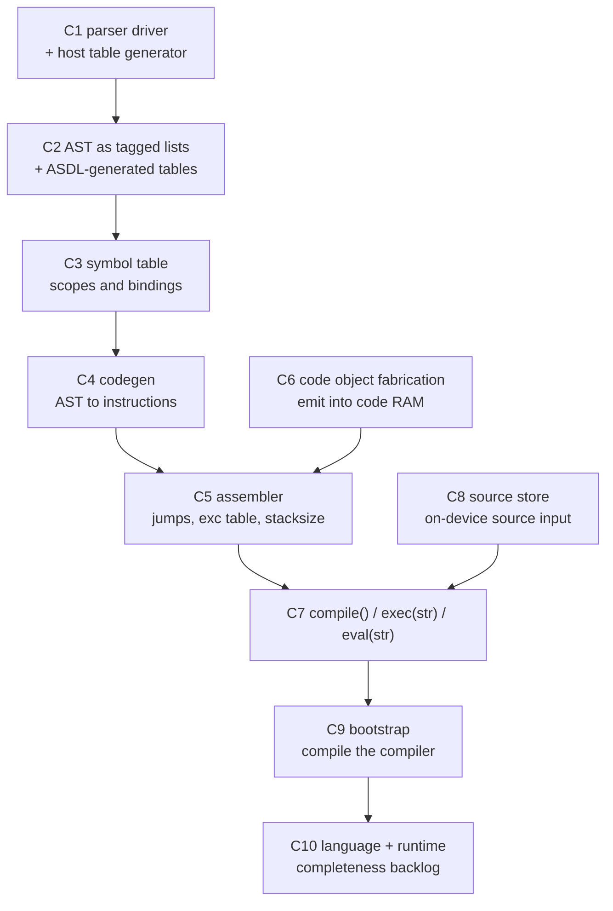

# Plan 2 — native `compile()`: parser, AST, codegen, assembler, self-hosting

**Status:** proposed
**Audience:** firmware compiler agent, bytecode agent, pycore RTL agent, tooling agent
**Prerequisite:** [`code_loading_bios_tokenizer_plan.md`](code_loading_bios_tokenizer_plan.md) (Plan 1) complete
**Supersedes:** the P7–P9 phases of `implemented/compile_exec_plan.md`

Plan 1 gets PyCore to *boot a BIOS, load code, `exec()` it, and tokenize source*.
Plan 2 completes the pipeline — **parse, build an AST, resolve scopes, generate
bytecode, and assemble a code object, entirely on PyCore** — and ends with a
bootstrap in which PyCore compiles its own compiler with no host involvement.

Plan 1 §14 is the dependency contract. Everything in this document assumes those
rows are delivered.

---

## 1. Goals

1. **Parse Python on-device** into a real AST, from the token stream Plan 1
   produces.
2. **Resolve scopes** with a symbol table, so locals compile to fast locals and
   globals to name lookups.
3. **Generate PyCore-canonical CPython 3.14 bytecode** and assemble it into a
   runnable code object, in code RAM.
4. **Ship `compile()`, and string-form `exec()` / `eval()`** as real builtins.
5. **Host independence:** PyCore compiles source it holds itself, including its
   own compiler source, and reaches a reproducible bootstrap fixpoint.
6. **Track the road to full language coverage** honestly, separating "no host
   needed" from "every Python feature works" (§11) — they are different problems
   and only the first is fully solved here.

### 1.1 The two independence axes

Stating this up front because it is easy to conflate:

| Axis | Meaning | Where it lands |
| --- | --- | --- |
| **Host independence** | No host CPython in the loop to compile anything | **Achieved in Plan 2** (§10 bootstrap) |
| **Language completeness** | Every CPython construct compiles *and runs* | **A tracked backlog** (§11). Much of it needs new *runtime* hardware (closures, generators, imports), not just codegen |

Compiling a construct PyCore cannot execute is worthless, so §11 pairs every
language feature with the runtime support it requires.

---

## 2. Open-source reuse for this stage

Plan 1 §2 holds the full audit and the licence policy; this section covers what
is specific to parsing and code generation.

### 2.1 What is reusable

| Stage | Source | Reuse |
| --- | --- | --- |
| **Parse tables** | `parso/pgen2/generator.py` (MIT) or PyPy's `pgen` | **Host-side generator.** Reads an EBNF grammar, produces LL(1) DFA tables. Pure Python, runs at image-build time — no device constraints apply |
| **Parser driver** | PyPy `pyparser/parser.py` (MIT, ~13 KB) | **Port.** Table-driven push-down automaton with an explicit stack; small and PyCore-shaped |
| **Parse tree → AST** | PyPy `astcompiler/astbuilder.py` (MIT, 60 KB) | **Reference, selective port.** Structure is right; it targets PyPy's class-based AST, which we replace (§4.2) |
| **AST node definitions** | CPython `Parser/Python.asdl` | **Host-side generator input.** Emit node-kind constants and field tables from the ASDL, as CPython and PyPy both do |
| **Symbol table** | PyPy `astcompiler/symtable.py` (MIT, 19 KB) | **Reference.** Scope rules are the subtle part and worth following closely |
| **Codegen** | PyPy `astcompiler/codegen.py` (MIT, 50 KB) | **Reference only.** Emits PyPy opcodes; ours must target PyCore's CPython-3.14 subset, so this is a re-implementation guided by a known-good structure |
| **Assembler** | PyPy `astcompiler/assemble.py` (MIT, 24 KB); `bytecode` (MIT) | **Reference.** `bytecode` is the better model for 3.11+ exception tables and EXTENDED_ARG jump convergence, and is an excellent **host-side oracle** |
| **Exception table codec** | `pycore/tools/exception_table.py` (in-repo) | Already mirrors CPython's 6-bit varint **parser**; Plan 2 adds the **encoder**, on host and on device |

### 2.2 Why LL(1) tables rather than PEG

CPython 3.14 itself uses a PEG parser, and `pegen` can generate a *Python* PEG
parser from `Grammar/python.gram`. It is nonetheless the wrong choice here, for
one hard reason and two soft ones:

- **Frame depth.** PyCore shares one flat register file (`RF_DEPTH = 256`) and
  caps call nesting at `MAX_CALL_DEPTH_CORE = 128`; `img_deep_callgraph` already
  exercises ~25 live frames. A PEG parser recurses once per grammar rule per
  token position, so ordinary nested expressions would blow the frame budget. A
  table-driven LL(1) parser keeps its state in an **explicit data stack**, so
  depth is bounded by heap, not frames. This is decisive.
- **Memoization needs tuple keys.** PEG performance depends on memoizing
  `(rule, position)`; `pycore_dict_key_tag_ok` excludes `TUPLE`, so every
  memo table would need a workaround.
- **Generated PEG parsers are class- and decorator-heavy** (`@memoize`, a
  `Parser` base class), and PyCore rejects inheritance and decorators.

LL(1) is also proven at this scale twice over: PyPy and `parso` both parse real
Python grammars with pgen-style tables.

**Cost, stated plainly:** modern Python is not fully LL(1) — that is precisely
why CPython moved to PEG. So we target a **documented LL(1)-expressible subset**
and grow it, accepting that a few constructs will need grammar factoring or a
targeted hack (as `parso` does). §11 tracks anything that cannot be expressed.

**Fallback:** if the LL(1) driver stalls on the grammar, fall back to
hand-written recursive descent with precedence climbing, whose depth is bounded
by precedence levels (~10) rather than by rules. Keep the same AST output so
nothing downstream changes.

### 2.3 Scale reality check

PyPy's compiler is ~315 KB of Python. At roughly 5–10 bytecode units per line,
a full port would be far past even Plan 1's 32 768-slot code RAM. Plan 2
therefore builds a **deliberately smaller compiler** using PyPy as an algorithm
reference, and tracks its size continuously (§9.4). The size report is a
first-class deliverable, not an afterthought.

---

## 3. Pipeline and phase map

```text
source ──► tokenizer ──► parser ──► AST ──► symtable ──► codegen ──► assembler ──► CODE_OBJECT
          (Plan 1 P9)     C1       C2        C3           C4          C5            C6
```



| Phase | Deliverable | Layer |
| --- | --- | --- |
| C1 | LL(1) parser driver + host table generator | firmware + tooling |
| C2 | AST representation + ASDL-generated node tables | firmware + tooling |
| C3 | Symbol table / scope resolution | firmware |
| C4 | Code generator (AST → instruction list) | firmware |
| C5 | Assembler (instructions → code object fields) | firmware |
| C6 | Code-object fabrication primitives | RTL + tooling |
| C7 | `compile()`, `exec(str)`, `eval(str)` | firmware |
| C8 | On-device source store | RTL + firmware |
| C9 | Self-hosting bootstrap | all |
| C10 | Language and runtime completeness | RTL + firmware |

**C6 is RTL and independent of C1–C5** — start it in parallel so the assembler
has something real to write into.

---

## 4. C1 / C2 — parser and AST

### 4.1 C1 — parser

`pycore/tools/gen_grammar_tables.py` (host) reads
`pycore_firmware/compiler/python.gram` and emits
`pycore_firmware/compiler/grammar_tables.py`: per-nonterminal DFA states, arc
tables, first-sets, and a label table. Built on `parso`'s pgen2 generator
algorithm (MIT, attributed per Plan 1 §2.4) or a direct reimplementation.

**Tables are strings, indexed with `ord(s[i])`** — the same decision as the
tokenizer's DFA (Plan 1 §10.2) and for the same reason: a `TUPLE` of `INT` costs
32 bytes per entry, a string costs 1. Any table entry that can exceed 127 must
be encoded as two bytes with a documented scheme, and the generator must assert
the encoding invariant rather than silently emitting multi-byte UTF-8.

`pycore_firmware/compiler/parser.py` is the driver, ported from PyPy's
`parser.py`: a push-down automaton over an explicit stack of
`[dfa, state, node]` frames, consuming the token list and building parse-tree
nodes. On an unexpected token it raises `SyntaxError` with the token's line and
column (Plan 1 §9.1 gives it a message payload).

**Staging:** prove the driver on a **tiny expression grammar** first
(`expr: term (('+'|'-') term)*` and friends), with the full Python subset
grammar landing only once the driver and tables are trusted. A parser bug and a
grammar bug look identical; do not debug both at once.

**Tests.** Host (`test_rom_parser.py`): tiny-grammar acceptance and rejection;
then, for a corpus of snippets, compare the parse tree's shape against a
reference built from CPython's `ast` (structural comparison after normalisation).
Edge cases: empty input; a single expression; deeply nested parentheses (**depth
regression** — the whole point of LL(1) is that this does not grow frames);
every statement form in the grammar; every operator precedence and associativity
pair, including `a - b - c` and `a ** b ** c`; trailing commas; empty
collections; every syntax-error position, each asserting line and column.
Device: `img_parser_tiny_expr`, `img_parser_stmt_count`,
`img_parser_deep_nesting`, `img_parser_syntax_error_trap`.

### 4.2 C2 — AST without classes

PyCore rejects class inheritance and has no `__slots__`, and PyPy's `ast.py` is
146 KB of generated classes. So an AST node is a **tagged list**:

```text
node = [NODE_KIND, lineno, col, field0, field1, ...]
```

`NODE_KIND` is a small `INT` so every dispatch is a native integer compare.
Field order per kind comes from a generated table, so codegen indexes fields by
constant rather than by name.

`pycore/tools/gen_ast_tables.py` (host) reads CPython's `Parser/Python.asdl` and
emits `pycore_firmware/compiler/ast_kinds.py`: `KIND_*` constants, field counts,
field-name tables (for debugging), and optional-field masks. Generating from the
ASDL keeps our node set aligned with CPython's, which is what makes PyPy's
`astbuilder` and `codegen` usable as references and makes host-side differential
comparison against `ast.parse` meaningful.

`pycore_firmware/compiler/astbuilder.py` converts parse tree → AST, ported
selectively from PyPy's, with the class constructors replaced by list literals.

**Heap cost.** A node is a list object (32 B) plus 32 B per element, so a
5-element node is ~192 B. A few thousand nodes is a few hundred KB — **more than
the 109 KB heap**. Consequences, and they shape the design:

- Keep nodes narrow; do not store what codegen can recompute.
- Free the token list before building the AST, and the parse tree before
  codegen, using Plan 1's marks (§9.2 there).
- **Compile per top-level statement where possible** rather than holding a whole
  module's AST at once.
- The compiler must raise a clean "source too large" error rather than tripping
  an OOM trap, and a host test must assert the node-size accounting the error
  is based on.

**Tests.** Host: for each ASDL node kind, build and round-trip; compare AST
shape against `ast.parse` for the corpus; assert every generated field table
matches the ASDL. Device: `img_ast_build_expr`, `img_ast_build_stmt`,
`img_ast_node_count`, `img_ast_too_large_trap`.

---

## 5. C3 — symbol table

Scope analysis decides, per name per scope, whether it is a fast local, a
global, a cell, or a free variable. Without it, codegen cannot choose between
`LOAD_FAST` and `LOAD_NAME`, and function locals are simply wrong.

Ported in structure from PyPy's `symtable.py`. v1 handles module scope and
function scope with `global` / `nonlocal` declarations; **closures are deferred**
to §11 because PyCore has no `MAKE_CELL` / `LOAD_DEREF`.

Per scope: a dict from name → binding flags, plus ordered `varnames`. Long
identifiers work only because Plan 1 §6.4 made long-string keys content-equal —
this phase is the reason that was a hard requirement.

**Tests.** Host: parameter is local; assignment makes a local; read-only name is
global; `global x` forces global; augmented assignment before binding is an
error; comprehension scoping (once comprehensions land); shadowing a builtin;
name bound in one branch only; `del` of a local; duplicate parameter (error);
a name that is both parameter and `global` (error); nested function referencing
an outer local (**must raise a clear "closures unsupported" error, not miscompile
to a global read** — silent miscompilation here would be very hard to debug).
Device: `img_symtable_locals`, `img_symtable_global_decl`,
`img_symtable_closure_unsupported_trap`.

---

## 6. C4 / C5 — codegen and assembler

### 6.1 C4 — code generator

AST → a list of pseudo-instructions grouped into basic blocks. Blocks and
instructions are tagged lists, like AST nodes.

Target is the **PyCore-canonical** subset: every opcode emitted must be in
`bytecode_support.md`'s fully-supported table. Two rules make this enforceable:

1. A firmware-side opcode allowlist mirroring `SUPPORTED_OPS`. Emitting anything
   else raises a compiler-internal error, so a codegen bug surfaces as a clean
   failure rather than an illegal-opcode trap.
2. A host test asserting the firmware allowlist and `SUPPORTED_OPS` agree, so
   they cannot drift.

Established deviations, carried from the earlier plan and to be re-documented as
`bytecode_support.md` entries:

- **No `CACHE` padding.** CPython 3.14 emits inline cache units after
  `LOAD_GLOBAL`, `CALL`, `BINARY_OP`, `COMPARE_OP` and others; PyCore's fetch
  skips `CACHE`, so we emit none. Jump deltas stay internally consistent, but
  emitted bytecode is **not** byte-identical to host `compile()`. Differential
  tests therefore compare **program results**, never `co_code`.
- **`LOAD_GLOBAL` low-bit convention:** `namei = oparg >> 1`, bit 0 requests the
  `NULL` push.
- **`COMPARE_OP`** uses CPython 3.14's packed oparg (selector in bits 7:5).

Coverage grows in tiers, each fully tested before the next:

| Tier | Constructs |
| --- | --- |
| T1 | Literals, names, arithmetic/bitwise/unary, comparisons, `is`, `in`, calls, subscript, attribute, expression statements, assignment |
| T2 | `if`/`elif`/`else`, `while`, `for`, `break`, `continue`, `pass`, chained comparisons, `and`/`or` short-circuit, augmented assignment |
| T3 | `def` with positional/default/kw-only/`*args`/`**kwargs`, `return`, multiple assignment and unpacking, list/tuple/dict/set displays |
| T4 | `try`/`except`/`finally`, `raise`, `with`, comprehensions |
| T5 | `class`, decorators, `import`, `lambda` |

T4 and T5 depend on runtime features tracked in §11; do not generate code for a
construct PyCore cannot execute.

### 6.2 C5 — assembler

Instruction list → code-object fields:

1. **Order blocks** and resolve labels to code-unit offsets.
2. **Jump resolution with EXTENDED_ARG.** Emit forward jumps as a reserved
   `EXTENDED_ARG 0` + `JUMP_*` pair so patching never resizes the stream —
   otherwise resolution iterates to a fixpoint, which `bytecode` does with a
   pass limit and is easy to get subtly wrong. Deltas are computed in code units
   relative to the instruction after the jump, matching CPython.
3. **Stack depth** for `co_stacksize` by walking the CFG. Hardware does not
   currently check it (deviation 10, no stack-overflow detection), so a
   conservative over-estimate is safe — but compute it properly, because once a
   stack-limit trap exists a wrong value becomes a live bug.
4. **Exception table** encoding into code field 7 as CPython's 6-bit varints.
   `pycore/tools/exception_table.py` already implements the host **parser**; add
   the **encoder** on host and on device, and property-test
   `encode(decode(x)) == x` over random tables.
5. **Metadata** packing: argcount, nlocals, stacksize, kwonlyargcount, and the
   flag bits.

### 6.3 Metadata beyond 48 bits — fix the old plan's limitation

`INT` is a signed i64, but `pack_code_metadata` places `posonlyargcount` at bits
`[81:66]`. The earlier plan simply forbade `*args` / `**kwargs` / posonly in
compiled code as a result. That is not acceptable for T3, so `_bi_code_new`
takes **flags as a separate list element** rather than requiring one >64-bit
integer:

```text
fields[3] = metadata  INT: argcount | nlocals<<16 | stacksize<<32 | kwonly<<48
fields[8] = flags     INT: varargs | varkw<<1 | posonlyargcount<<2
```

The builtin composes the full metadata word in hardware, where the 128-bit value
field has room. Field count therefore goes 8 → 9 in the *builtin's argument
list*; the on-heap code object keeps its 8 fields and 256-byte size.

**Tests (assembler).** Host, mostly property-based: jump deltas correct for
forward, backward, and zero-distance jumps; a jump needing EXTENDED_ARG; a jump
at exactly the 255/256 oparg boundary; nested loops; a block reachable by two
paths; stack depth for balanced and unbalanced branches; exception-table
round-trip including nested and adjacent ranges; empty function; function whose
body is only `pass`; a function with 0, 1, 255, and 256 locals; and a
`co_stacksize` cross-check against CPython's for the same construct where the
opcode sequence is comparable.

---

## 7. C6 — code-object fabrication

Three primitives, continuing the `BI_*` id sequence after Plan 1's
`PY_BI_LOAD_MODULE`. All are on-core: excore cannot reach code memory.

| Builtin | Behaviour |
| --- | --- |
| `_bi_code_alloc(nslots) -> INT` | Reserve `nslots` from `code_ram_ptr_r`; return the base slot. Overflow → `PY_TRAP_MEM_FAULT` |
| `_bi_code_emit(slot, opcode, oparg)` | Write one code word (`bits[39:8] = arg`, `bits[7:0] = opcode`). `slot` must lie inside already-reserved code RAM, else `PY_TRAP_MEM_FAULT`. **Absolute slot addressing**, so patching a jump is just a re-emit |
| `_bi_code_new(fields) -> CODE_OBJECT` | Take a 9-element list, validate each element's tag, bump-allocate a 256-byte code object, populate its 8 fields (composing metadata from `fields[3]` and `fields[8]`), and return the handle |

Field/tag contract for `_bi_code_new`:

| i | Field | Tag | Notes |
| --- | --- | --- | --- |
| 0 | `entry_slot` | `INT` | Must be inside reserved code RAM |
| 1 | `co_consts` | `TUPLE` | Built in Python via `(*lst,)` |
| 2 | `co_names` | `TUPLE` | Elements must be strings |
| 3 | `metadata` | `INT` | Low 64 bits (see §6.3) |
| 4 | `co_defaults` | `TUPLE` | |
| 5 | `co_varnames` | `TUPLE` | |
| 6 | `co_kwdefaults` | `MUT_DICT` | |
| 7 | `co_exceptiontable` | `TUPLE` of `INT` bytes | `()` when there are no handlers |
| 8 | `flags` | `INT` | varargs / varkw / posonly (§6.3) |

Wrong length, wrong tag, or heap OOM traps.

**Self-modification is not supported:** writing a slot that is currently
executing is undefined. Code must be fully emitted before it is called; state it
in `code_loading.md`.

**Host stand-ins** in `image_from_source.py`, alongside `_host_bi_print`:
accumulate emitted words and assemble a real CPython `types.CodeType` via
`CodeType.replace`. This is the **highest-value test asset in either plan** — it
lets C1–C5 be developed and debugged entirely under CPython while exercising the
same emitted instruction stream the device will run.

**Tests.** Host: `test_code_fabrication.py` for the stand-ins and metadata/flag
packing round-trips. Device: `img_code_new_call` (emit
`RESUME; LOAD_SMALL_INT 7; RETURN_VALUE`, fabricate, call, expect 7);
`img_code_new_args` (a fabricated function taking arguments);
`img_code_new_varargs` (exercises the §6.3 flags path);
`img_code_emit_range_trap`; `img_code_new_bad_field_trap`;
`img_code_new_bad_tag_trap`; `img_code_alloc_exhaust_trap`;
`img_code_new_heap_oom_trap`.

---

## 8. C7 / C8 — the builtins and getting source in

### 8.1 C7 — `compile()`, `exec(str)`, `eval(str)`

```python
def compile(source, filename, mode, flags=0, dont_inherit=False, optimize=-1):
    if flags != 0:
        raise ValueError
    toks = tokenize(source)
    tree = parse(toks, mode)
    ast = build_ast(tree, mode)
    sym = build_symtable(ast)
    instrs = codegen(ast, sym, mode)
    return assemble(instrs)
```

`filename` is accepted and ignored (there are no tracebacks yet). `mode`
compares as a `SHORT_STR`, which is native. `"single"` raises.

`exec` / `eval` gain string dispatch using `_bi_code_kind` (Plan 1 §8.1):

```python
def exec(source, globals=None):
    if _bi_code_kind(source) == KIND_CODE:
        code = source
    else:
        code = compile(source, "<string>", "exec")
    ...
```

Seed `compile` in `ROM_FIRMWARE_BUILTINS`, extend
`load_rom_firmware_callables()` so host goldens use the ROM bodies with the
`_bi_code_*` stand-ins bound, and move `compile` / `eval` / `exec` to **in ROM**
in `builtins.md`. Rewrite `compile.md` / `eval.md` / `exec.md` from blocker
analyses into shipped notes describing the supported subset and its deviations.

**Tests.** Device: `img_compile_exec_roundtrip`
(`exec(compile("x = 1 + 2", "<s>", "exec"))` then read `x`);
`img_compile_eval_expr`; `img_exec_str_direct`; `img_eval_str_direct`;
`img_compile_exec_nested` (compiled code that itself compiles and execs);
`img_compile_mode_trap`; `img_compile_flags_trap`;
`img_compile_repeat_release` (many compiles in one run, using marks — the leak
regression). Aggregate `pycore-img-compile-all`, wired into `all-tests`.

Host: for every tier-T1..T3 construct, compile with the ROM compiler through the
host stand-ins, `exec` the result under CPython, and compare against CPython's
own `exec` of the same source. This is where language coverage is actually
established; device tests confirm the same code runs on hardware.

### 8.2 C8 — on-device source store

"No host" requires source text to come from somewhere PyCore owns. Three routes,
in increasing independence:

| Route | Mechanism | Independence |
| --- | --- | --- |
| **S1. Image-resident source** | Source blobs as `LONG_STR` constants in the boot image or a loaded module's data section | Enough for the bootstrap (§10). No new hardware |
| **S2. Console input** | `input()` over a console RX MMIO register (the existing `CONSOLE_TX` at `0xF0` gains an RX sibling) | Interactive REPL becomes possible |
| **S3. Block device** | A read-only storage MMIO window; `open()` on top | Real filesystem; the OS direction |

**S1 is required for Plan 2**; S2 and S3 are the natural first pieces of the OS
that replaces the test payload, and both unblock the long-standing `open` /
`input` blockers. Note that S1 competes for the 16 KB static string region with
the DFA and grammar tables — which is exactly why Plan 1's module format lets a
data section carry them into the heap instead.

**Tests.** S1: `img_source_blob_compile` (compile a source string held in the
image). S2/S3 when built: `img_input_line`, `img_open_read`, plus trap tests for
missing device, EOF, and oversized reads.

---

## 9. Cross-cutting discipline

Plan 1 §4 applies unchanged: documentation lands in the same commit as the code,
every phase ships host unit tests plus device differential and trap tests, every
documented deviation gets a numbered `bytecode_support.md` entry and a test that
pins it, and `make all-tests` green is the merge gate. Plan 2 adds four items.

### 9.1 A new document: `pycore/docs/compiler.md`

Owned by this plan and updated every phase: pipeline stages and their data
representations, the tagged-list AST layout and node-kind table, the grammar and
table-generation flow, the codegen tier table, the assembler's jump and
exception-table rules, every deviation from CPython's compiler, and the size
budget (§9.4).

### 9.2 Generated files are never hand-edited

`grammar_tables.py`, `ast_kinds.py`, and `dfa_tables.py` are build products.
Each carries a "generated by — do not edit" header naming its generator, and a
host test regenerates and diffs them so a hand edit fails CI.

### 9.3 The host oracle is the primary development surface

Every stage must run under CPython via `load_rom_firmware_callables()`. Device
tests confirm; they are not where the language gets debugged. A stage that only
works on device is a stage that cannot be tested at breadth.

### 9.4 Continuous size and cost budgeting

The compiler competes with everything else for code RAM, heap, and the static
string region. Add a `make pycore-size-report` target emitting, per ROM/loaded
module: code slots used, heap bytes for constants, and static string bytes —
with the totals against `PYCORE_CODE_RAM_SLOTS`, `PYCORE_HEAP_LIMIT`, and
`STRING_RUNTIME_BASE`. Track it in `compiler.md` and **fail the build on
overflow with a clear message** rather than discovering it as an OOM trap.

---

## 10. C9 — the self-hosting bootstrap

This is the milestone that proves host independence, and it is a fixpoint test,
not a demo.

| Stage | What runs | Proves |
| --- | --- | --- |
| **S0** | Host builds the compiler image (today's flow) | Baseline |
| **S1** | On-device compiler compiles a test program; the result runs | The pipeline works on hardware |
| **S2** | On-device compiler compiles **its own source** (held per §8.1 S1) into a module; that module is loaded via Plan 1's loader | The compiler is expressible in its own supported subset |
| **S3** | The stage-2 compiler compiles the same test program; results are identical to S1 | Semantic self-consistency |
| **S4** | Stage-2 output is **byte-identical** to stage-1's emitted code for the same input | Reproducible, deterministic codegen — the classic bootstrap fixpoint |

S2 is the demanding one: the compiler's own source must lie inside the subset the
compiler supports. Enforce it continuously from C1 onward with a host test that
compiles every `pycore_firmware/compiler/*.py` file **with the ROM compiler
itself** (via the host stand-ins) and fails on any unsupported construct. Left
until the end, this becomes a rewrite; checked from the start, it is a constraint
that keeps the code simple.

Sizing note: S2 must hold the compiler's source, its own working set, and the
emitted module simultaneously. Expect this to be the tightest memory moment in
either plan, and to require Plan 1's marks plus possibly compiling module by
module rather than all at once.

**Tests.** `img_bootstrap_compile_self` (S2), `img_bootstrap_stage2_compiles`
(S3), and a host test asserting S4 byte-identity. Plus `make pycore-bootstrap`
running the whole chain, in `all-tests` if runtime permits, otherwise nightly.

---

## 11. C10 — language and runtime completeness

Compiling a construct PyCore cannot execute is pointless, so each row pairs the
language feature with the runtime work it needs. This is the backlog that
separates "no host" from "all of Python".

| Feature | Runtime support required | Notes |
| --- | --- | --- |
| Closures / nested functions | `MAKE_CELL`, `LOAD_DEREF`, `STORE_DEREF`, `LOAD_CLOSURE`, cell objects | Symbol table (C3) already computes the information |
| Generators / `yield` | `YIELD_VALUE`, `SEND`, `RETURN_GENERATOR`, frame suspension | Frames are a dmem push/pop stack today; suspension is a significant change |
| `class` statements at runtime | `LOAD_BUILD_CLASS`, frame-local namespaces, `__build_class__` | Classes are currently folded at image-build time |
| `import` | Module objects, a module registry, a source/module store (§8.2 S3) | Depends on the OS direction |
| `try` / `finally` / `with` | Broader exception tables, `SETUP_*`/`WITH_EXCEPT_START`, context managers | StopIteration-only handling exists today |
| Comprehensions | Already partly supported (list comps run); needs the codegen tier and `MAP_ADD`/`SET_ADD` paths | Policy B in `bytecode_support.md` |
| `f`-strings | `FORMAT_VALUE` / `FORMAT_WITH_SPEC` / `BUILD_STRING` | Also unblocks `format` / `str` |
| Decorators | Nothing new beyond calls | Cheap once T5 codegen exists |
| `lambda` | Nothing new beyond `MAKE_FUNCTION` | Cheap |
| `async` / `await` | `GET_AWAITABLE`, `SEND`, event loop | Far future |
| Negative indices and step slices | Index normalisation; `BUILD_SLICE` | Removes a large class of porting friction (Plan 1 R5) |
| Full LEGB / `locals()` | Frame-local namespace mapping, `LOAD_NAME` locals step | Also gives `exec(code, g, l)`, `vars()`, `dir()` |
| Real GC | Tracing collector over the tagged heap | Marks (Plan 1 §9.2) are a stopgap; a long-running OS needs GC |
| `int` beyond 64 bits | Arbitrary-precision integers | CPython semantics; currently a documented ceiling |

Sequencing recommendation: **closures → `try`/`finally` → runtime `class` →
f-strings → generators → imports**, because that order maximises the fraction of
ordinary Python that runs, and closures are the one most likely to be needed by
the compiler's own source.

---

## 12. Definition of done for Plan 2

- [ ] Parser driver + generated tables parse the documented grammar subset on device
- [ ] AST builds as tagged lists; node tables generated from `Python.asdl`
- [ ] Symbol table resolves locals/globals; unsupported closures raise clearly
- [ ] Codegen covers tiers T1–T3, emitting only allowlisted opcodes
- [ ] Assembler resolves jumps (incl. EXTENDED_ARG), computes stack depth, encodes exception tables
- [ ] `_bi_code_alloc` / `_bi_code_emit` / `_bi_code_new` work, with host stand-ins
- [ ] `compile()`, `exec(str)`, `eval(str)` are in ROM and pass differential tests
- [ ] Source is available on-device (§8.2 S1 minimum)
- [ ] Bootstrap S1–S4 pass, including byte-identical stage-2 output
- [ ] `pycore/docs/compiler.md` exists and is current; every deviation numbered and pinned by a test
- [ ] `make pycore-size-report` reports within budget and fails the build on overflow
- [ ] Every edge matrix in §4–§8 covered; `make all-tests` green

---

## 13. Risks

| # | Risk | Mitigation |
| --- | --- | --- |
| R1 | **Heap exhaustion during compilation** — AST nodes at ~192 B, no GC, 109 KB heap. | Narrow nodes; free tokens before AST and AST before codegen using marks; compile statement-by-statement; clean "too large" error with a host-tested accounting model; consider growing `DMEM_BLOCK_COUNT`. |
| R2 | **Compiler exceeds code RAM.** | §9.4 size report with hard build failure; split into loadable modules and overlay; `PYCORE_CODE_RAM_SLOTS` is a parameter. |
| R3 | **Python is not LL(1).** | Target and document a subset; factor the grammar; keep recursive-descent as the fallback (§2.2); track unexpressible constructs in §11. |
| R4 | **The compiler's own source drifts outside its supported subset**, breaking S2 late. | Host test from C1 onward that compiles every compiler source file with the ROM compiler. |
| R5 | **Frame depth** in the parser or codegen tree walks. | LL(1) explicit stack for parsing; iterative or shallow-recursive walks in codegen; a deep-nesting device regression per stage; `RF_DEPTH` / `MAX_CALL_DEPTH` are parameters. |
| R6 | **Static string region (16 KB) overflows** with tokenizer DFA + grammar tables + source blobs. | Move tables into a loaded module's data section (Plan 1 §6.2 enables this); size report; fail loudly. |
| R7 | **Jump resolution subtleties** (EXTENDED_ARG, relative deltas, exception-table interaction). | Reserve EXTENDED_ARG on forward jumps so patching never resizes; property tests at the 255/256 boundary; use `bytecode` as a host oracle. |
| R8 | **Silent miscompilation** — code runs but computes the wrong thing. | Every construct differentially tested against CPython semantics on the host; results compared, never bytecode; the S4 fixpoint catches nondeterminism. |
| R9 | **Simulation time** for a full compile on a multi-cycle core. | Generous per-target cycle caps; tiny device sources; breadth on host; bootstrap possibly nightly rather than per-PR. |
| R10 | **Third-party licence hygiene** across several ported sources. | `THIRD_PARTY.md` (Plan 1 §2.4) updated with every port, per-file provenance headers, MIT notices retained. |

---

## 14. Owner split

| Track | Owner | First deliverable |
| --- | --- | --- |
| C1 parser | firmware compiler agent + tooling | Tiny-grammar driver green on host |
| C2 AST | firmware + tooling | `gen_ast_tables.py` + node round-trip tests |
| C3 symtable | firmware compiler agent | Locals vs globals on the host corpus |
| C4 codegen | firmware compiler agent | Tier T1 differential green |
| C5 assembler | firmware compiler agent | Jump/exception-table property tests |
| C6 fabrication | pycore RTL + tooling | `img_code_new_call` |
| C7 builtins | firmware agent | `img_compile_exec_roundtrip` |
| C8 source store | pycore RTL + firmware | `img_source_blob_compile` |
| C9 bootstrap | all | `make pycore-bootstrap` |
| C10 completeness | bytecode + RTL agents | Closures first |
