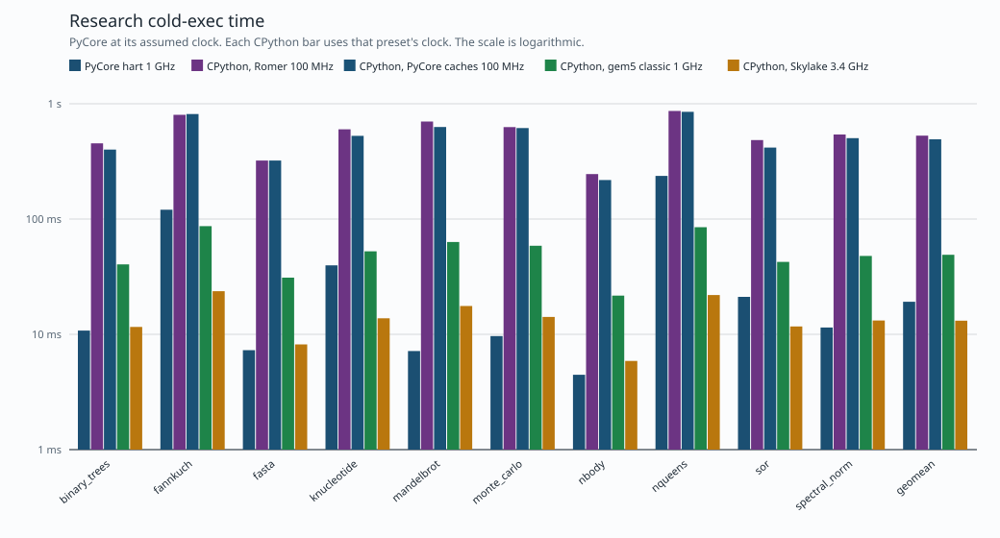

# CPython research benchmarks across machines

Cold-exec time for the research set. PyCore is the measured hart. Every other series is CPython 3.14 under the simple-core model (`cpython_baseline`) at that preset's own clock, so a faster clock is part of the machine. The same cycle counts are in the table.

Regenerate with `make research-compare-machines`.

Recorded 2026-10-08 21:28 UTC.

## Geometric mean

| machine | clock | programs | geomean cycles | geomean time |
| --- | ---: | ---: | ---: | ---: |
| PyCore hart 1 GHz | 1000 MHz | 10 | 19,154,864 | 19.15 ms |
| CPython, Romer 100 MHz | 100 MHz | 10 | 52,918,570 | 529.19 ms |
| CPython, PyCore caches 100 MHz | 100 MHz | 10 | 49,192,874 | 491.93 ms |
| CPython, gem5 classic 1 GHz | 1000 MHz | 10 | 48,978,764 | 48.98 ms |
| CPython, Skylake 3.4 GHz | 3400 MHz | 10 | 44,654,509 | 13.13 ms |

## Cold exec, per program

| program | PyCore hart 1 GHz | CPython, Romer 100 MHz | CPython, PyCore caches 100 MHz | CPython, gem5 classic 1 GHz | CPython, Skylake 3.4 GHz |
| --- | ---: | ---: | ---: | ---: | ---: |
| binary_trees.py | 10.77 ms (10,774,318) | 453.17 ms (45,316,620) | 400.69 ms (40,068,816) | 40.44 ms (40,444,691) | 11.60 ms (39,423,864) |
| fannkuch.py | 120.57 ms (120,567,458) | 802.48 ms (80,248,113) | 814.46 ms (81,446,404) | 86.81 ms (86,807,979) | 23.67 ms (80,464,755) |
| fasta.py | 7.28 ms (7,279,622) | 321.83 ms (32,183,147) | 321.77 ms (32,177,348) | 31.00 ms (30,998,059) | 8.17 ms (27,776,177) |
| knucleotide.py | 39.66 ms (39,663,444) | 600.22 ms (60,022,486) | 526.32 ms (52,632,216) | 52.50 ms (52,498,597) | 13.78 ms (46,835,072) |
| mandelbrot.py | 7.16 ms (7,163,734) | 701.20 ms (70,119,841) | 628.09 ms (62,809,316) | 63.25 ms (63,252,165) | 17.61 ms (59,876,517) |
| monte_carlo.py | 9.67 ms (9,668,276) | 627.31 ms (62,730,644) | 615.43 ms (61,543,467) | 58.64 ms (58,638,026) | 14.15 ms (48,104,231) |
| nbody.py | 4.46 ms (4,462,276) | 245.69 ms (24,568,662) | 217.89 ms (21,788,839) | 21.67 ms (21,671,252) | 5.88 ms (19,992,041) |
| nqueens.py | 236.70 ms (236,701,258) | 866.09 ms (86,609,315) | 850.37 ms (85,037,010) | 84.92 ms (84,923,095) | 21.90 ms (74,462,330) |
| sor.py | 21.15 ms (21,153,468) | 483.72 ms (48,372,011) | 416.75 ms (41,675,067) | 42.52 ms (42,522,592) | 11.69 ms (39,758,425) |
| spectral_norm.py | 11.46 ms (11,456,302) | 541.48 ms (54,148,356) | 503.06 ms (50,305,707) | 47.91 ms (47,906,070) | 13.18 ms (44,810,722) |

Each cell is simulated time at that machine's clock, then the cycle count.
Time is cycles / clock. A smaller bar is a faster machine.
